```{r, setup, include = F}
library(knitr)
opts_chunk$set(
  comment = "#>",
  fig.align = "center",
  fig.height = 7,
  fig.width = 10.5,
  warning = F,
  message = F
)
```

class: agenda

# Agenda

<ul class="agenda-list">
<li class="current">Progress studies and this course</li>
<li class="upcoming">Millennia of modest growth</li>
<li class="upcoming">The miracle of progress</li>
<li class="upcoming">Drivers of progress</li>
<li class="upcoming">Who benefits from progress?</li>
</ul>

---


# The evolution of economic history <br> .small[<span class="gray">Goldin (1995)</span>]
.center-content[
- **1965-1975: Rewriting the canonical stories**
    - Challenged conventional wisdom on big historical events (e.g., railroads, slavery, Civil War)
    - Used economic theory and quantitative methods to test old narratives


- **1975-1985: Turning inward**
    - Scrutinized early cliometric findings; refined data and methods
    - Focus remained on traditional topics but with greater rigor and nuance


- **1985-present: Exploring the present through the past**
    - Shifted focus to long-run roots of current issues: inequality, gender gaps, education, aging
]

---

# Progress studies

.center-content[
Progress is **not automatic**. <span class="gray">Collison & Cowen (2019)</span> call for a new field dedicated to understanding why progress happens — and how to speed it up.

- Progress has been **uneven**. Some ecosystems generate orders-of-magnitude more progress.
- **Why?** The relevant knowledge is **fragmented** across economics, history, sociology, management, science policy — no field owns the question

Progress studies asks: How should we fund science? Train talent? Design organizations? Structure incentives? The goal is not just to understand — but to **intervene**.
]

---
class: quote-slide

<div class="quote-box">
"The idea that humans should and could work consciously to make the world a better place for themselves and for generations to come is by and large one that emerged in the two centuries between Christopher Columbus and Isaac Newton. Of course, just believing that progress could be brought about is not enough—one must bring it about. The modern world began when people resolved to do so."
</div>
<div class="quote-source">
— Joel Mokyr
</div>

---

# What can history teach us about the present?

.center-content[

  "Most economic historians believe that to understand the present and future we need to understand the past and how we got here to begin with"
  <span class="gray">— Abramitzky (2015)</span>

- **Studying long-run impacts** of a policy or technology requires it to lie far in the past

- **Data availability** is often better for historical contexts (fewer privacy concerns)

- **Qualitative accounts** available from contemporaries and scholars that have studied the period

- **Context** is methodological focus of economic historians, informing judgement about what history does or does not teach us about the present

]

---
class: quote-slide

<div class="quote-box">
"The rise of AI is arguably the biggest information revolution in history. But we cannot understand it unless we compare it with its predecessors. History isn't the study of the past; it is the study of change. History teaches us what remains the same, what changes, and how things change."
</div>
<div class="quote-source">
— Yuval Noah Harari
</div>

---

.center-content[
```{r, echo=FALSE, out.width="55%"}
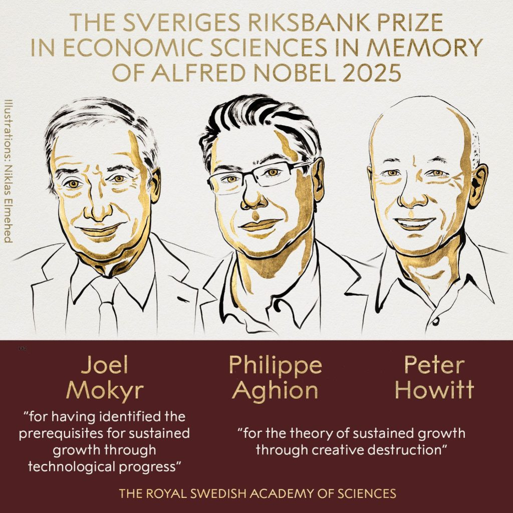
```
]

---

.center-content[
```{r, echo=FALSE, out.width="80%"}
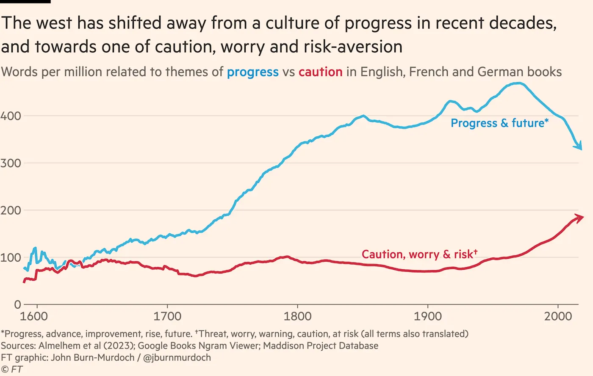
```
]

---

# Course structure

.center-content[
- **Part I: Foundations of Progress** <span class="gray">(Lecture 1)</span>

- **Part II: Engines of Progress** <span class="gray">(Lectures 2--8)</span>
    - Dawn of Civilization
    - Sustained Growth
    - Diffusion of Technology and Direction of Innovation

- **Part III: Inequality and Barriers to Progress** <span class="gray">(Lectures 9--16)</span>
    - Technology and Inequality
    - Race, Gender
    - Intergenerational Mobility and the Allocation of Talent

- **Part IV: Student Presentations** <span class="gray">(Lectures 17--19)</span>
]

---

# Who this course is for

.center-content[
- PhD students and pre-doctoral fellows only; not open to undergraduates

- Pre-docs: requires comfort with advanced applied econometrics

- The course cannot slow down to review methods; if that pace is a poor fit, do not enroll
]

---

# Interactive components

.center-content[
- **Presentation of recent papers** <span class="gray">[10min]</span>
    - Each student presents one paper (*), topic assigned in week 1 based on preferences
    - Slides are due 24h before the presentation

- **Readings**
    - Read one paper per week
    - Fill in a short feedback form 12h before the lecture
    - Note: Some papers are recommended (®) or covered in lecture (|||)

- **Brainstorming research frontiers**

- **Lightning paper**
    - AI-assisted replication due end of week 2 (Sunday 11:59pm)
    - Final version due two weeks after last class; presentations during the final two weeks
]

---
name: lightning_paper

# Lightning paper

.center-content[
- **Main goal:** A novel, well-identified contribution
    - AI tools make replication and extension fast; the bar for contribution rises
    - Aim for work that could develop into a publishable paper

- **First deliverable:** AI-assisted replication, due end of week 2 (Sunday 11:59pm)
    - About two pages: key result replicated, difficulties encountered, extension plan

- **Task:** Extend previous work using its replication package
    - Example: China Trade Shock papers <a href="#china_shock" class="btn">Details</a>

- **Paper choice:** Strong link to the course required
    - Historical question or setting, or a core course theme
    - Papers unrelated to the course are not acceptable

- **Collaboration:** Encouraged
]

---
class: inverse, middle

# Introductions

1. Name
2. Where you are from (broadly defined)
3. Research interests
4. One other thing about you

.footnote[.small[Luke Stein's "chain method" of introduction.]]

---

# Lightning paper: Timeline

.center-content[
- This week: Choose your paper (& potential collaborator)
- Week 2: AI-assisted replication due Sunday 11:59pm <span class="gray">(repo + 2-page memo: key result, difficulties, extension plan)</span>
- Weeks 3-5: Finalize extension question & background research
- Weeks 5-7: Implement extension
- Week 8: Finalize results & prepare presentation
- Weeks 9-10: Presentations
]

---

# Prompting coding agents for replication

.center-content[
- **Tools:** Claude Code, Cursor, Codex

- **Start in plan mode:** Review the agent's plan before it writes or runs anything

- **Point the agent at the replication package:** README, code, data files

- **Map files to exhibits:** Ask which script produces each table and figure

- **Spot gaps early:** Missing data, restricted access, broken dependencies

- **Verify:** Outputs must match published tables before extension work starts
]

---

# AI Policy

.center-content[
- You are encouraged to make use of AI tools

- You remain responsible for the accuracy, originality, and writing style <span class="gray">(garbage in, garbage out)</span>
]

---

# Mental framework to advance research projects

.center-content[
1. **Start:** Identify one of the three ingredients to your (applied) research project

.center[
**Research question** + **Data** + **(Identifying) variation**
]


2. **Fill in:** Identify the ideal candidates for the missing two ingredients


3. **Pivot:** As you work on the project, revisit to optimize the mix of ingredients
]

---

# Resources to stay up to date

.center-content[
- Journal alerts (at the very least [AER](https://www.aeaweb.org/notify/), [JPE](https://www.journals.uchicago.edu/action/showAlertSettings?referrer=https%3A%2F%2Fwww.journals.uchicago.edu%2Ftoc%2Fjpe%2Fcurrent&journalCode=jpe&action=addJournal), [ReStud](https://academic.oup.com/my-account/email-alerts?login=true), [QJE](https://academic.oup.com/pages/using-the-content/email-alerts), [AER:Insights, JEL, JEP, AEJ:Micro/Applied/Macro/Policy](https://www.aeaweb.org/notify/))

- [NBER working papers](https://www.nber.org/subscribe/free-newsletters-and-periodicals), [NBER digest](https://www.nber.org/subscribe/free-newsletters-and-periodicals)


- Recent econ-adjacent books: [Harvard](https://mailchi.mp/harvard/harvard-university-press-newsletter-preference-center), [Princeton](https://press.princeton.edu/newsletter-subscribe), [Yale](https://yalebooks.yale.edu/), [MIT](https://mitpress.mit.edu/newsletter/), [UChicago](https://press.uchicago.edu/books/mailnotifier/subscribe.html)

- Twitter & substack: [Best of Econ](https://www.bestofecontwitter.com/), [Alice Evans](https://substack.com/@draliceevans), [Jon Hartley](https://capitalismandfreedom.substack.com/), [Johan Fourie](https://www.ourlongwalk.com)

- Google Scholar alerts (pick your favorite authors)

- Other newsletters: [Rest of World](https://restofworld.org/newsletters/), [Data for Good](https://dataforgood.facebook.com/), [Our World in Data](https://ourworldindata.org/), [Microeconomic Insights](https://ifs.us2.list-manage.com/subscribe?u=32730df9ae3446dd3da3c80e9&id=d0bbb42096), [Flowing Data](https://flowingdata.com/newsletter/), [What's new in the world of LLMs](https://simonw.substack.com/p/whats-new-in-the-world-of-llms-for?utm_source=post-email-title&publication_id=1173386&post_id=158704518&utm_campaign=email-post-title&isFreemail=true&r=2jb0q4&triedRedirect=true&utm_medium=email)
]

---
class: agenda

# Agenda

<ul class="agenda-list">
<li class="done">Progress studies and this course</li>
<li class="current">Millennia of modest growth</li>
<li class="upcoming">The miracle of progress</li>
<li class="upcoming">Drivers of progress</li>
<li class="upcoming">Who benefits from progress?</li>
</ul>

---

# The world before 1800

.center-content[
  <div style="display: flex; justify-content: center; align-items: center; height: 490px; width: 100%; text-align: center;">
    <iframe src="../../undergraduate/materials/civilizational_progress_pre1800.html" width="100%" height="100%" style="border: none; display: block; margin: 0 auto;"></iframe>
  </div>

.center[<span class="gray">Implied annual growth rate: 0.006% per year (only 0.031% even between 500 and 1700)</span>]
]

---

# The Malthusian trap

<div style="display: flex; align-items: center; gap: 32px; width: 100%;">
  <div style="flex: 0 0 auto; text-align: center;">
```{r, echo=FALSE, out.width="230px"}
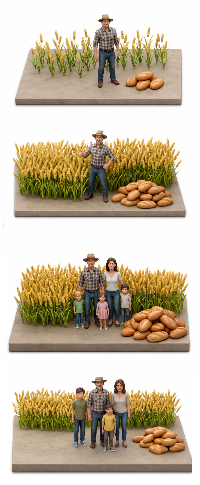
```
  </div>
  <div style="flex: 1; padding-left: 16px; font-size: 24px; line-height: 1.6;">
    <p>In 1798, Malthus argued that <b>any improvement in living standards was temporary</b> (Essay on the Principle of Population):</p>
    <ul>
      <li>Better conditions → more children</li>
      <li>More people → living standards fall back</li>
      <li>Result: <b>millennia of near-zero growth in income per person</b></li>
    </ul>
  </div>
</div>

---

# The Malthusian model: How it works

.center-content[
  <div style="display: flex; justify-content: center; align-items: center; height: 550px; width: 100%;">
    <iframe src="../../undergraduate/materials/malthusian_model.html" width="100%" height="100%" style="border: none; display: block; margin: 0 auto;"></iframe>
  </div>
]

---

# The Malthusian model: Predictions

.center-content[
The model testable predictions:

- **Living standards stay constant**
- **Higher productivity → more people, not richer people**
  - China in 1000 CE was the most technologically advanced civilization on Earth—gunpowder, the compass, paper money, cast iron, canal locks. Yet GDP per capita (~$600) was no higher than Europe's. It simply had *twice the population*.
- **Catastrophes could *raise* living standards**
  - The Black Death (1347–1351) killed ~40% of Europe's population. Real wages in England *doubled* within a generation (Clark, 2007). Land per worker rose, so the survivors were richer.
]

---
class: agenda

# Agenda

<ul class="agenda-list">
<li class="done">Progress studies and this course</li>
<li class="done">Millennia of modest growth</li>
<li class="current">The miracle of progress</li>
<li class="upcoming">Drivers of progress</li>
<li class="upcoming">Who benefits from progress?</li>
</ul>

---

# Escaping the trap

.center-content[
The Malthusian trap held for **10,000+ years**. Then something changed.

- Around 1800, income per person began to rise—and *kept* rising
- Population grew too, but income grew **faster**
- The hockey stick of progress was born

]

---

# Civilizational progress over the long run

.center-content[
  <div style="display: flex; justify-content: center; align-items: center; height: 550px; width: 100%;">
    <iframe src="../../undergraduate/materials/civilizational_progress_long_run.html" width="100%" height="100%" style="border: none; display: block; margin: 0 auto;"></iframe>
  </div>
]

---
class: agenda

# Agenda

<ul class="agenda-list">
<li class="done">Progress studies and this course</li>
<li class="done">Millennia of modest growth</li>
<li class="done">The miracle of progress</li>
<li class="current">Drivers of progress</li>
<li class="upcoming">Who benefits from progress?</li>
</ul>

---

# Escaping the Malthusian trap

.center-content[
  <div style="display: flex; justify-content: center; align-items: center; height: 550px; width: 100%;">
    <iframe src="../../undergraduate/materials/malthusian_escape.html" width="100%" height="100%" style="border: none; display: block; margin: 0 auto;"></iframe>
  </div>
]

---

# Revolution 1: The Neolithic Revolution
<span class="gray">~10,000 BCE</span>

.center-content[
- For 200,000 years, small bands of hunter-gatherers were scattered across the globe
- Increasing seasonal variability forced hunter-gatherers to store food and settle down
- Storage → sedentism → agriculture (Matranga, "The Ant and the Grasshopper")
- Agriculture → surplus → cities → states → writing — and **inequality**
- But growth remained slow (~0.006% per year)
]

---

# Revolution 2: The Intellectual Revolution
<span class="gray">~500 BCE</span>

.center-content[
Writing, cities, and trade networks created the conditions for a revolution in ideas

- Greek philosophy, Confucianism, the Hebrew prophets emerged across unconnected civilizations
- For the first time, humans asked questions about governance, ethics, and the nature of the world
- New institutions: codified law, formal education, organized religion
- But the Malthusian trap still held: most people remained poor
]

---

# Revolution 3: The Industrial Revolution
<span class="gray">~1760 AD</span>

.center-content[
Ideas began to flow: books, newspapers, telegraph, telephone, internet

- Capital and people flowed across borders
- The Industrial Revolution, globalization, the information age
- The hockey-stick growth we saw earlier happened here (growth above 1% per year)
- Humanity finally escaped the Malthusian trap
]

---

# Revolution 4: The Digital/AI Revolution
<span class="gray">Since ~2022</span>


---
class: agenda

# Agenda

<ul class="agenda-list">
<li class="done">Progress studies and this course</li>
<li class="done">Millennia of modest growth</li>
<li class="done">The miracle of progress</li>
<li class="done">Drivers of progress</li>
<li class="current">Who benefits from progress?</li>
</ul>

---

# Progress for whom?

.center-content[
```{r, echo = F, out.width = '65%'}
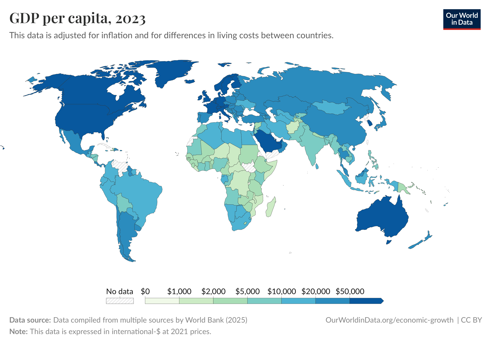
```
]

---

# Reversal of fortunes <br> .small[<span class="gray">Acemoglu, Johnson & Robinson (2002)</span>]

.center-content[
- Before colonialism, some of wealthiest regions in the world were in Asia, Africa, and the Americas
- Countries rich in 1500 are poor today, and vice versa
- Colonizers imposed extractive institutions in prosperous, densely populated regions, designed to exploit and extract from, not to develop
- Settler colonies received inclusive institutions that fostered long-run growth
- Result: reversal in the global income distribution
]

---

# Reversal of fortunes

.center-content[
<div style="display: flex; justify-content: center; align-items: center; gap: 32px; width: 100%;">
  <div style="flex: 1; text-align: center;">
```{r, echo=FALSE, out.width="100%"}
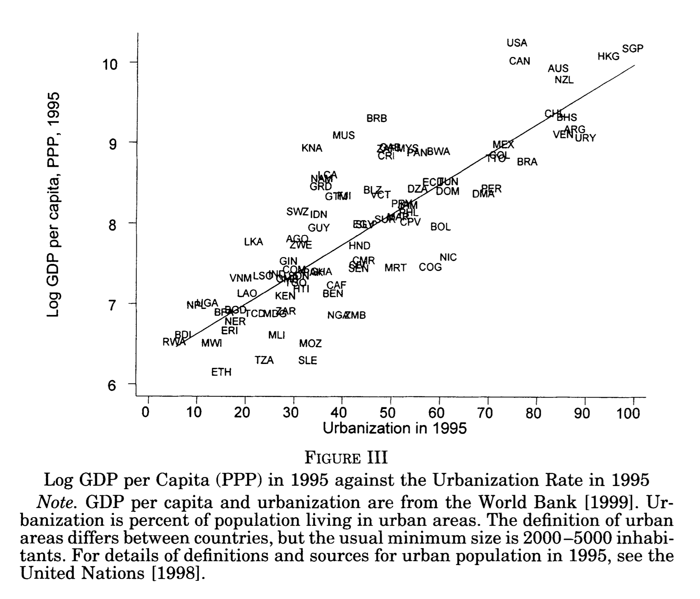
```
  </div>
  <div style="flex: 1; text-align: center;">
```{r, echo=FALSE, out.width="100%"}
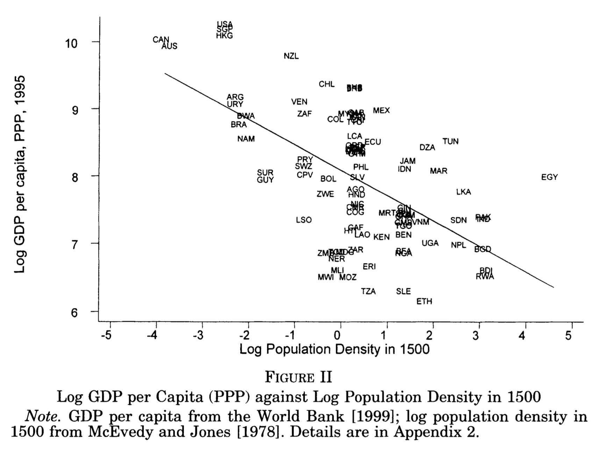
```
  </div>
</div>

.source[Acemoglu, Johnson & Robinson (2002)]
]

---

# Settler mortality and institutions

.center-content[
```{r, echo = F, out.width = '65%'}
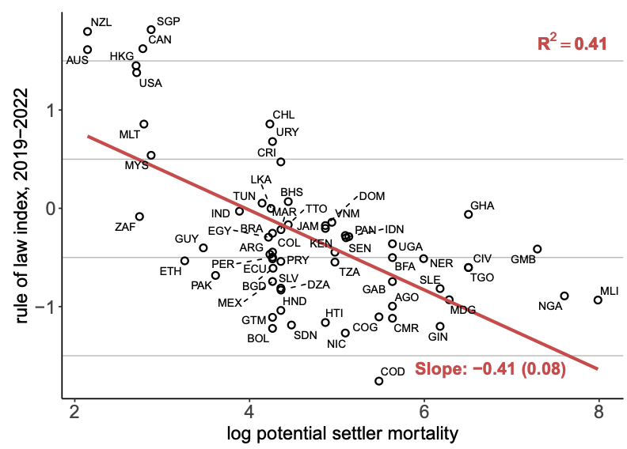
```

.footnote[.small[Source: Acemoglu, Johnson, Robinson (2001).]]
]

---


# Institutions and prosperity

.pull-left[
.center[Correlation]
```{r, echo = F, out.width = '99%'}
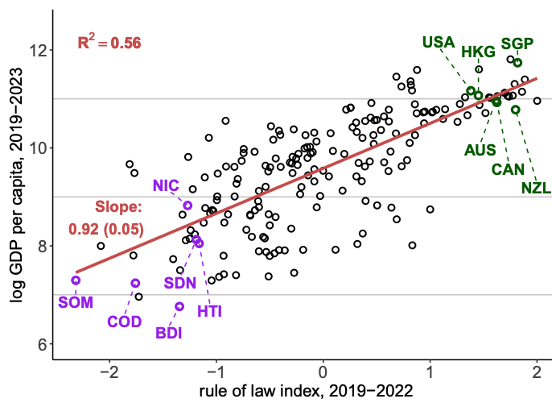
```
]

.pull-right[
.center[Causal effect (via settler mortality)]
```{r, echo = F, out.width = '99%'}
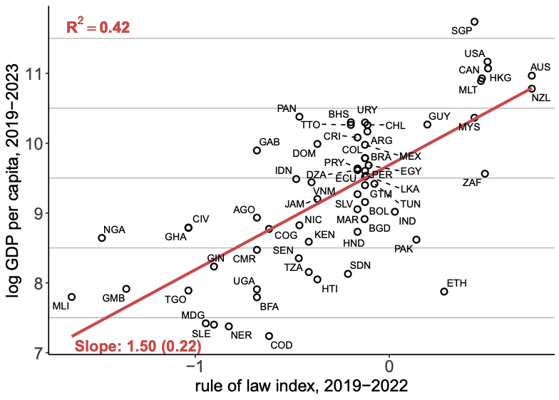
```
]

.footnote[.small[Source: Acemoglu, Johnson, Robinson (2024). "2024 Prize Lectures in Economic Sciences." [YouTube](https://www.youtube.com/live/YcuxbYUW8R8).]]

---

# For next class

.center-content[

- **Due tomorrow 10:30pm:** Topic choice via Canvas
  - Student presentations start Tuesday next week, due 24h before class

- **Read for next class:** Matranga (2024), "The Ant and the Grasshopper" <span class="gray">(QJE)</span>
  - Fill in the feedback form via Canvas 12h before class

- **Due Sunday 11:59pm:** Submit plan for lightning paper via Canvas
  - Short paragraph including (1) main reference and its link to the course, (2) extension proposal, (3) potential collaborator
  - Reminder: AI-assisted replication due end of week 2 (Sunday 11:59pm)
]

---

# Resources

.center-content[
- Course materials on Canvas

- Office hours: Tuesdays 1:00–2:00pm, Landau 238 (<a class="btn" href="https://calendar.app.google/6HKrAV9csDf37D679" target="_blank">Reserve a slot</a>)

- Instructor: Lukas Althoff ([lalthoff@stanford.edu](mailto:lalthoff@stanford.edu))
]

---
class: inverse, middle

# Appendix


---
name: china_shock

# Series of "The China Trade Shock" papers [1/3]

.center-content[
<div style="display: flex; justify-content: center; gap: 20px;">
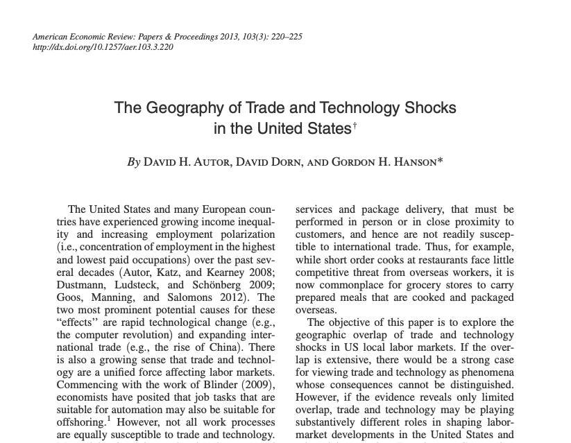
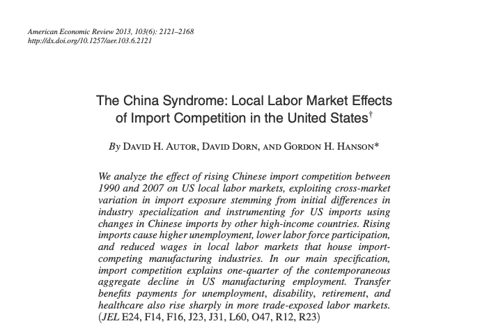
</div>

<a href="#lightning_paper" class="btn btn-back">Back</a>
]

---

# Series of "The China Trade Shock" papers [2/3]

.center-content[
<div style="display: flex; justify-content: center; gap: 20px;">
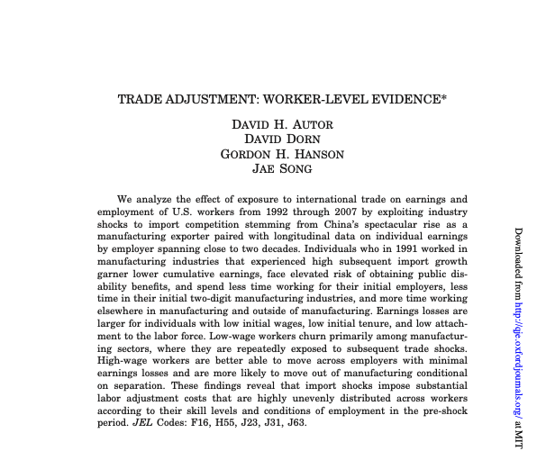
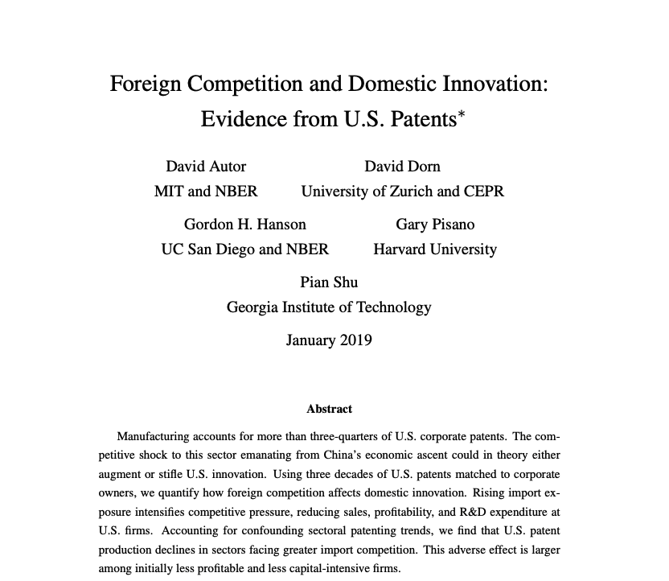
</div>

<a href="#lightning_paper" class="btn btn-back">Back</a>
]

---

# Series of "The China Trade Shock" papers [3/3]

.center-content[
<div style="display: flex; justify-content: center; gap: 20px;">
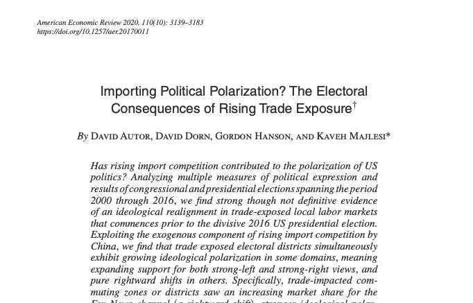
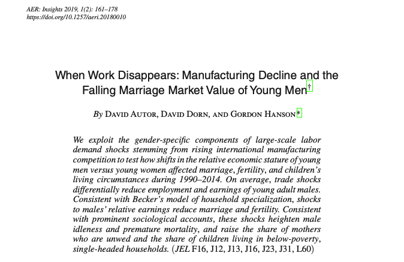

</div>

<a href="#lightning_paper" class="btn btn-back">Back</a>
]
