```{r, setup, include = F}
library(knitr)
opts_chunk$set(
  comment = "#>",
  fig.align = "center",
  fig.height = 7,
  fig.width = 10.5,
  warning = F,
  message = F,
  error = T
)
```

class: agenda

# Agenda

<ul class="agenda-list">
<li class="current">Economic progress in the long run</li>
<li class="upcoming">Origins of agriculture and civilization</li>
<li class="upcoming">Divergent growth</li>
<li class="upcoming">Methods: DAGs</li>
</ul>

---

# Very-long-run economic history

.center-content[
- Helps us understand why progress is not automatic, and that it is rarely shared equally
- Tends to draw heavily on other fields (anthropology, climate science, biology) and cumulative evidence via several methods and sources of variation
- But: Tempting to believe compelling and simple stories even when evidence is limited, and history is long enough to support many stories
]

---

# The hockey stick of progress

.center-content[

  <div style="display: flex; justify-content: center; align-items: center; height: 470px; width: 100%;">
    <iframe src="../../undergraduate/materials/civilizational_progress_long_run.html" width="100%" height="100%" style="border: none; display: block; margin: 0 auto;"></iframe>
  </div>
]

---

# From foragers to the modern world .small[[1/2]]

.center-content[
How did small bands of hunter-gatherers become complex civilizations?

1. **Nomadic bands to sedentary villages:** Seasonality, storage, sedentism, farming <span class="gray">Matranga (2024)</span>
    - Harsher winters forced food storage; settling down made agriculture likely

2. **Sedentary villages to cities:** Surplus, specialization, thicker markets <span class="gray">Smith (1976); Glaeser (2011)</span>
    - Agriculture freed labor from food production
    - Finer division of labor where markets are thicker
    - Proximity: Ideas, tasks, deeper specialization

3. **Cities to states:** Visible, storable harvests enable tax <span class="gray">Mayshar, Moav & Pascali (2022)</span>
    - Grain storable, visible, confiscatable
    - "History records no cassava states"
]

---

# From foragers to the modern world .small[[2/2]]

.center-content[
Once states emerged, why did some grow more than others?

4. **States to innovative states:** Geographic fragmentation, competition, innovation <span class="gray">Fernández-Villaverde et al. (2023)</span>
    - Europe: Rugged terrain, many polities; China: Core plains, unified empire
    - Competition spurred institutional innovation, openness

5. **Innovative states to colonial powers:** Extractive vs. inclusive institutions, persistence <span class="gray">Acemoglu, Johnson & Robinson (2001)</span>
    - Settler mortality shaped what Europeans built overseas
    - Legacies still structure much of today's income gaps
]

---

class: agenda

# Agenda

<ul class="agenda-list">
<li class="done">Economic progress in the long run</li>
<li class="current">Origins of agriculture and civilization</li>
<li class="upcoming">Divergent growth</li>
<li class="upcoming">Methods: DAGs</li>
</ul>

---

class: inverse, center, middle

<div style="text-align: center; width: 100%;">
  <div style="color: #1A3A68; font-weight: 700; font-size: 42px; line-height: 1.2;">
    The Ant and the Grasshopper
  </div>
  <div style="color: rgba(26, 58, 104, 0.7); font-weight: 400; font-size: 26px; line-height: 1.35; margin-top: 16px;">
    Matranga (2024)
  </div>
</div>

---

# Seasonality and the Invention of Agriculture <br> .small[<span class="gray">Matranga (2024)</span>]

.center-content[
- **Research question:** Why did humans transition from foraging to farming ~12,000 years ago?

- **Key argument:** Increasing climatic seasonality at end of last Ice Age made foraging less viable

- **Mechanism:** Seasonality forces storage, storage forces sedentism, sedentism enables agriculture

- **Evidence:**
    - Regions with greater increases in seasonality adopted agriculture earlier
    - Archaeological evidence of storage predates evidence of cultivation
    - Sedentary settlements appear before domesticated crops

- **Implication:** Agriculture not a sudden invention but an adaptation to environmental change
]

---

# The sudden decision to settle down: Seven independent origins <br> .small[<span class="gray">Matranga (2024)</span>]

.center-content[
Starting ~12,000 years ago, at least seven different groups independently began to settle down and farm:

- **Fertile Crescent** (~9,500 BC) — wheat, barley, sheep, goats
- **South China** (~7,000 BC) — rice
- **North China** (~6,000 BC) — millet, pigs
- **Mesoamerica** (~3,000 BC) — maize, squash, beans
- **Andes** (~3,000 BC) — potatoes, llamas
- **Sahel** (~3,000 BC) — sorghum, pearl millet
- **Eastern North America** (~2,500 BC) — sunflower, squash

]
---

# Milankovitch cycles over 150,000 years

.center-content[
  <div style="display: flex; justify-content: center; align-items: center; height: 520px; width: 100%;">
    <iframe src="../../undergraduate/materials/milankovitch_timeline.html" width="100%" height="100%" style="border: none; display: block; margin: 0 auto;"></iframe>
  </div>
]

---

# What changed? Milankovitch cycles

.center-content[
  <div style="display: flex; justify-content: center; align-items: center; height: 490px; width: 100%;">
    <iframe src="../../undergraduate/materials/milankovitch_explain.html" width="100%" height="100%" style="border: none; display: block; margin: 0 auto;"></iframe>
  </div>
]

---


# After: The demographic explosion <br> .small[<span class="gray">Matranga (2024)</span>]

.pull-left[
Sedentism dramatically increased how many children survived

- Nomadic: Can't have more than one young child per parent (someone has to carry them)

- Many childhood diseases survivable if you can stay in one warm place for a few weeks

- Nomadic, breastfeeding women often couldn't reach body fat threshold needed to conceive again for years
]

.pull-right[
Once sedentary, far more kids survive

And even if some groups wanted to remain nomadic:

- Farmers having more children who survive
- If there's ever conflict, farmers win by sheer numbers
]
---

# The data: Simulated climate meets archaeological adoption dates <br> .small[<span class="gray">Matranga (2024)</span>]

.center-content[
**Climate data:** TraCE Dataset, CCSM3 climate model simulating global climate for the past 22,000 years

- Temperature and precipitation for every point on Earth, in 3.75° x 3.75° grid cells
- Aggregated into 44 periods of 500 years each

**Archaeological data:** When did each place adopt agriculture?

- Global adoption dates from archaeobotanical records
- Final sample: 587 cells warm and wet enough to farm
- 7 independently dated invention sites

**Key variable:** Temperature seasonality = avg. of warmest quarter − avg. of coldest quarter
]
---

# The data: Global grid of adoption timing <br> .small[<span class="gray">Matranga (2024)</span>]

.center-content[
```{r, echo=FALSE, out.width="90%"}
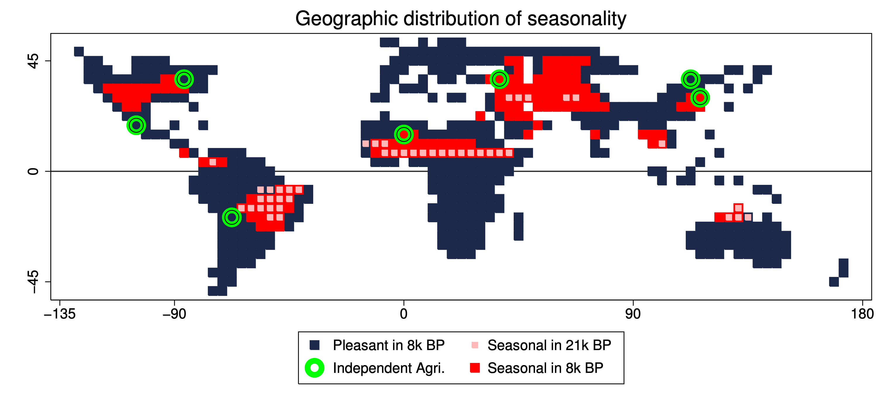
```
]
---

# The data: Seasonality varies sharply across cells <br> .small[<span class="gray">Matranga (2024)</span>]

.center-content[
```{r, echo=FALSE, out.width="62%"}
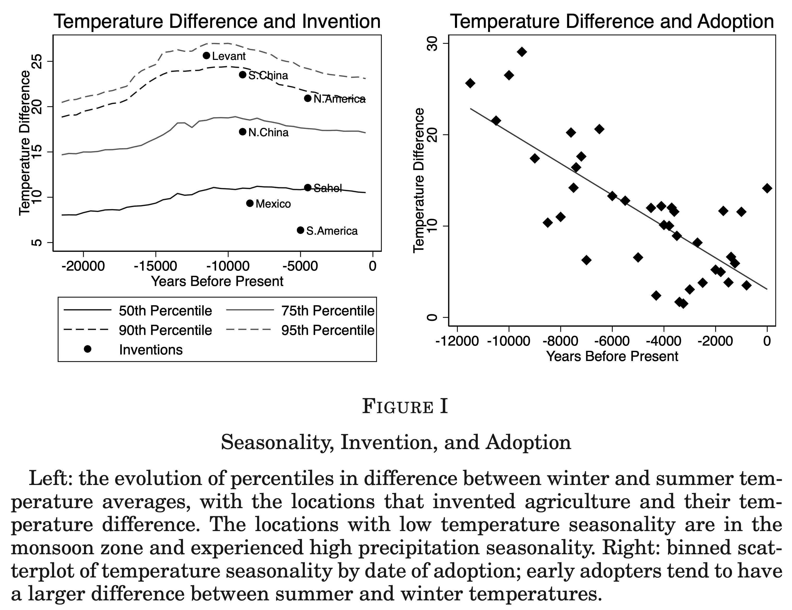
```
]
---

# Headline result: Seasonality predicts adoption <br> .small[<span class="gray">Matranga (2024)</span>]

.center-content[
```{r, echo=FALSE, out.width="75%"}
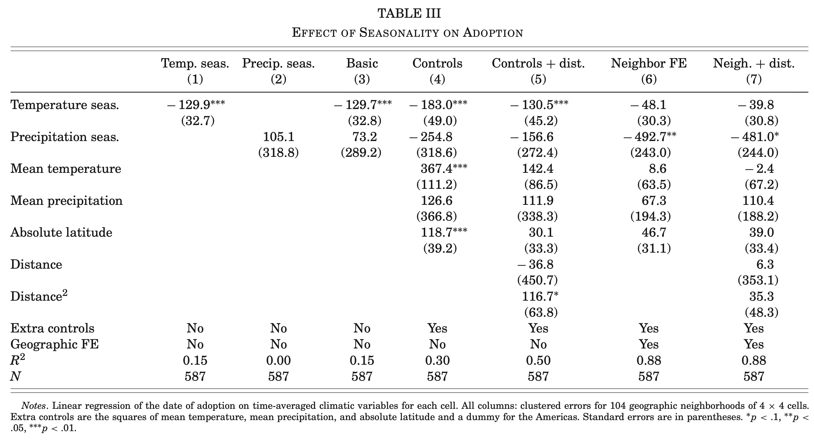
```
]
---

# Seasonality also predicts independent invention <br> .small[<span class="gray">Matranga (2024)</span>]

.center-content[
```{r, echo=FALSE, out.width="70%"}
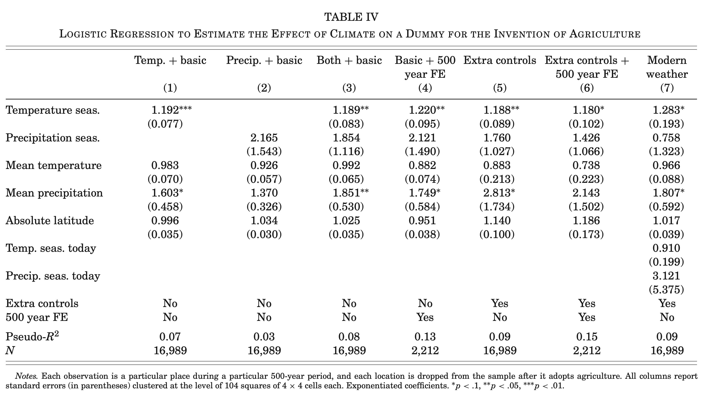
```
]
---

# Archaeological evidence: Storage came BEFORE farming <br> .small[<span class="gray">Matranga (2024)</span>]

.pull-left[
**Middle East**

- Became sedentary and built granaries before domesticating any crops
- Height declined upon settling down, even before cereals were common

**Pacific Northwest peoples**

- Lived in permanent villages, stored salmon
- Never adopted agriculture but followed same storage-and-settlement pattern
]

.pull-right[
**Implications**

Model predicts a sequence:

1. Seasonality increases
2. Hunter-gatherers settle down to store food
3. Sedentary life + storage makes farming almost inevitable

Archaeology confirms this exact sequence. Settlement and storage are the intermediate step, not a consequence of farming
]
---

# The cost of farming: Skeletal evidence <br> .small[<span class="gray">Matranga (2024)</span>]

.pull-left[
First farmers were worse off physically

- Shorter than hunter-gatherer ancestors
- More joint diseases, less skeletal robustness

But fewer growth-arrest lines, meaning less seasonal starvation

**Trade-off:** Eat less on average, but eliminate risk of starving in winter
]

.pull-right[
```{r, echo=FALSE, out.width="95%"}
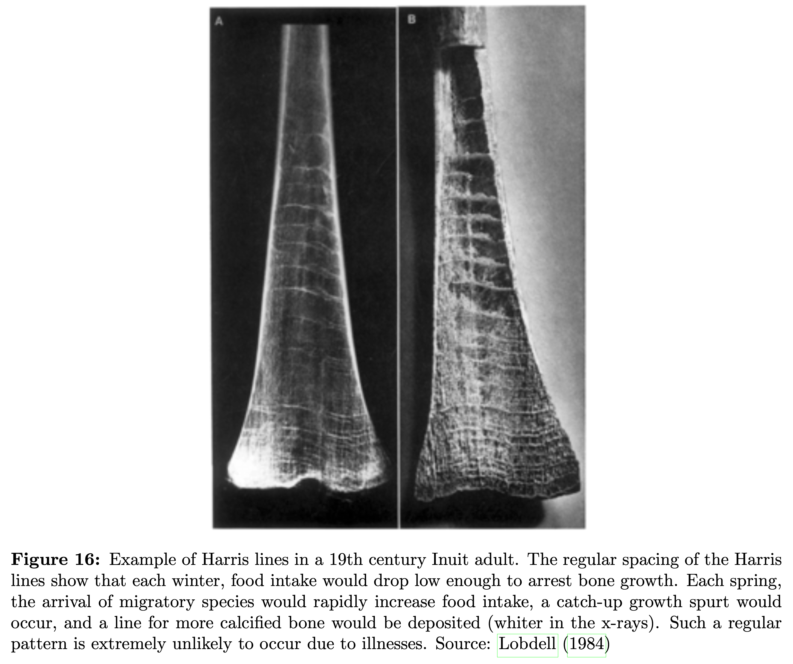
```
]

.footnote[.small[Source: Cohen and Armelagos (1984).]]

---


# Agriculture created surplus, surplus changed everything

.center-content[
For the first time, one farmer could produce more food than their family needed

Surplus enabled:

- **Specialization** — potters, weavers, priests, soldiers
- **Cities** — large permanent settlements
- **Writing** — invented to track grain stores and debts
- **States** — organized taxation and defense
]

---

# The dawn of inequality <br> .small[<span class="gray">Bowles & Fochesato (2024)</span>]

.center-content[
```{r, echo = F, out.width = '55%'}
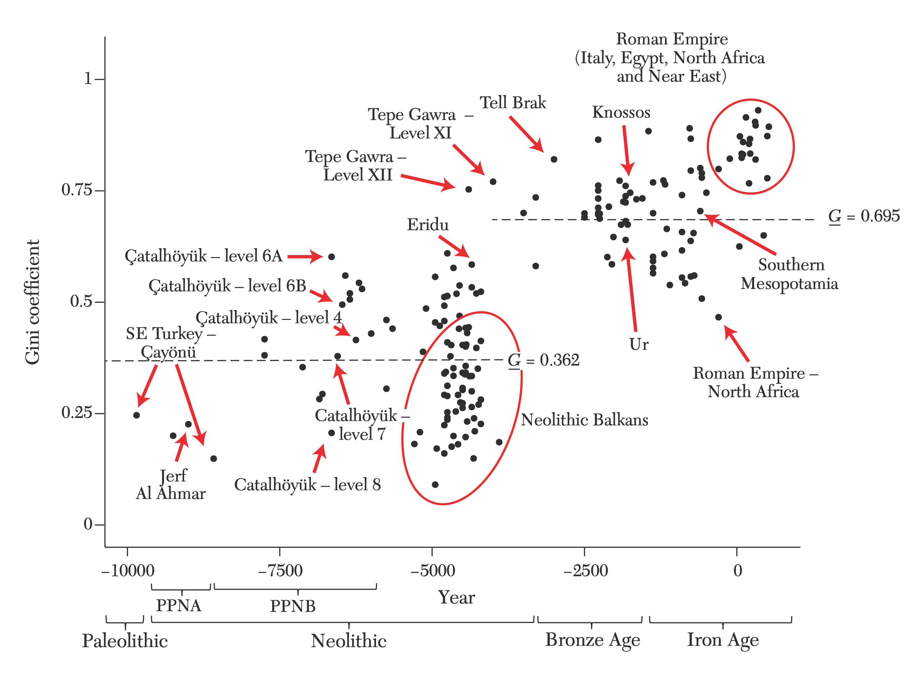
```
]

---
class: inverse, center, middle

<div style="text-align: center; width: 100%;">
  <div style="color: #1A3A68; font-weight: 700; font-size: 42px; line-height: 1.2;">
    The Origin of the State:<br>Land Productivity or Appropriability?
  </div>
  <div style="color: rgba(26, 58, 104, 0.7); font-weight: 400; font-size: 26px; line-height: 1.35; margin-top: 16px;">
    Mayshar, Moav &amp; Pascali (2022)
  </div>
</div>

---

# Neolithic revolution & origin of the state <br> .small[<span class="gray">Mayshar, Moav & Pascali (2022)</span>]

.center-content[
- Following the Neolithic Revolution, some regions developed complex hierarchies: City-states, great civilizations of antiquity

- **Research questions:**
    1. How did farming trigger this change?
    2. Why did some regions remain with only simple hierarchy, despite adopting farming?
]

---

# Cities pre-500 BC <br> .small[<span class="gray">Mayshar, Moav & Pascali (2022)</span>]

.center-content[
```{r, echo = F, out.width = '85%'}
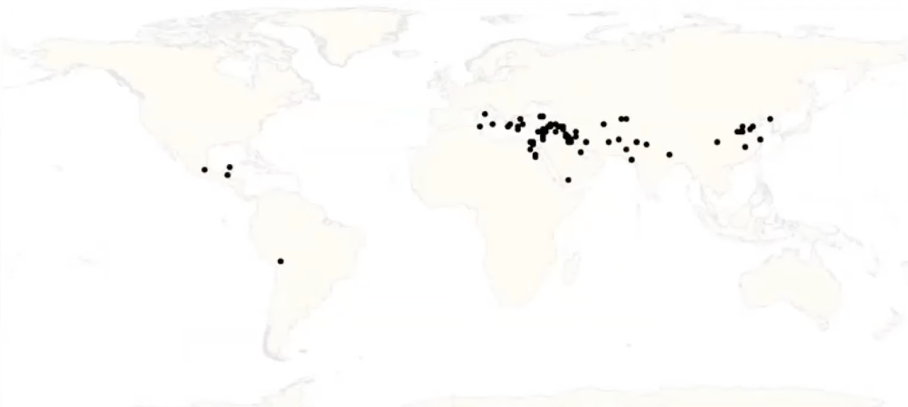
```
]

---

# Existing theory <br> .small[<span class="gray">Mayshar, Moav & Pascali (2022)</span>]

.center-content[
```{r, echo = F, out.width = '95%'}

```

"In short, plant and animal domestication meant much more food... The resulting food surpluses ... were a prerequisite for the development of settled, politically centralized, socially stratified, economically complex societies." <span class="gray">Diamond (1997)</span>
]

---

# Critique of existing theory <br> .small[<span class="gray">Mayshar, Moav & Pascali (2022)</span>]

.center-content[
- **Surplus not necessary** for appropriation
    - Labor and fruits of labor may be stolen by authority even if it leads to death

- **Surplus not sufficient** for appropriation
    - Some crops not suitable for transfer and storage, even if there's surplus
]

---

# New theory: **Cereals** <br> .small[<span class="gray">Mayshar, Moav & Pascali (2022)</span>]

.center-content[
```{r, echo = F, out.width = '95%'}
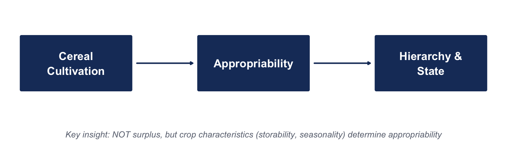
```

- **Appropriability**
    - Encouraged robbery and created demand for protection
    - Facilitated finance of elite and provision of protection
]

---

# Datasets on hierarchy beyond Ethnographic Atlas <br> .small[<span class="gray">Mayshar, Moav & Pascali (2022)</span>]

.center-content[
- **Ethnographic Atlas** <span class="gray">Murdock 1962–1980, Gray (1998)</span>

- **Hierarchy Index** <span class="gray">Borcan et al. (2014)</span>
    - 159 countries, every half century from 0 CE to 2000 CE
    - Government above tribal level? (=1 state; 0.75 chiefdom; 0 no)

- **Cross-sectional archaeological evidence** <span class="gray">(various sources)</span>
    - Ancient urban settlements <span class="gray">Reba, Reitsma & Seto (2016); DeGroff (2018)</span>
    - Archaeological sites <span class="gray">(Ancientlocations.net, Megalith Portal)</span>

- **Radiocarbon-dated prehistoric sites** <span class="gray">Whitehouse (1975)</span>
    - Most relevant prehistoric and proto-historic sites, carbon-dated
]

---

# Optimal crops <br> .small[<span class="gray">Mayshar, Moav & Pascali (2022)</span>]

.center-content[
```{r, echo = F, out.width = '85%'}
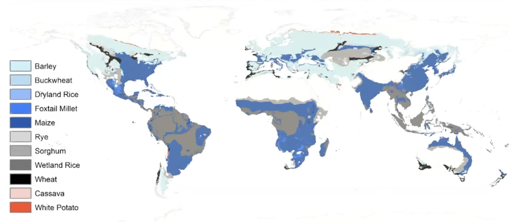
```
]

---

# Difference in productivity: Cereals vs. roots/tubers <br> .small[<span class="gray">Mayshar, Moav & Pascali (2022)</span>]

.center-content[
```{r, echo = F, out.width = '85%'}
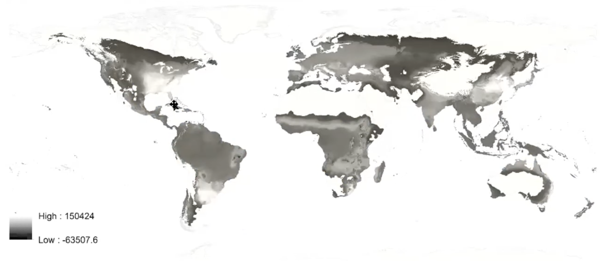
```
]

---

# Major crop in pre-colonial societies <br> .small[<span class="gray">Mayshar, Moav & Pascali (2022)</span>]

.center-content[
```{r, echo = F, out.width = '85%'}
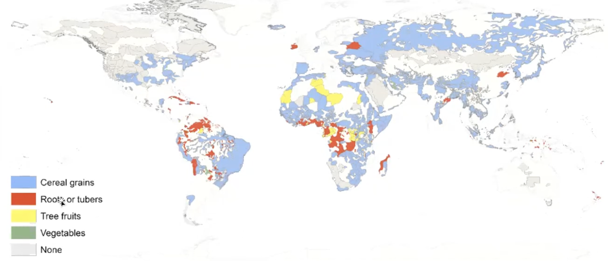
```
]

---

# Hierarchy in pre-colonial societies <br> .small[<span class="gray">Mayshar, Moav & Pascali (2022)</span>]

.center-content[
```{r, echo = F, out.width = '85%'}
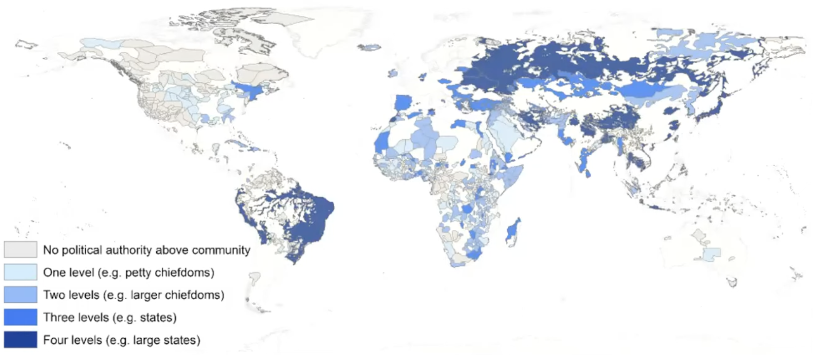
```
]

---

# Main results: Agriculture only leads to hierarchy through cereals <br> .small[<span class="gray">Mayshar, Moav & Pascali (2022)</span>]

*Cross-section: Jurisdictional Hierarchy Beyond Local Community*

| | OLS | 2SLS | 2SLS | 2SLS | OLS | 2SLS | 2SLS | 2SLS |
|---|---|---|---|---|---|---|---|---|
| **Cereals** are main crop | 0.71\*\*\* | 1.17\*\*\* | 0.86 | 1.04\*\* | 0.30\*\* | 0.89\*\* | 1.06\*\* | 0.99\*\* |
| | (0.13) | (0.36) | (0.60) | (0.41) | (0.120) | (0.42) | (0.54) | (0.46) |
| Land productivity | | | | 0.08 | | | | -0.04 |
| | | | | (0.13) | | | | (0.07) |
| Dependence on agriculture | | | | | 0.33 | | | -0.42 |
| | | | | | (0.52) | | | (0.78) |
| Continent FE | No | No | No | No | Yes | Yes | Yes | Yes |
| N | 952 | 952 | 952 | 952 | 952 | 952 | 952 | 952 |
| F | | 147.7 | 44.84 | 65.51 | | 99.87 | 76.90 | 33.09 |

---

# Main results: Cereals advantage consistently predicts hierarchy <br> .small[<span class="gray">Mayshar, Moav & Pascali (2022)</span>]

*Panel: Hierarchy Index <span class="gray">Borcan et al. (2014)</span>*

| | (1) | (2) | (3) | (4) | (5) | (6) | (7) | (8) |
|---|---|---|---|---|---|---|---|---|
| **Cereals** advantage | | 0.19\*\*\* | 0.27\*\*\* | 0.28\*\*\* | 0.24\*\*\* | 0.26\*\*\* | 0.26\*\*\* | 0.20\*\* |
| | | (0.07) | (0.08) | (0.08) | (0.09) | (0.09) | (0.08) | (0.08) |
| Land productivity | 0.14 | | -0.16 | -0.19 | -0.15 | -0.12 | -0.15 | -0.17 |
| | (0.10) | | (0.14) | (0.13) | (0.14) | (0.14) | (0.14) | (0.12) |
| Controls x Year FE | Precip. | | | Yes | | | | |
| Country FE | Yes | Yes | Yes | Yes | Yes | Yes | Yes | Yes |
| Time FE | Yes | Yes | Yes | Yes | Yes | Yes | Yes | Yes |
| R2 | 0.67 | 0.68 | 0.68 | 0.72 | 0.68 | 0.68 | 0.69 | 0.71 |
| N | 2869 | 2869 | 2869 | 2869 | 2812 | 2755 | 2869 | 2869 |

---

# Main results: Quasi-experiment of the Columbian Exchange <br> .small[<span class="gray">Mayshar, Moav & Pascali (2022)</span>]

.pull-left[
```{r, echo = F, out.width = '100%'}
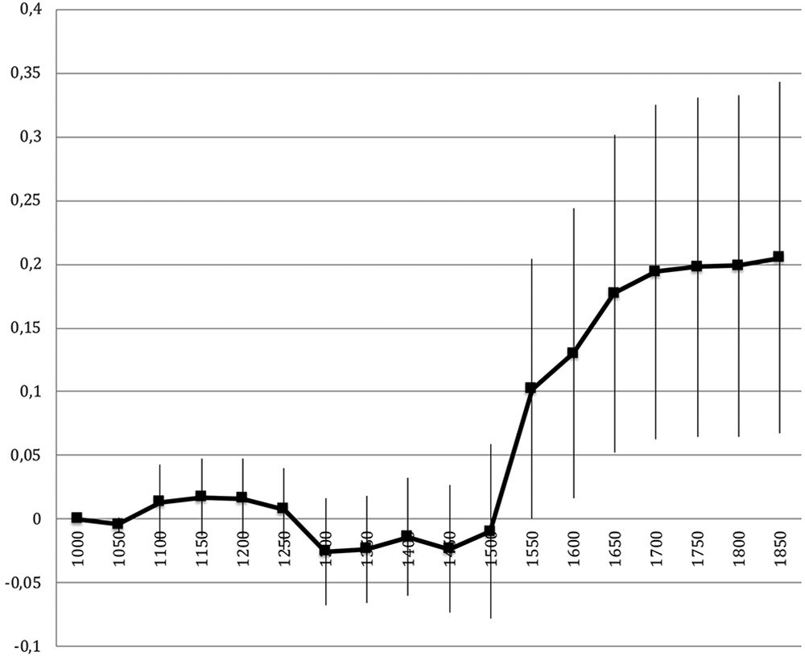
```
]

.pull-right[
- Crop exchange between New/Old World as natural experiment

- Introduced new crops, changing land productivity and advantage of cereals over roots/tubers
]

---

# "Old" cereals predict old cities (pre-500 BC) <br> .small[<span class="gray">Mayshar, Moav & Pascali (2022)</span>]

.center-content[
```{r, echo = F, out.width = '85%'}
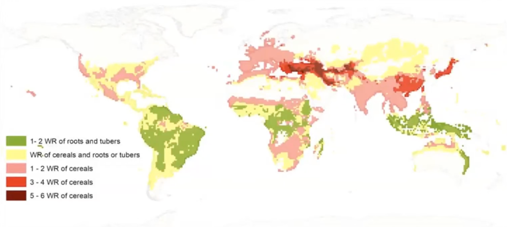
```
]

---

# Old cereals predict old cities (pre-500 BC) <br> .small[<span class="gray">Mayshar, Moav & Pascali (2022)</span>]

.center-content[
```{r, echo = F, out.width = '85%'}

```
]

---
class: inverse, middle, center

# Discussion

---

# Critique: Columbian Exchange bundled crops with disease and technology

.center-content[
- **Columbian Exchange** was not just a crop shock — bundled biological and technological transfer between Old and New Worlds <span class="gray">Crosby (1972)</span>

- **Disease channel:** Smallpox, measles, influenza caused 50–90% mortality among Indigenous populations, reshaping hierarchies independently of crops <span class="gray">Weil (2007, 2010)</span>

- **Technology channel:** Europeans brought firearms, horses, steel, writing, bureaucratic institutions — all one-directional (Old to New World) and correlated with the cereal shock

- **Robustness check** drops formal colonies, but disease, technology, and trade extended beyond formal colonial boundaries
]

---
class: agenda

# Agenda

<ul class="agenda-list">
<li class="done">Economic progress in the long run</li>
<li class="done">Origins of agriculture and civilization</li>
<li class="current">Divergent growth</li>
<li class="upcoming">Methods: DAGs</li>
</ul>

---
class: inverse, center, middle

<div style="text-align: center; width: 100%;">
  <div style="color: #1A3A68; font-weight: 700; font-size: 42px; line-height: 1.2;">
    The Fractured-Land Hypothesis
  </div>
  <div style="color: rgba(26, 58, 104, 0.7); font-weight: 400; font-size: 26px; line-height: 1.35; margin-top: 16px;">
    Fernández-Villaverde et al. (2023)
  </div>
</div>

---

# The Fractured-Land Hypothesis <br> .small[<span class="gray">Fernández-Villaverde et al. (2023)</span>]

.center-content[
- **Research question:** Why did Europe develop differently from China?

- **Key argument:** Geographic fragmentation shaped political and economic development
    - Europe's fractured geography produced many competing states
    - China's open geography produced a unified empire
    - Competition among European states spurred institutional innovation
]

---

# Geographic Fragmentation and State Competition <br> .small[<span class="gray">Fernández-Villaverde et al. (2023)</span>]

.center-content[
- **Model:** Geographic barriers (mountains, rivers, coastlines) determine equilibrium number of polities

- **Mechanism:**
    - More fragmentation, more states, more competition
    - Competition produces better institutions, more innovation, less extractive governance
    - Unified empires face less competitive pressure, institutional stagnation

- **Evidence:**
    - Computational model calibrated to Eurasia's geography
    - Correctly predicts Europe's fragmentation vs. China's unification
    - Consistent with historical patterns of institutional divergence
]

---
class: agenda

# Agenda

<ul class="agenda-list">
<li class="done">Economic progress in the long run</li>
<li class="done">Origins of agriculture and civilization</li>
<li class="done">Divergent growth</li>
<li class="current">Methods: DAGs</li>
</ul>

---

# Directed acyclic graphs (DAGs)

.center-content[
- DAGs discipline research design by explicitly stating the identifying assumptions

- A complete DAG includes every direct effect and every common cause of any pair of variables

- The graph comes from theory and prior knowledge, not from data

- Nodes are variables; arrows are direct causal effects, pointing from cause to effect

- Acyclic: causality runs in one direction, with no feedback loops (reverse causality and simultaneity need a different tool)

- A missing arrow is an assumption: it asserts there is no direct effect
]

.footnote[.small[Pearl (2009); Cunningham (2021), *Causal Inference: The Mixtape*, ch. 3.]]

---

# Reading a DAG: paths and bias

.center-content[


- **Mediator:** sits on the causal chain, D → X → Y, and carries part of the effect
  - e.g., sedentism → surplus → states

- **Moderator:** changes the size of D's effect rather than lying on the causal chain; drawn as an arrow into the D → Y arrow, and need not be caused by D
  - e.g., cereals switch on the surplus → states effect

- **Confounder:** a common cause, D ← X → Y; it opens a backdoor path and biases a naive comparison
  - e.g., climate causes both sedentism and crop suitability

- **Collider:** has two arrows into it, D → X ← Y; it blocks a backdoor path until you condition on it
  - e.g., surplus → monuments ← states (building them needs both wealth and central authority)

- **Backdoor criterion:** close backdoor paths by conditioning on confounders, never colliders or mediators (bad controls)
]

---


# A DAG combining Matranga (2024), Mayshar, Moav & Pascali (2022), and Fernández-Villaverde et al. (2023)

