```{r, setup, include = F}
library(knitr)
opts_chunk$set(
  comment = "#>",
  fig.align = "center",
  fig.height = 7,
  fig.width = 10.5,
  warning = F,
  message = F
)
```

class: agenda

# Agenda

<ul class="agenda-list">
<li class="current">How do economies grow?</li>
<li class="upcoming">Why did it take so long for sustained growth to materialize?</li>
<li class="upcoming">Why do some countries remain so much richer than others?</li>
<li class="upcoming">Can government policy fuel growth?</li>
</ul>

---

# Growth (1/2): Diminishing returns mean accumulation alone not enough

.center-content[

Q: Can population or factor growth by itself generate sustained growth in living standards?

A: No. Diminishing returns → expanding one factor can generate transitional but not sustained growth

- <span class="gray">Malthus (1798):</span> With land fixed, higher productivity raises wages only temporarily; population growth eventually pushes living standards back down.

- <span class="gray">Solow (1956):</span> With diminishing returns to capital, capital accumulation raises income per worker only temporarily; sustained growth requires technological progress.
- <span class="gray">Solow (1957):</span> Growth accounting for the US shows that most long-run growth in output per worker reflects TFP growth, not factor accumulation alone.

- <span class="gray">Mankiw, Romer & Weil (1992):</span> Adding human capital improves the model's fit to *cross-country* income differences and implies slow convergence (because physical and human capital are complementary, diminishing returns set in more slowly).

]

---

# The Solow model <br> .small[<span class="gray">Solow (1956, 1957)</span>]

.center-content[
- $Y = F(K, L, A)$ with diminishing returns to $K$
  - $K$ = capital, $L$ = labor, $A$ = technology/TFP

- $\dot k = s f(k) - (n + \delta) k$
  - $k = K/L$, $s$ = saving rate, $n$ = population growth, $\delta$ = depreciation

- Steady state $k^*$ where $s f(k^*) = (n + \delta) k^*$

- Economy converges to $k^*$ from any starting point
]

---

# The Solow model: Phase diagram <br> .small[<span class="gray">Solow (1956, 1957)</span>]

.center-content[
  <div style="display: flex; justify-content: center; align-items: center; height: 500px; width: 100%;">
    <iframe src="../materials/solow_model.html" width="100%" height="100%" style="border: none; display: block; margin: 0 auto;"></iframe>
  </div>
]

---

# Sustained growth requires improvements in technology <br> .small[<span class="gray">Solow (1956, 1957)</span>]

.center-content[
- Many things raise output per worker temporarily:
  - Physical capital accumulation
  - Human capital accumulation
  - Trade and specialization
  - Institutional improvements

- Without growth in $A$, long-run growth in output per worker is zero

- In Solow, growth in $A$ is exogenous

- Subsequent growth theory tries to explain where growth in $A$ comes from
]

---

# Growth (2/2): Ideas as the escape from diminishing returns

.center-content[

Q: If accumulation alone cannot sustain growth, what can?

A: The creation and diffusion of ideas. Unlike land or capital, ideas can be used by many people at once.

- <span class="gray">Romer (1990):</span> Ideas are non-rival: once discovered, the same idea can raise productivity in many places at once. Producing new ideas can therefore sustain growth by offsetting diminishing returns to factor accumulation alone.

- <span class="gray">Lucas (1988):</span> Human-capital spillovers can also offset diminishing returns, especially where skilled workers cluster and learn from one another.

- <span class="gray">Jones (1995):</span> But idea production may itself face diminishing returns: new ideas get harder to find. More research effort then raises discovery less than proportionally, so sustaining growth requires a growing research workforce.
]

---

# Ideas are non-rival <br> .small[<span class="gray">Romer (1990)</span>]

.center-content[
- Non-rivalry → increasing returns at the aggregate level
  1. Non-rivalry of ideas as a *good*
  2. People produce them: $\dot A = \lambda \cdot L_R \cdot A^\varphi$
     - $\dot A$ = new ideas, $A$ = stock of ideas, $L_R$ = researchers, $\lambda$ = research productivity, $\varphi$ = how existing ideas affect discovery (strength of knowledge spillovers)

- Technical change becomes an economic choice (vs. exogenous constant)
]

---

# Ideas are getting harder to find <br> .small[<span class="gray">Jones (1995)</span>]

.center-content[

- <span class="gray">Jones (1995):</span> If $\varphi < 1$, ideas get harder to find, so each new idea requires more research effort

  - Long-run growth then depends on growth in the research workforce, not just its level

  - Declining population growth could permanently slow growth

- <span class="gray">Bloom, Jones, and Van Reenen (2020):</span> Provide evidence that falling research productivity has offset the growing number of researchers
]


---


# Number of researchers and growth

.center-content[
```{r, echo = F, out.width = '60%'}
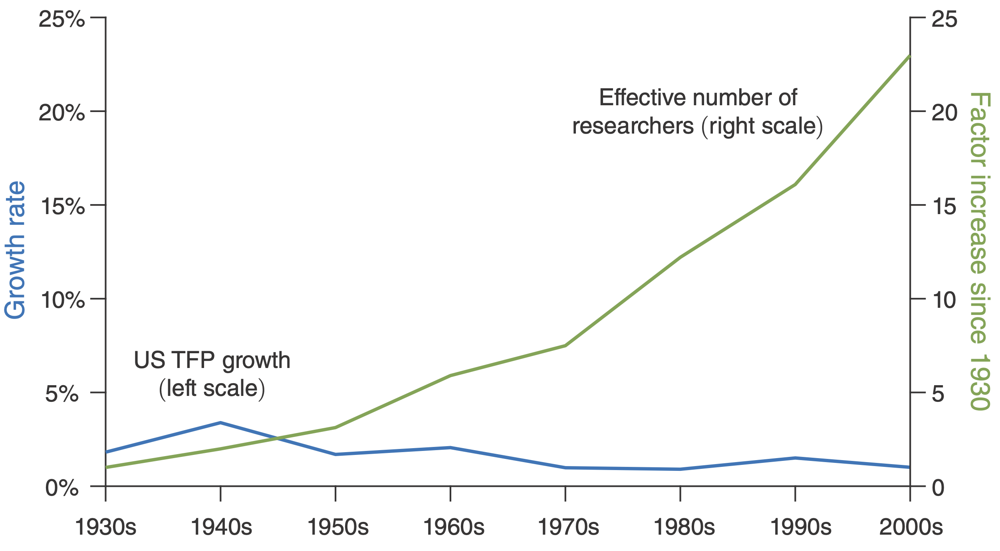
```
]


---


# Economic growth = Number of researchers $\times$ Research productivity

.center-content[
```{r, echo = F, out.width = '60%'}
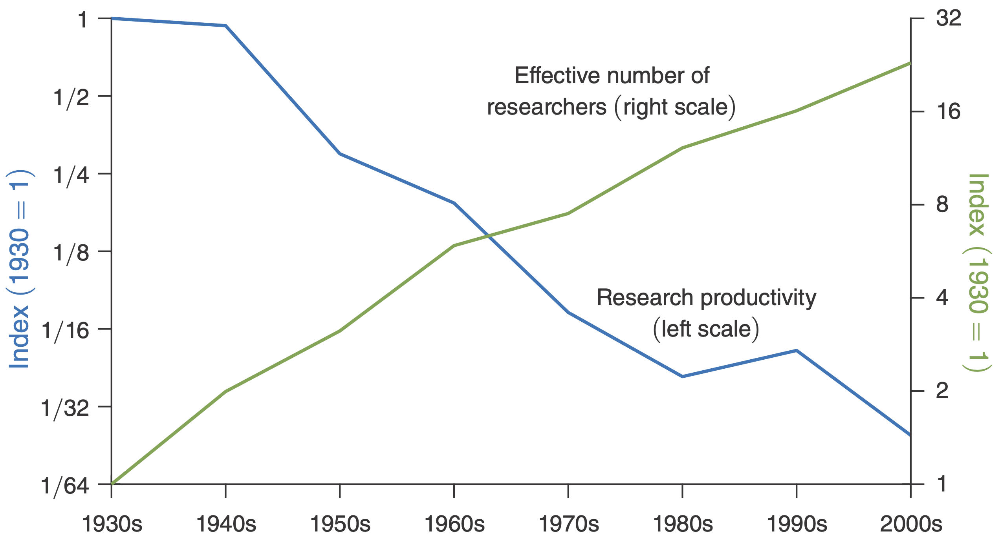
```
]


---


# Moore's Law

.center-content[
```{r, echo = F, out.width = '60%'}
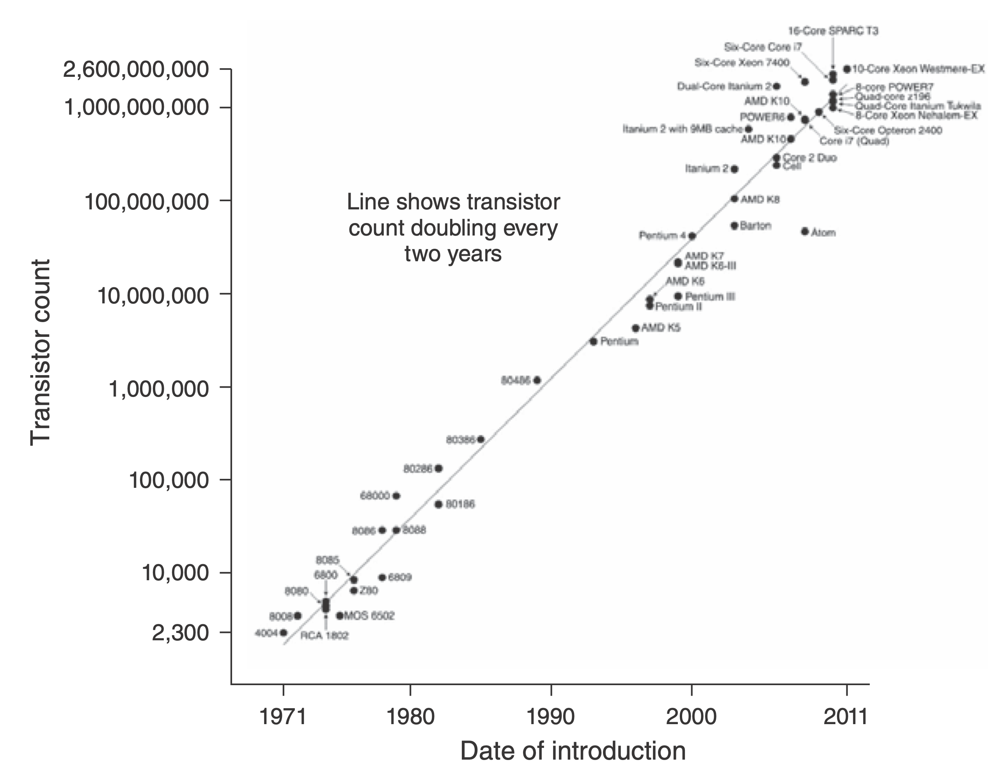
```
]


---


# Growing number of researchers needed to push Moore's Law forward

.center-content[
```{r, echo = F, out.width = '60%'}
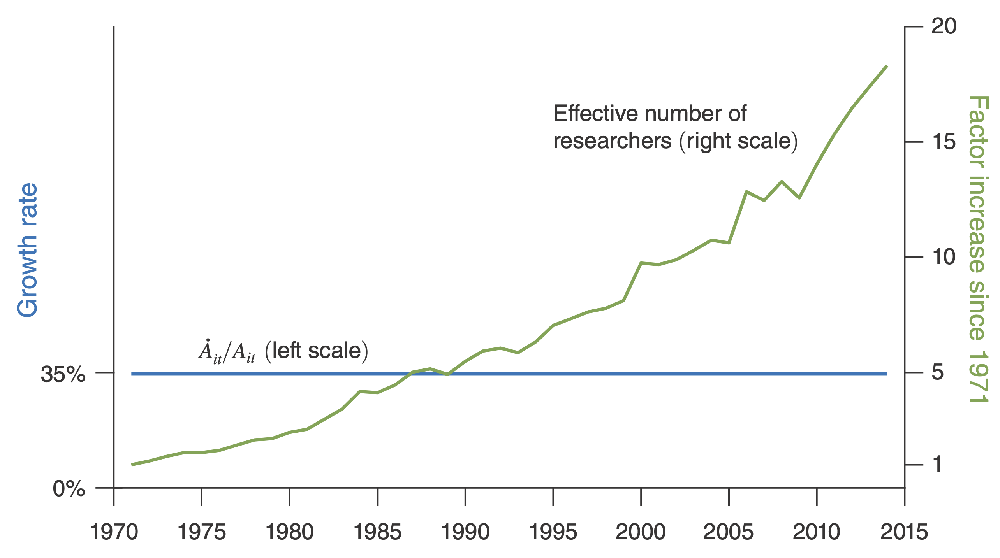
```
]


---
class: inverse, center, middle

<div style="text-align: center; width: 100%;">
  <div style="color: #1A3A68; font-weight: 700; font-size: 42px; line-height: 1.2;">
    Student Presentation
  </div>
  <div style="color: #1A3A68; font-weight: 400; font-size: 32px; line-height: 1.35; margin-top: 18px;">
    "Growth is Getting Harder to Find, Not Ideas"
  </div>
  <div style="color: rgba(26, 58, 104, 0.7); font-weight: 400; font-size: 24px; line-height: 1.35; margin-top: 14px;">
    Fort et al. (2025)
  </div>
</div>

---
class: inverse, center, middle

<div style="text-align: center; width: 100%;">
  <div style="color: #1A3A68; font-weight: 700; font-size: 42px; line-height: 1.2;">
    Student Presentation
  </div>
  <div style="color: #1A3A68; font-weight: 400; font-size: 32px; line-height: 1.35; margin-top: 18px;">
    "The Rising Returns to R&amp;D: Ideas Are Not Getting Harder to Find"
  </div>
  <div style="color: rgba(26, 58, 104, 0.7); font-weight: 400; font-size: 24px; line-height: 1.35; margin-top: 14px;">
    Ando, Bessen &amp; Wang (2025)
  </div>
</div>

---
class: inverse, center, middle

<div style="text-align: center; width: 100%;">
  <div style="color: #1A3A68; font-weight: 700; font-size: 42px; line-height: 1.2;">
    Student Presentation
  </div>
  <div style="color: #1A3A68; font-weight: 400; font-size: 32px; line-height: 1.35; margin-top: 18px;">
    "Artificial Intelligence in Research and Development"
  </div>
  <div style="color: rgba(26, 58, 104, 0.7); font-weight: 400; font-size: 24px; line-height: 1.35; margin-top: 14px;">
    Jones (2025)
  </div>
</div>


---
class: agenda

# Agenda

<ul class="agenda-list">
<li class="done">How do economies grow?</li>
<li class="current">Why did it take so long for sustained growth to materialize?</li>
<li class="upcoming">Why do some countries remain so much richer than others?</li>
<li class="upcoming">Can government policy fuel growth?</li>
</ul>

---


# The hockey stick of progress

.center-content[

  <div style="display: flex; justify-content: center; align-items: center; height: 470px; width: 100%;">
    <iframe src="../../undergraduate/materials/civilizational_progress_long_run.html?hidetabs=1#gdp" width="100%" height="100%" style="border: none; display: block; margin: 0 auto;"></iframe>
  </div>
]

---

# Growth in England pre-1700

.center-content[
  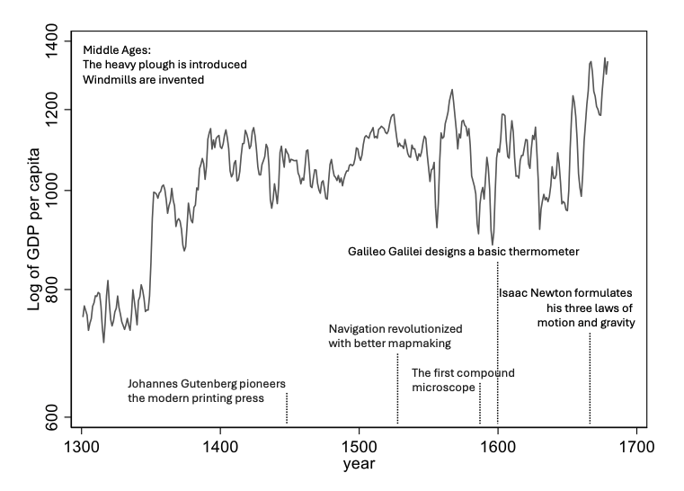
]

.footnote[.small[Source: Nobel Prize background (2025). GDP per capita in Geary-Khamis 1990 dollars; y-axis logarithmic. Data source: Broadberry et al. (2015).]]

---

# Why did technology generate sustained growth only after 1750?

.center-content[
- Major inventions appeared long before modern growth

- But before 1800, they did not generate sustained growth in income per person

- What was missing was continuous follow-on improvement

- Mokyr's question: when do breakthroughs trigger a self-sustaining stream of incremental innovation?
]

---

# The culture of growth <br> .small[<span class="gray">Mokyr (2016)</span>]

.center-content[
- Thinkers such as Bacon and Newton helped shift elite beliefs toward using knowledge to understand and improve nature

- The Republic of Letters (1500–1800): a pan-European network of open publication, criticism, and priority rules that lowered the cost of sharing knowledge

- Political fragmentation limited censorship: a thinker banned in one state could publish in another

- By contrast, China had advanced technology, but greater political unity and a centralized examination system left less room for competing ideas
]

---

# Coffee houses

.center-content[
  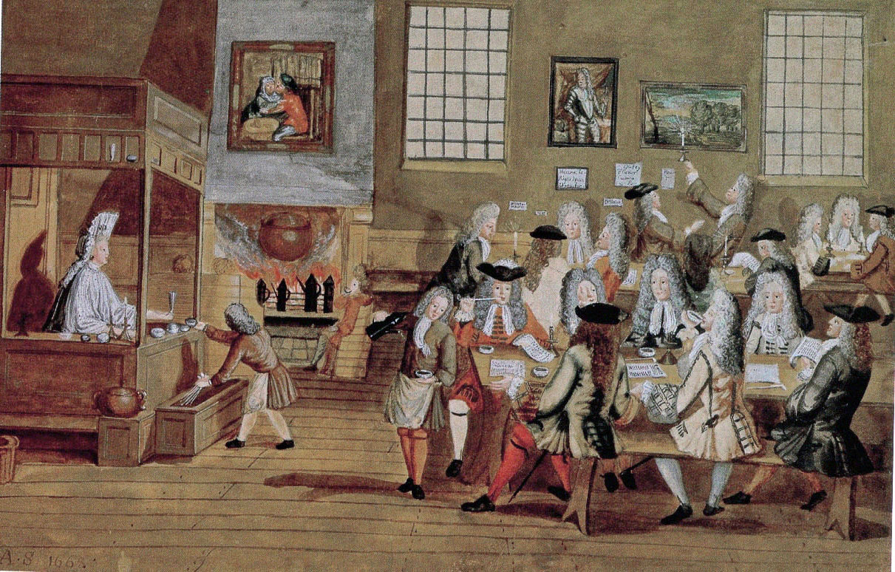
]

---

# Coffee houses

.center-content[
- “British culture was intensely hierarchical and structured. The idea that you could go and sit next to someone as an equal was radical,” says Markman Ellis, author of *The Coffee House: A Cultural History*.

- “One could enter the coffeehouse with a penny, get their cup off coffee, and become part of that day's intellectual discussions. A penny would also grant the patrons access to newspapers. In fact, coffeehouses in Oxford earned a name for becoming ‘penny universities’.”
]

.footnote[.small[Sources: [“Coffeehouses during the Enlightenment,” HIST 139 - Early Modern Europe](https://earlymoderneurope.hist.sites.carleton.edu/items/show/218); [“How Coffee Fueled Revolutions—and Revolutionary Ideas,” *HISTORY*](https://www.history.com/articles/coffee-houses-revolutions)]]

---
name: progress_topics

# Belief in Progress in British Books: Topics by genre (1650-1850) <br> .small[<span class="gray">Almelhem, Iyigun, Kennedy, Rubin (2025)</span>]

.pull-left[
  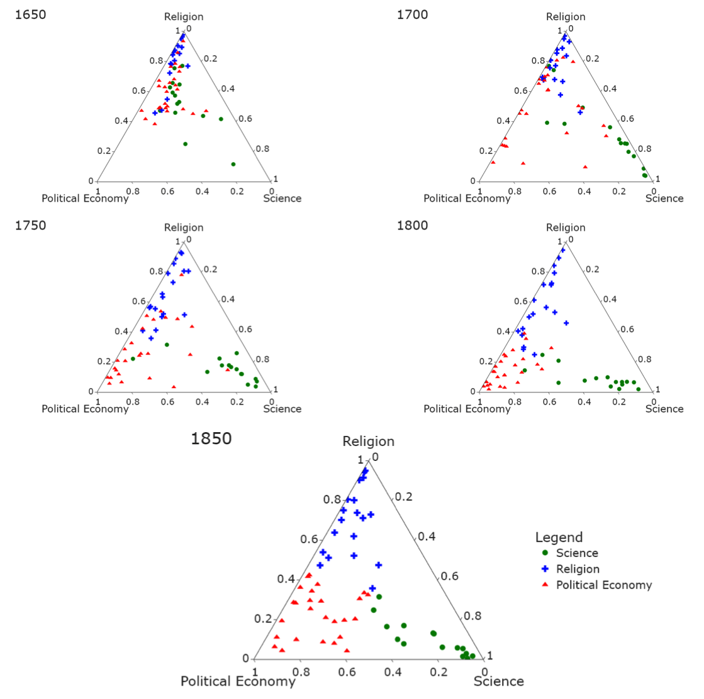
]

.pull-right[
<div style="height: 460px; display: flex; flex-direction: column; justify-content: center; align-items: flex-start; gap: 16px;">
<ul style="font-size: 1.08em; line-height: 1.4; margin: 0; padding-left: 1.1em;">
  <li>After 1700, the corpus becomes more heterogeneous.</li>
  <li>From the mid-18th century, science and religion separate more clearly, while political economy overlaps more with both.</li>
  <li>This shift predates the Industrial Revolution, consistent with Mokyr (2016).</li>
</ul>
<a href="#progress_topics_methodology" class="btn">Methodology</a>
</div>
]

<div style="clear: both;"></div>

---

# Belief in Progress in British Books over time (1500-1900) <br> .small[<span class="gray">Almelhem, Iyigun, Kennedy, Rubin (2025)</span>]

.center-content[
  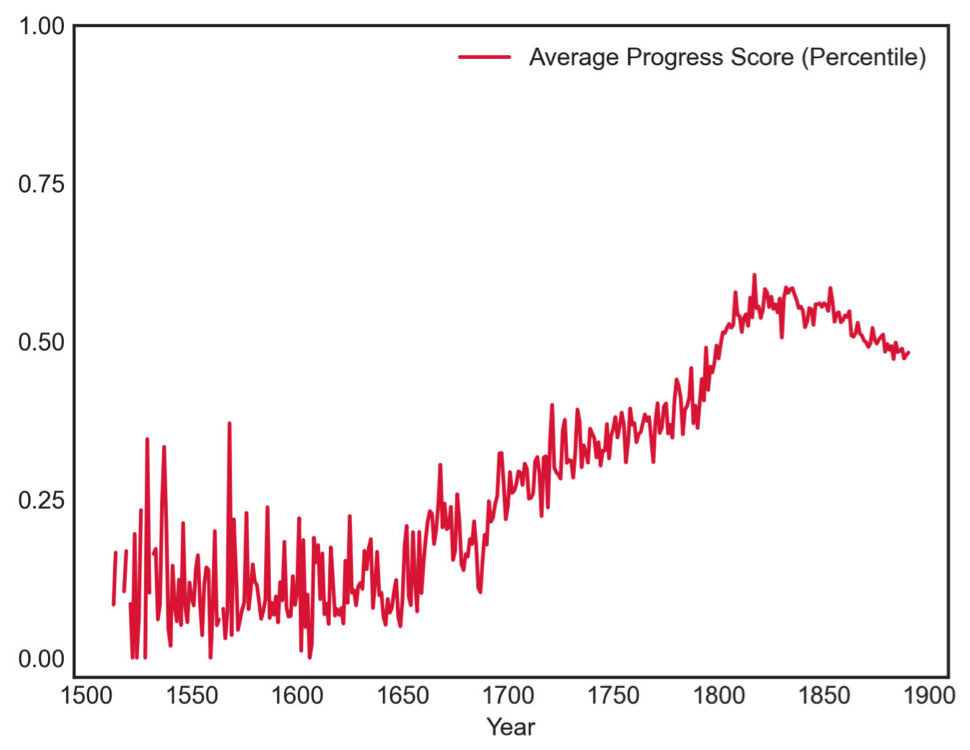
]

---

# Belief in Progress in British Books by Genre (1650-1850) <br> .small[<span class="gray">Almelhem, Iyigun, Kennedy, Rubin (2025)</span>]

.center-content[
  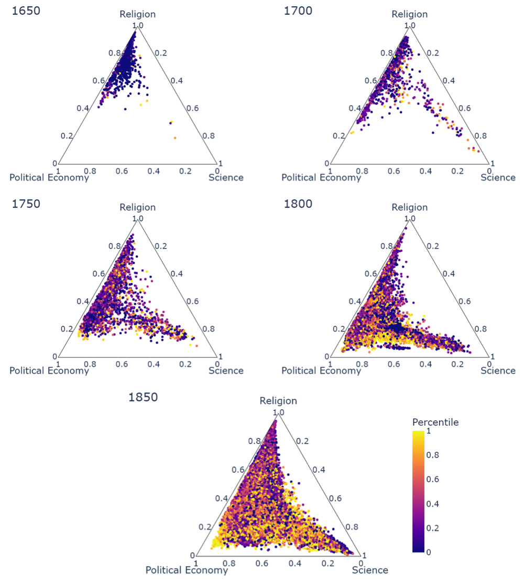
]

---

# **Propositional** ($\Omega$) vs. **prescriptive** ($\lambda$) knowledge <br> .small[<span class="gray">Mokyr (2002), *Gifts of Athena*</span>]

.pull-left[
**Propositional ($\Omega$)**

Why things work: natural laws, theories, regularities

Produced mainly by scientists
]

.pull-right[
**Prescriptive ($\lambda$)**

How to do things: recipes, techniques, designs

Produced mainly by engineers and artisans
]

<div style="clear: both;"></div>

Before the Enlightenment, $\lambda$ rested on a narrow epistemic base (understanding of why methods worked): artisans often knew that a method worked, but not why.

---

# The Industrial Enlightenment: $\Omega \leftrightarrow \lambda$ feedback <br> .small[<span class="gray">Mokyr (2002, 2009)</span>]

.center-content[
- 1660–1800, Europe linked propositional knowledge ($\Omega$) and prescriptive knowledge ($\lambda$) more tightly
  - This was a precondition for the Industrial Revolution, not the Industrial Revolution itself

- More $\Omega$ improved $\lambda$: theory helped artisans diagnose problems and target improvements
  - A broad upper tail of skilled tweakers and implementers turned ideas into working machines, adapting and improving them beyond headline inventors <span class="gray">(Meisenzahl & Mokyr 2012)</span>

- Better $\lambda$ improved $\Omega$: practitioners generated results that refined theory
  - Societies, print, lectures, workshops, and coffeehouses helped connect natural philosophy to upper-tail mechanics who could turn ideas into better machines

- Improvement became cumulative rather than one-off
]

---

# **Macroinventions** vs. **microinventions** <br> .small[<span class="gray">Mokyr (1990), *Lever of Riches*</span>]

.pull-left[
**Macroinventions**

Radical breakthroughs: steam engine, printing press, integrated circuit

One-off, hard to predict, disruptive
]

.pull-right[
**Microinventions**

Incremental refinements: thousands of small improvements to the steam engine, 1769–1900

Turns a breakthrough into sustained growth
]

<div style="clear: both;"></div>

Sustained growth requires a feedback loop between the two. Before 1800, the stream of microinventions was thin and self-limiting because the foundations for systematic improvement were missing.

---

# Other explanations for Britain's takeoff

.center-content[
These are usually best seen as complements to Mokyr, not strict alternatives.


- *High wages.* Made labor-saving mechanization profitable <span class="gray">(Allen 2009)</span>

- *Institutions and state capacity.* Property rights, patents, Parliament, and a capable fiscal state supported investment and experimentation <span class="gray">(North & Weingast 1989; Brewer 1989)</span>

- *Coal, empire, and global markets.* Coal eased energy constraints, while empire and trade provided raw materials and demand <span class="gray">(Wrigley 2010; Pomeranz 2000)</span>

- *Slavery and colonial wealth.* Profits and wealth tied to slavery may have accelerated British industrialization <span class="gray">(Williams 1944; Heblich, Redding & Voth 2022)</span>

- *Agriculture and structural change.* Higher farm productivity released labor and supported urbanization and industrial demand <span class="gray">(Overton 1996)</span>

]

---

# How did sustained growth spread beyond Britain? <br> .small[<span class="gray">Juhász, Sakabe & Weinstein (2025)</span>]

.center-content[
- Codifying technical knowledge in local languages lowered the cost of adopting British industrial technology

- Japan's industrial takeoff in the 1880s–1890s coincided with a state-led effort to translate and codify Western technical knowledge into Japanese

- Industries more exposed to codified British industrial knowledge grew faster in Japan, but not in most of the periphery

- Cultural transmission mattered too: Meiji Japan also imported ideals of "civilization and enlightenment," not just technical manuals <span class="gray">(Ghadimi 2024)</span>

Diffusion required not just trade or imported machines, but readable, teachable knowledge and a broader culture of useful knowledge.
]


---
class: agenda

# Agenda

<ul class="agenda-list">
<li class="done">How do economies grow?</li>
<li class="done">Why did it take so long for sustained growth to materialize?</li>
<li class="current">Why do some countries remain so much richer than others?</li>
<li class="upcoming">Can government policy fuel growth?</li>
</ul>

---

# The great divergence

.center-content[
  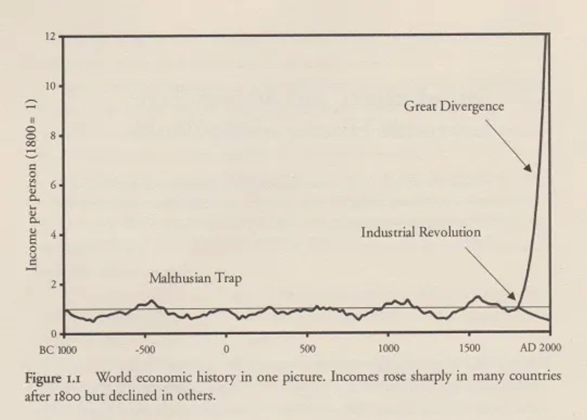
]

---

# Social Infrastructure as the Fundamental Cause <br> .small[<span class="gray">Hall & Jones (1999)</span>]

.center-content[
- Levels accounting: the productivity residual explains much more of income gaps than capital or schooling
    - Richest vs. poorest: capital contributes 1.8x, human capital 2.2x, productivity 8.3x

- That residual is productivity, not social infrastructure

- Hall and Jones argue that social infrastructure is the fundamental cause
    - Institutions and policies shape incentives for production rather than extraction
]

---

# Identification, results, and caveats <br> .small[<span class="gray">Hall & Jones (1999)</span>]

.center-content[
- Social infrastructure is measured with anti-diversion policies and openness to trade
    - Low extraction: law and order, low corruption, low expropriation risk

- They instrument with distance from the equator, predicted trade share, and the share speaking English or another European language
    - Logic: Western European influence spread production-friendly institutions

- Main result: countries with better social infrastructure have much higher output per worker

- Main caveat: language shares are themselves outcomes of colonization and settlement
    - The same forces that shaped settlement could also affect income directly

- This motivates <span class="gray">Acemoglu, Johnson & Robinson (2001)</span>: use settler mortality rather than language as the instrument
]

---

# The Colonial Origins of Comparative Development <br> .small[<span class="gray">Acemoglu, Johnson & Robinson (2001)</span>]

.center-content[
- Question: do institutions cause prosperity?

- Problem: institutions are endogenous
    - Rich countries may choose better institutions
    - Geography or culture may affect both institutions and income

- Strategy: use colonial history to isolate institutional variation
    - A sharper version of the Hall-Jones argument
]

---

# Settler Mortality as an Instrument <br> .small[<span class="gray">Acemoglu, Johnson & Robinson (2001)</span>]

.center-content[
- Core idea: settler mortality affected settlement, settlement affected institutions, and institutions persisted

- Two types of colonies:
    1. Settler colonies (low mortality): Replicated European institutions (property rights, checks on government)
    2. Extractive colonies (high mortality): Set up extractive institutions (forced labor, expropriation)

- Exclusion restriction: settler mortality affects income only through institutions
    - Main threats: persistent disease, selection, population composition
]

---

# Results: Institutions have a large causal effect on income <br> .small[<span class="gray">Acemoglu, Johnson & Robinson (2001)</span>]

.center-content[
- First stage: higher settler mortality predicts weaker institutions today
    - In particular, less protection against expropriation

- Second stage: institutions have a large causal effect on income

- The result survives controls for geography, religion, and colonizer

- Once institutions are instrumented, geography explains much less
]

---

# Critique and reply: Settler mortality data <br> .small[<span class="gray">Albouy (2012); Acemoglu, Johnson & Robinson (2012)</span>]

.center-content[
- Only 28 of 64 countries have mortality data from settlers or soldiers in that colony

- The other 36 are imputed from nearby countries, other periods, or brief campaigns
    - Many African observations come from short expeditions, not long-run settler conditions

- Albouy argues that dropping the weakest observations weakens the first stage and makes IV estimates fragile

- AJR reply: Albouy drops too much of Latin America and Africa, miscoded a campaign dummy, and overstates the role of outliers

- The dispute has not been fully resolved because the mortality series is still thin and heterogeneous for much of the sample
]

---

# Critique: Human capital, not institutions <br> .small[<span class="gray">Glaeser, La Porta, Lopez-de-Silanes & Shleifer (2004)</span>]

.center-content[
- Settlers may have brought human capital, not just institutional blueprints
    - Settler mortality predicts schooling as well as institutions

- The institutional measure is a policy outcome, not a durable constraint
    - Expropriation risk can change quickly
    - Using constitutional constraints weakens the result

- East Asia is a challenge: South Korea, Taiwan, and Singapore grew before institutions improved
    - Early takeoff often came via authoritarian states: land reform, mass schooling, export discipline, and industrial policy, not liberal rule-of-law reforms

- Is the institutions-vs-human-capital debate partly a false dichotomy?
    - Britain's human-capital edge was itself shaped by institutions like the Poor Law (local poor relief that also supported schooling and apprenticeship), apprenticeship, and schools
]

---

# Takeaway: Institutions matter for growth

.center-content[
- AJR remains among the most important papers in this literature <span class="gray">Nobel (2024)</span>

- Broad conclusion: institutions matter for development

- But identification is less airtight than it seemed in 2001
    - <span class="gray">Albouy (2012):</span> Mortality data unreliable for over half the sample
    - <span class="gray">Glaeser et al. (2004):</span> Settler mortality predicts human capital just as well

- Separating institutions from human capital, geography, and disease remains difficult
]

---
class: agenda

# Agenda

<ul class="agenda-list">
<li class="done">How do economies grow?</li>
<li class="done">Why did it take so long for sustained growth to materialize?</li>
<li class="done">Why do some countries remain so much richer than others?</li>
<li class="current">Can government policy fuel growth?</li>
</ul>

---
class: inverse, center, middle

<div style="text-align: center; width: 100%;">
  <div style="color: #1A3A68; font-weight: 700; font-size: 42px; line-height: 1.2;">
    America, Jump-Started:<br>World War II R&amp;D and the Takeoff of the US Innovation System
  </div>
  <div style="color: rgba(26, 58, 104, 0.7); font-weight: 400; font-size: 26px; line-height: 1.35; margin-top: 16px;">
    Gross &amp; Sampat (2023)
  </div>
</div>

---

# Motivation <br> .small[<span class="gray">Gross & Sampat (2023)</span>]

.center-content[
- Can concentrated government R&D investment create lasting growth?

- WWII created the largest R&D shock in US history up to that point
  - Before 1940, the federal government did little R&D outside agriculture
  - 1940-45: the Office of Scientific Research and Development (OSRD) signed more than 2,250 R&D contracts with firms and universities
  - OSRD spent about $9 billion in today's prices and backed about 1 in 8 US patents at the wartime peak

- Did this temporary shock reshape the U.S. innovation system?
]

---

# WWII and the rise of US public R&D <br> .small[<span class="gray">Gross & Sampat (2023)</span>]
.center-content[
```{r, echo = F, out.width = '51%'}
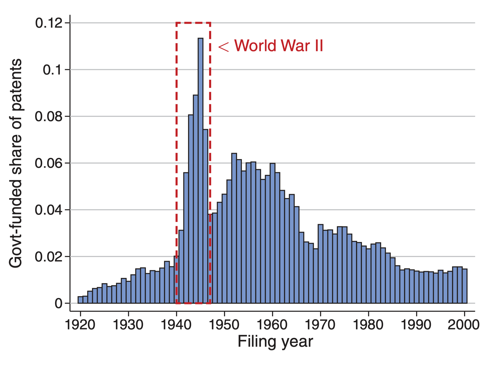
```
]

---

# OSRD innovations
.center-content[
```{r, echo = F, out.width = '78%'}

```
]

---

# Preview of findings <br> .small[<span class="gray">Gross & Sampat (2023)</span>]
.center-content[
- WWII catalyzed the takeoff of tech. clusters across the US
  - By 1970: Top quartile of treated clusters producing 50% more patents rel. to untreated clusters
  - No pre-trends
- Sustained impacts driven by Marshallian dynamics (clusters become self-reinforcing)
  - Possible mechanisms: sharing (local assets), matching (local labor and capital markets), learning (knowledge spillovers)
  - Versus: continued gov. funding (non-gov. patenting also rises), OSRD contractors patenting more (can drop them), or follow-ons to OSRD inventions (drop citing patents)
- These changes brought local industrial employment growth and firm creation in related high-tech industries
- Large, lasting effects on the direction of US invention (esp. towards electronics & communications)
]

---
# Data and empirical strategy <br> .small[<span class="gray">Gross & Sampat (2023)</span>]
.center-content[
- Digitized the full archive of OSRD contracts, inventions, and patents

- Linked to U.S. patent data (1920-1979), County Business Patterns (CBP), Dun & Bradstreet (D&B), and National Science Foundation records

- Empirical unit: county $\times$ technology field

- Compare patenting in more- and less-exposed clusters before and after WWII

$$\log(\text{Patents})_{ict} = \sum_t \beta_t \cdot \log(\text{OSRD Rate})_{ic} \cdot \text{Year}_t + \alpha_{ic} + \delta_t + \varepsilon_{ict}$$

- $i$: county, $c$: patent category, $t$: year

- OSRD rate: the 1941-48 share of patents in a county-technology cluster that were funded by OSRD
]

---

# Illustration: Middlesex County, MA <br> .small[<span class="gray">Gross & Sampat (2023)</span>]
.center-content[
```{r, echo = F, out.width = '76%'}
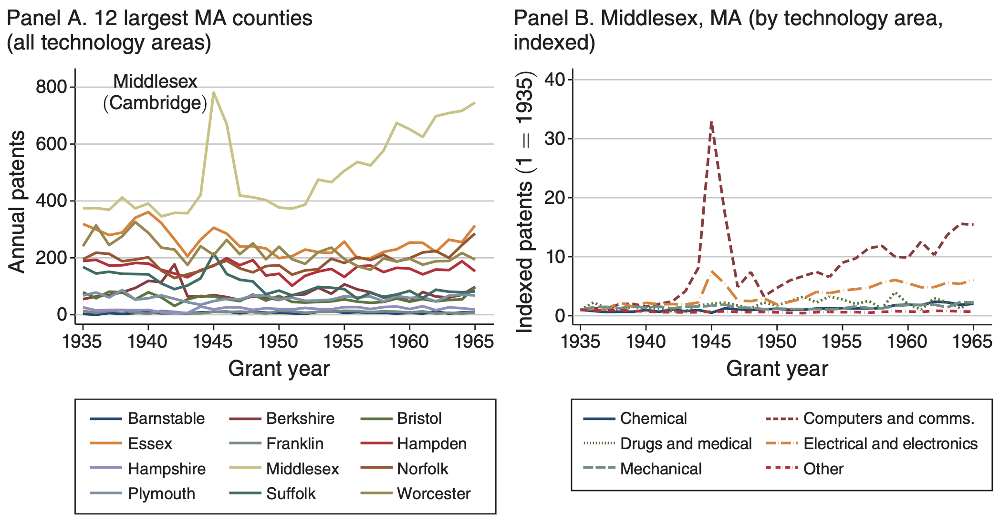
```
]

---

# Postwar innovation takeoff <br> .small[<span class="gray">Gross & Sampat (2023)</span>]
```{r, echo = F, out.width = '50%'}
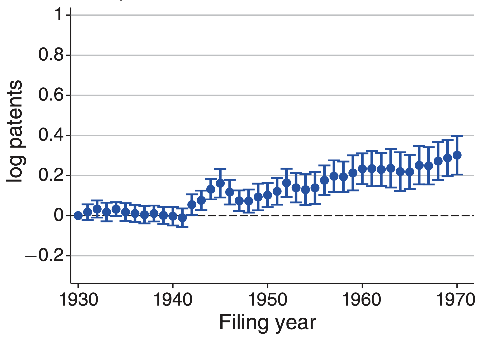
```

- Treated clusters: +30% more patents by 1970

- No pre-trends; results hold excluding OSRD and government patents

---

# Identification Concerns <br> .small[<span class="gray">Gross & Sampat (2023)</span>]
.center-content[
- Funding choices may be endogenous
    - Response: treated and untreated clusters had different levels but not trends before the war
    - Response: OSRD prioritized wartime military needs, not postwar commercial potential

- Other wartime shocks could still matter
    - Response: they compare high- and low-OSRD technologies within the same county
    - Response: controls for postwar government R&D do not remove the effect

- Spillovers mean the estimates are not purely isolated treatment effects
    - Response: cross-technology effects are strongest in related fields and fade with technological distance
]

---

# Effects concentrated in existing clusters <br> .small[<span class="gray">Gross & Sampat (2023)</span>]
```{r, echo = F, out.width = '85%'}
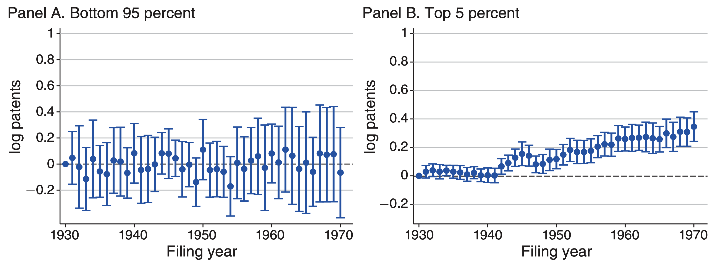
```

- Effects are concentrated in counties that were already highly inventive before WWII

- OSRD amplified existing clusters more than it created new ones

---

# Not driven by OSRD patents <br> .small[<span class="gray">Gross & Sampat (2023)</span>]
.center-content[
```{r, echo = F, out.width = '51%'}
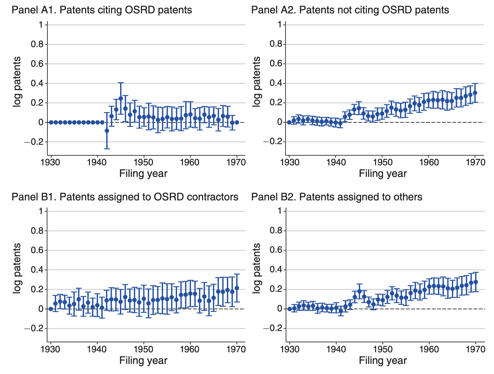
```

- The long-run effect remains after excluding OSRD patents and other government patents
]

---

# Not explained by continued government R&D <br> .small[<span class="gray">Gross & Sampat (2023)</span>]
.center-content[
```{r, echo = F, out.width = '85%'}
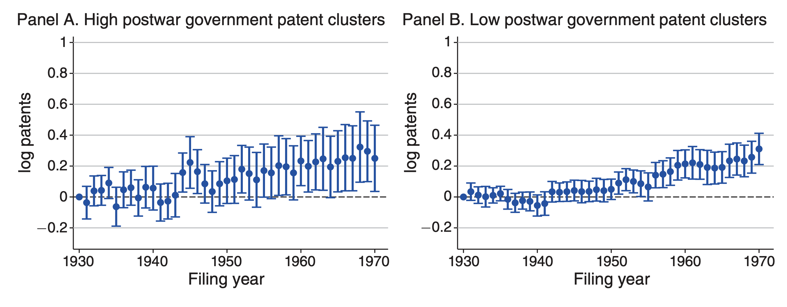
```

- Similar effects appear in places with high and low postwar government patenting
]

---

# US vs. foreign patenting: pre-1940 vs. post-1945 <br> .small[<span class="gray">Gross & Sampat (2023)</span>]
.center-content[
```{r, echo = F, out.width = '60%'}
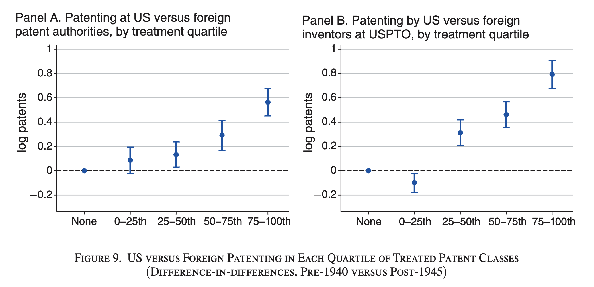
```

- US patenting in most heavily treated classes rises >50% postwar than in other countries

- Effect attenuates in magnitude and significance as treatment intensity declines
]

---

# What we learn <br> .small[<span class="gray">Gross & Sampat (2023)</span>]
.center-content[
- A temporary R&D shock can have long-run effects

- The effect mainly amplified places that were already inventive

- The mechanism was agglomeration: denser local sharing, matching, and learning
]


---


# Critique of patents as a proxy for innovation

.center-content[
- Patents are detailed and widely available across time and space

- But they are an imperfect measure of innovation

- Many inventions are never patented, and many patents are never economically important
    - Fewer than half of inventions are patented; many patents lapse early

- Patenting behavior varies across industries, firms, legal regimes, and countries

- Patent counts and productivity are often weakly correlated in the short run <span class="gray">(Ribeiro 2025)</span>

- Better measures focus on higher-value or more novel patents
    - Triadic patents: the same invention filed at the USPTO, EPO, and JPO <span class="gray">(OECD 2009)</span>
    - Citation-weighted patents <span class="gray">(Hall, Jaffe & Trajtenberg 2005)</span>
    - New technical terms in patent text <span class="gray">(Kalyani 2024)</span>
    - Stock-market responses to patent news <span class="gray">(Kogan et al. 2017)</span>

- Even so, patent-based and non-patent-based studies often reach similar broad conclusions

.footnote[.small[Source: [Matt Clancy's "What's New Under the Sun"](https://www.newthingsunderthesun.com/pub/6skgk0ij/release/2)]]
]

---

# Lightning paper: Timeline

.center-content[
- ~~Week 1: Choose your paper (& potential collaborator)~~
- ~~Weeks 2-3: Replication~~
- Week 4-5: Finalize extension question & background research
- Weeks 5-6: Implement extension
- Week 7: Finalize & analyze results
- Week 8: Prepare presentation
- Weeks 9-10: Presentations
]

---

class: inverse, middle

# Appendix

---

name: progress_topics_methodology

# Methodology <br> .small[<span class="gray">Almelhem, Iyigun, Kennedy, Rubin (2025)</span>]

.center-content[
- **Corpus:** 264,443 books printed in England, 1500-1900.

- **Topics:** each book is treated as a bundle of words; 60 topics are clusters of words that often appear together.

- **Triangle:** each topic gets a religion, science, and political economy share; those three shares determine its position.

- **Example:** an architecture topic can move from church, divine, temple language toward stone, steel, load, structure language.

- **Important:** position is year-specific, but the dot's color and label reflect the topic's 1850 classification.

<a href="#progress_topics" class="btn btn-back">Back</a>
]
