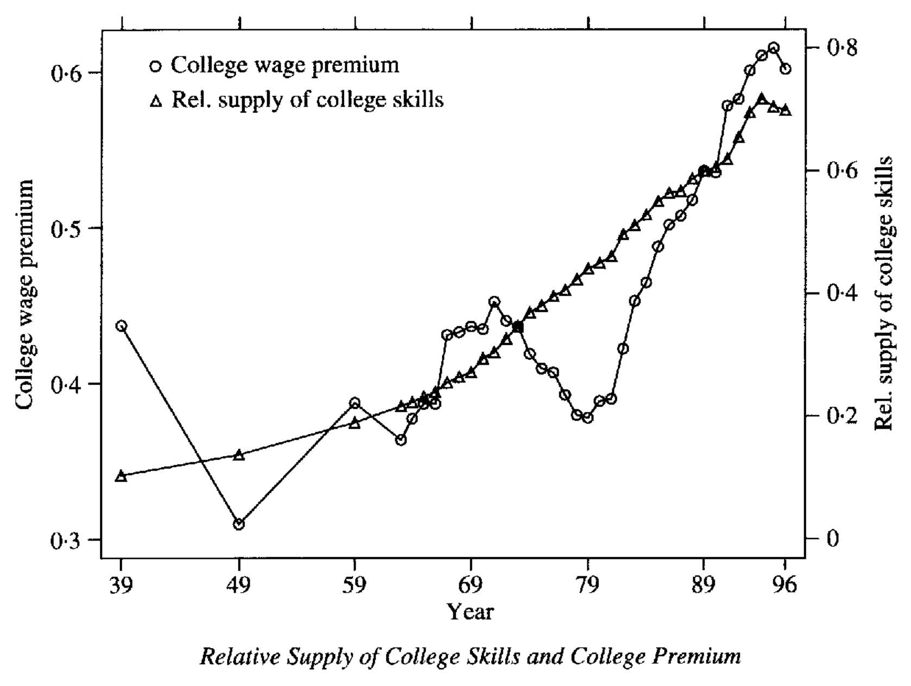
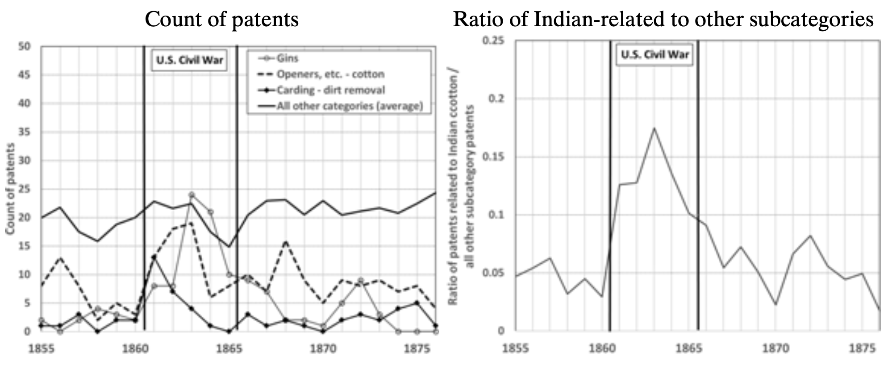
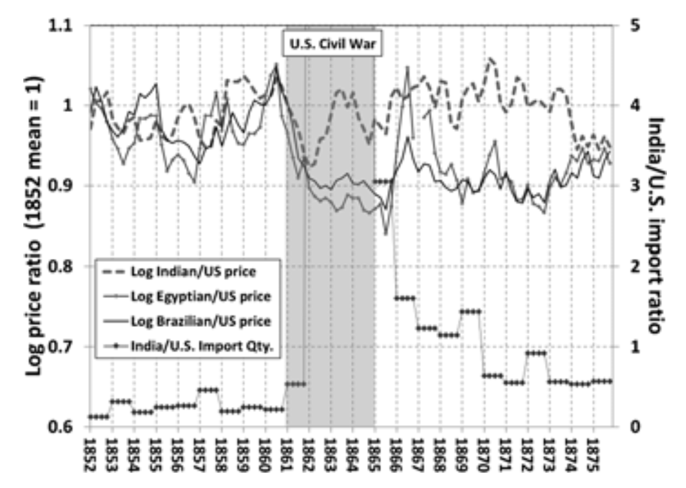
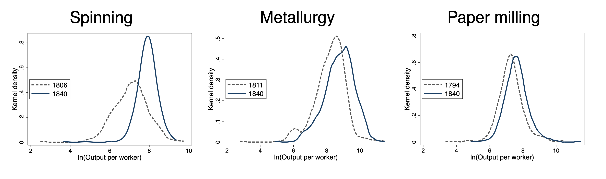
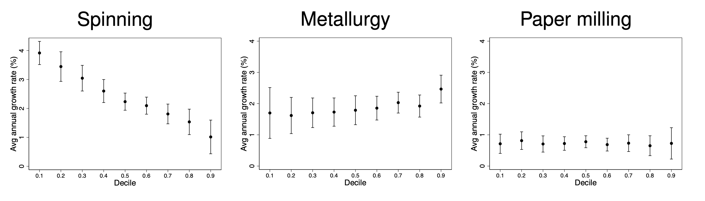
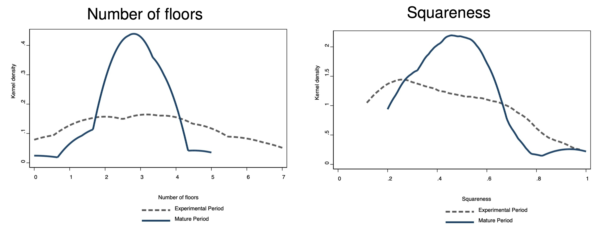

```{r, setup, include = F}
library(knitr)
opts_chunk$set(
  comment = "#>",
  fig.align = "center",
  fig.height = 7,
  fig.width = 10.5,
  warning = F,
  message = F
)
```

class: agenda

# Agenda

<ul class="agenda-list">
<li class="current">Theory of directed technological change</li>
<li class="upcoming">Empirical evidence on the direction of innovation</li>
<li class="upcoming">Technology diffusion</li>
</ul>

---
class: inverse, center, middle

<div style="text-align: center; width: 100%;">
  <div style="color: #1A3A68; font-weight: 700; font-size: 42px; line-height: 1.2;">
    Directed Technical Change
  </div>
  <div style="color: rgba(26, 58, 104, 0.7); font-weight: 400; font-size: 26px; line-height: 1.35; margin-top: 16px;">
    Acemoglu (2002)
  </div>
</div>

---

# The direction of innovation <br> .small[<span class="gray">Acemoglu (2002)</span>]

.center-content[
- So far: *neutral* technical change (productivity $\uparrow$ across inputs)

- Real-world change is often *directed* to favor some factors
  - *Nineteenth century:* factory tech displaced skilled artisans (low-skill-biased)
  - *Twentieth century:* computers, software, automation complement skilled labor (high-skill-biased)

- Technical change can be "directed" toward specific factors of production (skilled labor, unskilled labor, capital)
]

---

# Skill-biased technical change

.center-content[
```{r, echo = F, out.width = '60%'}

```

.center[Despite rising supply of college-educated workers, the wage premium has risen]
]

---
# Two forces shaping the direction of R&D <br> .small[<span class="gray">Acemoglu (2002)</span>]

.center-content[
Innovators compare the profitability of improving technologies used with different factors.

- *Price effect.* A scarce factor is expensive, so improving the technology used with it is valuable per user
  - Pushes R&D toward technologies used with the scarce factor

- *Market size effect.* An abundant factor has many users, so improving the technology used with it has a larger market
  - Pushes R&D toward technologies used with the abundant factor

- The direction of R&D depends on which force is stronger
]

---

# Elasticity of substitution and the direction of R&D <br> .small[<span class="gray">Acemoglu (2002)</span>]

.center-content[
- $\sigma$ measures how easily one factor substitutes for another in production

- $\sigma$ determines whether the market-size effect or the price effect dominates

- If $\sigma > 1$ (factors are good substitutes):
  - Market-size effect dominates
  - R&D is directed toward technologies used with the *more abundant* factor

- If $\sigma < 1$ (factors are strong complements):
  - Price effect dominates
  - R&D is directed toward technologies used with the *scarcer* factor

- If $\sigma = 1$ (Cobb-Douglas):
  - Relative factor supplies do not affect the direction of R&D
]

---

# Direction of R&D vs. induced bias <br> .small[<span class="gray">Acemoglu (2002)</span>]

.center-content[
Two distinct questions:
  - *Direction of R&D:* whose technology gets improved ($A_H$ vs. $A_L$)?
  - *Bias of technical change:* whose *relative demand / reward* rises?

- *Weak induced bias* (any $\sigma \ne 1$):
  - If a factor becomes more abundant, technical change shifts relative demand *toward* that factor
  - If $\sigma < 1$, this can occur via R&D directed at the *other* factor (complements share the gain)

- *Strong induced bias:*
  - If $\sigma$ is high enough, the induced demand shift more than offsets the supply increase
  - Relative reward of now-more-abundant factor *rises*; long-run relative demand can slope upward

]

---

# Graphical intuition <br> .small[<span class="gray">Acemoglu (2002)</span>]

.center-content[
  <div style="display: flex; justify-content: center; align-items: center; height: 500px; width: 100%;">
    <iframe src="../materials/directed_tech_change.html" width="100%" height="100%" style="border: none; display: block; margin: 0 auto;"></iframe>
  </div>
]

---


# Induced automation innovation <br> .small[<span class="gray">Hémous, Olsen, Zanella, Dechezleprêtre (2025)</span>]

.center-content[
- Do higher wages induce firms to invent more automation technologies?

  - Use patent text to identify automation patents within machinery patents *(technology classes with unusually many words like `robot`, `automation`, or `CNC`)*  
  - Relate firms’ automation innovation to wages in the downstream markets they serve

- Findings:
  - Higher low-skill wages increase automation innovation strongly (elasticity: 2 to 5)
  - Higher high-skill wages tend to reduce automation innovation
  - The effect is specific to automation, not innovation in general

]

---
class: agenda

# Agenda

<ul class="agenda-list">
<li class="done">Theory of directed technological change</li>
<li class="current">Empirical evidence on the direction of innovation</li>
<li class="upcoming">Technology diffusion</li>
</ul>

---
class: inverse, center, middle

<div style="text-align: center; width: 100%;">
  <div style="color: #1A3A68; font-weight: 700; font-size: 42px; line-height: 1.2;">
    Necessity is the Mother of Invention:<br>Input Supplies and Directed Technical Change
  </div>
  <div style="color: rgba(26, 58, 104, 0.7); font-weight: 400; font-size: 26px; line-height: 1.35; margin-top: 16px;">
    Hanlon (2015)
  </div>
</div>

---

# Motivation and research question <br> .small[<span class="gray">Hanlon (2015)</span>]

.center-content[
- Directed technical change theories predict:
  1. Shocks to relative input supplies shift the direction of innovation
  2. Strong induced bias: innovation raises demand for the expanding input $\Rightarrow$ price $\uparrow$

- Limited empirical evidence for either prediction

- Uses the US Civil War (1861–65) as an input supply shock for British cotton
  - Switch from US to Indian cotton $\Rightarrow$ directs innovation in textile machinery
]

---

# Historical setting <br> .small[<span class="gray">Hanlon (2015)</span>]

.center-content[
- Before 1861: cotton was Britain's largest manufacturing sector; 77% of imports from US, 17% from India

- Civil War shock: Union blockade cuts US exports $\Rightarrow$ British imports fall ~50%; mills turn to Indian cotton

- Indian cotton: shorter fibers, dirtier, harder to gin $\Rightarrow$ existing machines poorly suited
]

---

# Data and measurement <br> .small[<span class="gray">Hanlon (2015)</span>]

.center-content[
- *Patents (1855–1876).* British Patent Office, 146 categories; focus on *Preparation & Spinning*
  - Treatment: technology for Indian cotton (gins, openers/scutchers, carders)
  - Quality proxies: 3-year renewal, journal mentions

- *Machine producer order books.* Document commercial adoption of new technologies

- *Waste rates.* Productivity proxy

- *Cotton prices and imports.* <span class="gray">The Economist 1852–75</span>
]

---

# Empirical strategy: Direction of innovation <br> .small[<span class="gray">Hanlon (2015)</span>]

.center-content[
- Difference-in-differences on patent counts:
$$\log(\text{Patents}_{jt}) = a + b\cdot(\underset{\text{"Pre vs. post"}}{\text{Civil War}_t} \times \underset{\text{"Control vs. treated"}}{\text{India Tech}_j)} + w_j + o_t + e_{jt}$$

  - Machinery type is indexed by $j$
  - Identifying assumption: absent the shock, Indian-cotton technologies follow similar trends as other textile technologies

- Year-by-year effects:
$$\log(\text{Patents}_{jt}) = \alpha + \sum_{k=1859}^{1875} \beta_k (\text{Year}_k \times \text{India Tech}_j) + \Psi_j + \phi_t + \varepsilon_{jt}$$
]

---

# Empirical strategy: Strong induced bias <br> .small[<span class="gray">Hanlon (2015)</span>]

.center-content[
- Relative price regressions:
$$\text{Relative price}_{jt} = \alpha + \sum_{k=1859}^{1875} \gamma_k \, (\text{Year}_k \times \text{Indian cotton}_j) + \eta_j + \phi_t + Q_t + \varepsilon_{jt}$$

  - Relative price: cotton $j\in\{\text{India, Brazil, Egypt}\}$ vs. US; $Q_t$: quarter FE
  - Brazil and Egypt: also more abundant but little innovation (counterfactual)
]

---

# Results: Directed technical change <br> .small[<span class="gray">Hanlon (2015)</span>]

.center-content[
- Sharp rise in Indian-related patenting during Civil War: ~113% vs. other prep/spin categories
  - Starts 1861, peaks 1863, declines after

- Machine producers: Dobson & Barlow introduced 4 new gin types in 4 years; filings align with models

- Waste in spinning Indian cotton fell 19–30% (1862–68), likely from improved fiber cleaning
]

---

```{r, echo = F, out.width = '90%'}

```

---

# Results: Strong induced bias <br> .small[<span class="gray">Hanlon (2015)</span>]

.center-content[
- Indian/US relative price fell sharply in 1861–62

- Rebounded to pre-war levels by late 1862 despite abundance; remained high through early 1870s

- Counterfactual: Brazilian and Egyptian prices stayed low

- Demand shifts toward Indian cotton via tech change
]

---

```{r, echo = F, out.width = '65%'}

```

---
class: agenda

# Agenda

<ul class="agenda-list">
<li class="done">Theory of directed technological change</li>
<li class="done">Empirical evidence on the direction of innovation</li>
<li class="current">Technology diffusion</li>
</ul>

---

# The Solow paradox

.center-content[
- In 1987, Solow quipped:

  > "You can see the computer age everywhere but in the productivity statistics."

- Computers had been commercial for over two decades, yet productivity growth was *slowing*

- Explanations:
  1. Productivity increases may be difficult to measure
  2. For gains to materialize, new technologies may require
      - Human capital investments
      - Organizational adaptation 
  3. Technologies may diffuse slowly
]

---

# Productivity J-curve <br> .small[<span class="gray">Brynjolfsson, Rock & Syverson (2021)</span>]

.center-content[
- GPT adopters invest in unmeasured *intangible capital* — reorganizing processes, retraining workers, building complementary systems

- National accounts don't count these as investment $\rightarrow$ diverted resources look like waste $\rightarrow$ measured TFP *falls* even as true productivity rises

- Later, accumulated intangibles generate output that appears as "free" productivity $\rightarrow$ measured TFP *overstates* true gains

- Net error traces a J-curve: understatement, then overstatement, then convergence

- Adjusting for software intangibles alone, US TFP was 15.9% higher than official statistics by 2017

- Prediction: AI adoption will initially *slow* measured productivity growth
]


---

# Technology adoption lags across 166 countries <br> .small[<span class="gray">Comin & Hobijn (2010)</span>]

.center-content[
- Average adoption lag between invention and widespread use: 45 years

- Lags are enormous and persistent

- Predictors of faster adoption: higher income, trade openness, human capital, institutional quality

- Technologies are adopted in clusters of complementary technologies, not in isolation
]


---

# Historical diffusion case studies <br> .small[<span class="gray">Comin & Hobijn (2010)</span>]

.center-content[
| Technology | Invention | Widespread adoption | Lag |
|:-----------|:----------|:-------------------|:----|
| Spinning jenny | 1764 | ~1800–1830 | 35–65 years |
| Steam engine (Watt) | 1769 | ~1830–1850 | 60–80 years |
| Electricity | 1882 | ~1920–1940 | 40–60 years |
| Assembly line | 1913 | ~1930–1950 | 17–37 years |
| Computers | 1950s | ~1990–2000 | 30–40 years |
| Internet | 1991 | ~2005–2015 | 14–24 years |

]

---

# The diffusion of new technologies <br> .small[<span class="gray">Kalyani, Bloom, Carvalho, Hassan, Lerner & Tahoun (2025)</span>]

.center-content[
- Text analysis of 3M US patents, 51M job postings, earnings calls (1976–2014) identifies 1,899 novel technology phrases; tracks geographic and occupational diffusion

- *Innovation is hyper-concentrated.* 56% of economically impactful technologies originate in 5 urban areas (Silicon Valley + Northeast Corridor)

- *Diffusion is slow* ($\approx$ 50 years). High-skill jobs stay clustered near pioneers for decades; low-skill jobs spread faster as technologies mature

- *Skill bias persists but declines.* Early jobs: 57% require college; mean skill falls ~23 pp/yr; standardization (not training) drives skill broadening

- Pioneer locations retain advantages for generations
]

---
class: inverse, center, middle

<div style="text-align: center; width: 100%;">
  <div style="color: #1A3A68; font-weight: 700; font-size: 42px; line-height: 1.2;">
    Student Presentation
  </div>
  <div style="color: #1A3A68; font-weight: 400; font-size: 32px; line-height: 1.35; margin-top: 18px;">
    "Innovation Networks in the Industrial Revolution"
  </div>
  <div style="color: rgba(26, 58, 104, 0.7); font-weight: 400; font-size: 24px; line-height: 1.35; margin-top: 14px;">
    Rosenberger, Hanlon &amp; Hallmann (2026)
  </div>
</div>

---

# Complementary reorganization as the bottleneck <br> .small[<span class="gray">David (1990)</span>]

.center-content[
- The computer productivity paradox mirrors the earlier case of electrification

- Electricity was available by the 1880s, but large factory productivity gains came only decades later

- The delay was not just slow adoption of electric motors
  - Factories first had to reorganize how production was organized around the new technology
  - Key shift was from factories powered by one central engine (*group drive*) to factories where individual machines had their own electric motors (*unit drive*)

]

---
class: inverse, center, middle

<div style="text-align: center; width: 100%;">
  <div style="color: #1A3A68; font-weight: 700; font-size: 42px; line-height: 1.2;">
    Technology Adoption and Productivity Growth:<br>Evidence from Industrialization in France
  </div>
  <div style="color: rgba(26, 58, 104, 0.7); font-weight: 400; font-size: 26px; line-height: 1.35; margin-top: 16px;">
    Juhász, Squicciarini &amp; Voigtländer (2024)
  </div>
</div>

---

# Framing <br> .small[<span class="gray">Juhász, Squicciarini & Voigtländer (2024)</span>]

.center-content[
- Diffusion lags, organizational adaptation, and the J-curve all suggest adoption is costly

- <span class="gray">David (1990):</span> electrification took 40 years to boost productivity because factories had to be redesigned from the ground up

- This paper: plant-level data from French cotton spinning during the Industrial Revolution

- Aggregate productivity gains came from reorganization, not uniform improvement — and took decades of trial-and-error
]

---

# Setting and strategy <br> .small[<span class="gray">Juhász et al. (2024)</span>]
.center-content[
- Mechanized cotton spinning in France, 1806–1840

- Spinning jenny led to factory-based production
  > "One of the most dramatic sea changes in economic history" <span class="gray">(Mokyr 2010)</span>

- Adoption required shift from home production to factories

- Plant-level panel from French surveys (1800, 1840)

- Comparison sectors: metallurgy and paper (already plant-based by 1800 due to high fixed costs)

- This isolates the reorganization effect from common cross-sector technology shifts
]

---


# Empirical design <br> .small[<span class="gray">Juhász et al. (2024)</span>]
.center-content[
- Difference-in-differences in productivity distributions across sectors

- Early (1800) vs. late (1840), after 1764 spinning jenny (French adoption ~1800)

- Treated (cotton spinning) vs. control (metallurgy & paper milling)

- Outcome: log(output per worker)
]

---

# Main findings: Disappearing lower tail of productivity <br> .small[<span class="gray">Juhász et al. (2024)</span>]
```{r, echo = F, out.width = '80%'}

```

- Short-run: highly dispersed productivity distribution in early cotton spinning

- Long-run: 82% productivity growth in cotton after adoption

---

# Main findings: Lower-tail bias <br> .small[<span class="gray">Juhász et al. (2024)</span>]
.center-content[
```{r, echo = F, out.width = '90%'}

```

- Cotton spinning: productivity growth concentrated in the lower tail
]

---

# Theory: Learning & reorganization <br> .small[<span class="gray">Juhász et al. (2024)</span>]
.center-content[
  > "The cotton mill [...] had to be invented as well as the spinning machinery per se." <span class="gray">(Allen 2009)</span>

- Factory layout: material flow, ventilation, fire hazard

- Management: hierarchies, instructions, scheduling, coordination

- Stylized framework:
  - Production has complementarity across organizational tasks
  - Plants draw efficiency indep. in each task; one bad task $\Rightarrow$ low productivity $\Rightarrow$ fat lower tail
  - Firms imitate best practice $\Rightarrow$ lower tail disappears over time
]

---

# Evidence 1: Learning about mill design <br> .small[<span class="gray">Juhász et al. (2024)</span>]
```{r, echo = F, out.width = '85%'}

```

- Early mills vary widely in shape and height; over time converge to 3–4 floors, rectangular

---

# Evidence 2: Spatial diffusion of know-how <br> .small[<span class="gray">Juhász et al. (2024)</span>]
.center-content[
- Plants $i$ learn by observing successful experimenters
$$\log(Y/L)_{ij} = \beta_0 + \beta_1 \log(\text{dist}_{p90})_{ij} + \text{FE}_j + \varepsilon_{ij}$$
  - Log distance to the nearest 90th-percentile plant in the same sector is $\log(\text{dist}_{p90})$; $\text{FE}_j$ denotes department fixed effects

- Result: proximity most impactful for spinning (less for metallurgy & paper)
]

---

# Evidence 3: Technology vs. organization <br> .small[<span class="gray">Juhász et al. (2024)</span>]
.center-content[
- Are firms learning efficient organization or how to use the new technology?

- Evidence points to organization:
  1. High exit rates in cotton spinning (vs. metallurgy) despite all plants adopting technology
  2. Young plants more productive in cotton spinning in 1800, but not later or in metallurgy
]

---

# What do we learn? <br> .small[<span class="gray">Juhász et al. (2024)</span>]
.center-content[
- Technology adoption often requires complementary organizational innovation

- Gains materialize slowly through learning, entry, and exit

- Helps explain slow measured productivity gains from GPTs
]
