```{r, setup, include = F}
library(knitr)
opts_chunk$set(
  comment = "#>",
  fig.align = "center",
  fig.height = 7,
  fig.width = 10.5,
  warning = F,
  message = F,
  error = T
)
```

class: agenda

# Agenda

<ul class="agenda-list">
<li class="current">Scale-bias</li>
<li class="upcoming">Skill-bias</li>
<li class="upcoming">Task-bias</li>
</ul>

---

# What history teaches about technology and inequality

.center-content[
- Every general-purpose technology created winners and losers: Steam, electricity, computers

- Same function, opposite distribution: Steam engines raised top inequality, electric motors lowered it <span class="gray">(Reichardt '24)</span>

- Skill premium tracks technology, not just supply: College premium rose 2.7% per year despite rising college supply <span class="gray">(Katz & Murphy '92; Acemoglu '02)</span>

- Technologies displace tasks, not whole skill groups: Historical episodes are the baseline for claims about AI and labor <span class="gray">(Althoff & Reichardt '26)</span>

- Distribution shaped by fixed costs, skill requirements, and task content, not predetermined by the technology

- **This lecture:** Three mechanisms linking technical change to inequality: scale-bias, skill-bias, task-bias
]

---

# Methods in focus

.center-content[
- Structural estimation of a quantitative labor-market model <span class="gray">(Althoff & Reichardt 2026)</span>

- LLMs to generate data: task-level skill requirements and AI exposure from text <span class="gray">(Althoff & Reichardt 2026)</span>

- Historical firm and power-source data to identify scale-bias <span class="gray">(Reichardt 2024)</span>

- Factor-augmenting vs. task-based frameworks for skill demand <span class="gray">(Acemoglu 2002)</span>
]

---
class: inverse, center, middle

<div style="text-align: center; width: 100%;">
  <div style="color: #1A3A68; font-weight: 700; font-size: 42px; line-height: 1.2;">
    Scale-Biased Technical Change and Inequality
  </div>
  <div style="color: rgba(26, 58, 104, 0.7); font-weight: 400; font-size: 26px; line-height: 1.35; margin-top: 16px;">
    Reichardt (2024)
  </div>
</div>

---

# Scale-biased technical change and inequality <br> .small[<span class="gray">Reichardt (2024)</span>]

.center-content[
- Technological revolutions come with concerns about income inequality

- Entrepreneurs are key for inequality, yet literature focuses on wage inequality

- **Question:** (How) does technical change affect inequality through entrepreneurship?

- **Answer:** *Scale bias* = differential productivity impact on large vs. small firms

- **Mechanism:** Technical change $\implies$ firm sizes $\implies$ profits $\implies$ income inequality
]

---

# Summary of findings <br> .small[<span class="gray">Reichardt (2024)</span>]

.center-content[
- **Theory:** Scale-biased technical change affects inequality through firm size distribution
  - High-fixed cost technologies $\implies$ large-scale-biased technical change
  - Large-scale biased $\implies$ firm sizes $\uparrow$ $\implies$ inequality $\uparrow$

- **Empirics:** Test the theory using .hi-lared[steam engines] and .hi-lalightblue[electric motors]
  - Both convert energy into motion, but strong differences in scale bias
  - Evidence confirms theoretical predictions
      1. Steam engines increased firm sizes
      2. Steam engines increased profit-wage ratios
      3. Steam engines increased overall income and wealth inequality
    - Electric motors had opposite effects.
]

---

# Theory: implications of scale-biased technical change <br> .small[<span class="gray">Reichardt (2024)</span>]

.center-content[
**Theoretical predictions:** if technical change is .hi-lared[large-scale-biased] it

1. .hi-lared[increases] average firm size measured in employment

2. .hi-lared[increases] income inequality between active entrepreneurs and workers

3. .hi-lared[increases] top income inequality
]

---

# Theory: implications of scale-biased technical change <br> .small[<span class="gray">Reichardt (2024)</span>]

.center-content[
**Theoretical predictions:** if technical change is .hi-lalightblue[small-scale-biased] it

1. .hi-lalightblue[decreases] average firm size measured in employment

2. .hi-lalightblue[decreases] income inequality between active entrepreneurs and workers

3. .hi-lalightblue[decreases] top income inequality
]

---

# A timeline of power use in US manufacturing <br> .small[<span class="gray">Reichardt (2024)</span>]

.center-content[
```{r, echo = F, out.width = '85%'}
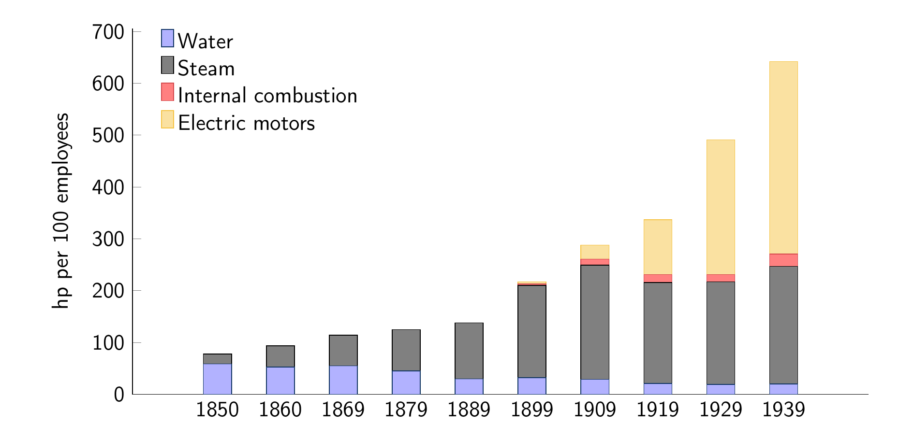
```

.footnote[.small[Note: This chart shows horsepower per 100 employees by power source over time.]]
]

---

# Steam engines vs. electric motors <br> .small[<span class="gray">Reichardt (2024)</span>]

.pull-left[
```{r, echo = F, out.width = '65%'}
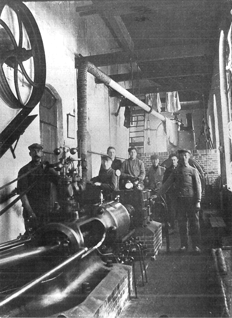
```
]

.pull-right[
```{r, echo = F, out.width = '65%'}
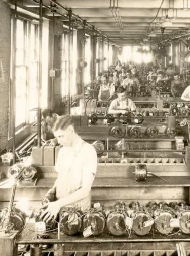
```
]

---

# Steam engines have much higher fixed costs <br> .small[<span class="gray">Reichardt (2024)</span>]

.center-content[
| **Features** | .hi-lared[**Steam engines**] | .hi-lalightblue[**Electric motors**] |
|:-------------|:----------------------------:|:------------------------------------:|
| Fixed cost (50 hp, in unskilled wages) | 3-4 | 0.02-0.04 |
| Efficiency increases with size | Strongly | Barely |
| Source of power | Generated in plant | Purchased |
| Average capacity (US 1909, in hp) | 93.4 | 8.5 |
| | .hi-lared[**Large-scale-biased**] | .hi-lalightblue[**Small-scale-biased**] |
]

---

# Average cost by capacity <br> .small[<span class="gray">Reichardt (2024)</span>]

.center-content[
```{r, echo = F, out.width = '60%'}
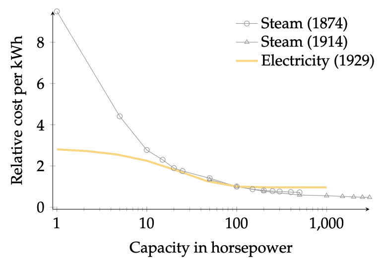
```

.footnote[.small[Sources: own computation based on (Emery, 1883) (for steam engines) and (Bolton, 1926) (for electric motors).]]
]

---

# Adoption rates by size <br> .small[<span class="gray">Reichardt (2024)</span>]

.pull-left[
```{r, echo = F, out.width = '100%'}
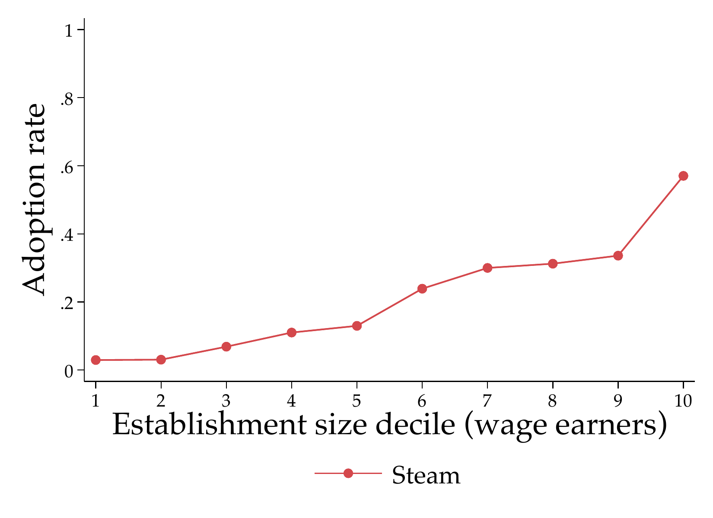
```
.center[Steam engines (1880)]
]

.pull-right[
```{r, echo = F, out.width = '100%'}
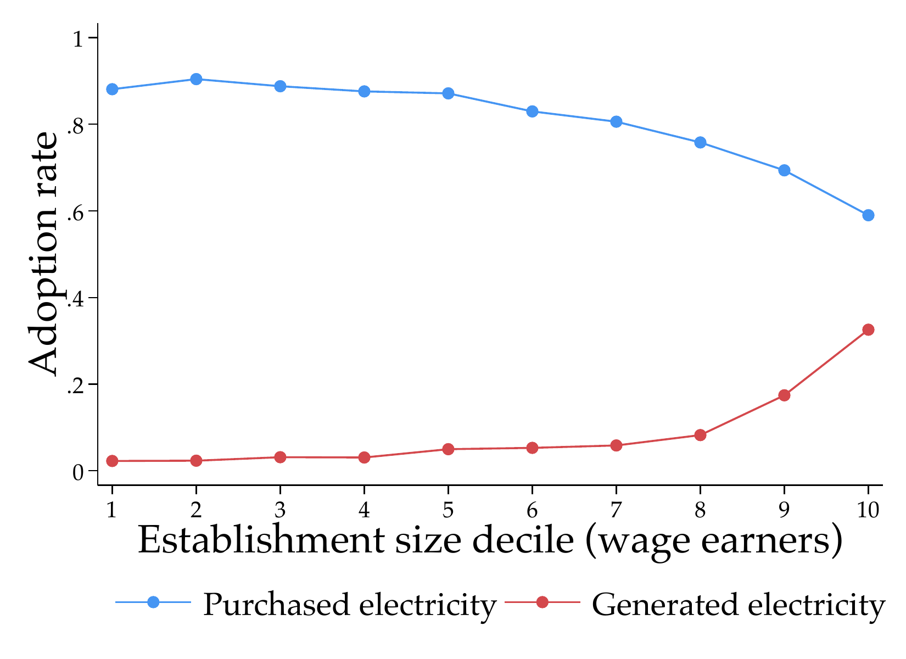
```
.center[Electric motors (1929)]
]

.footnote[.small[Sources: samples from the Census of Manufactures. 1880: <span class="gray">Atack & Bateman (1999)</span>; 1929: (Vickers & Ziebarth).]]

---

# Effect of .hi-lared[steam engines] and .hi-lalightblue[electric motors] on firm size <br> .small[<span class="gray">Reichardt (2024)</span>]

.center-content[
- IV: geographic variation in (1) coal access and (2) hydropower potential
  - Transportation-cost weighted access to natural coal resources $\implies$ .hi-lared[steam engines]
  - Waterpower that can be generated given topography $\implies$ .hi-lalightblue[electric motors]

- Exogeneity:
  - Natural coal resources before mining, transportation cost before railroads
  - Potential (not realized) hydropower: developed and undeveloped sites

- Exclusion restriction:
  - Estimate effects separately for "placebo" industries
]

---

# Reduced form effect of coal access and hydropower <br> .small[<span class="gray">Reichardt (2024)</span>]

.center-content[
$$\ln\left(y_{ist}\right) = \alpha_s + \eta_{it} + \sum_{k\in T}\left[\beta_k\left(\ln\left(\text{COAL}_{s}\right)\times D_{tk}\right) + \gamma_k\left(\ln\left(\text{HYDRO}_{s}\right) \times D_{tk}\right)\right] + \boldsymbol{\lambda}'\boldsymbol{X}_{st} + \varepsilon_{ist}$$

where

- $y_{ist}$ is the average firm size in wage earners for industry $i$, state $s$, and year $t$
- $\text{COAL}_s$ and $\text{HYDRO}_s$ are coal access and hydropower potential in state $s$
- $D_{tk}$ is a dummy that is 1 if $t= k$ and 0 otherwise
- Vector of controls $\boldsymbol{X}_{st}$ contains:
  - Density of the population in state $s$ at time $t$
  - Interactions between $t$ and "market access" in state $s$ .small[<span class="gray">(Donaldson & Hornbeck 2016)</span>]
]

---

# Results: reduced form effect of coal access on firm size <br> .small[<span class="gray">Reichardt (2024)</span>]

.center-content[
```{r, echo = F, out.width = '55%'}
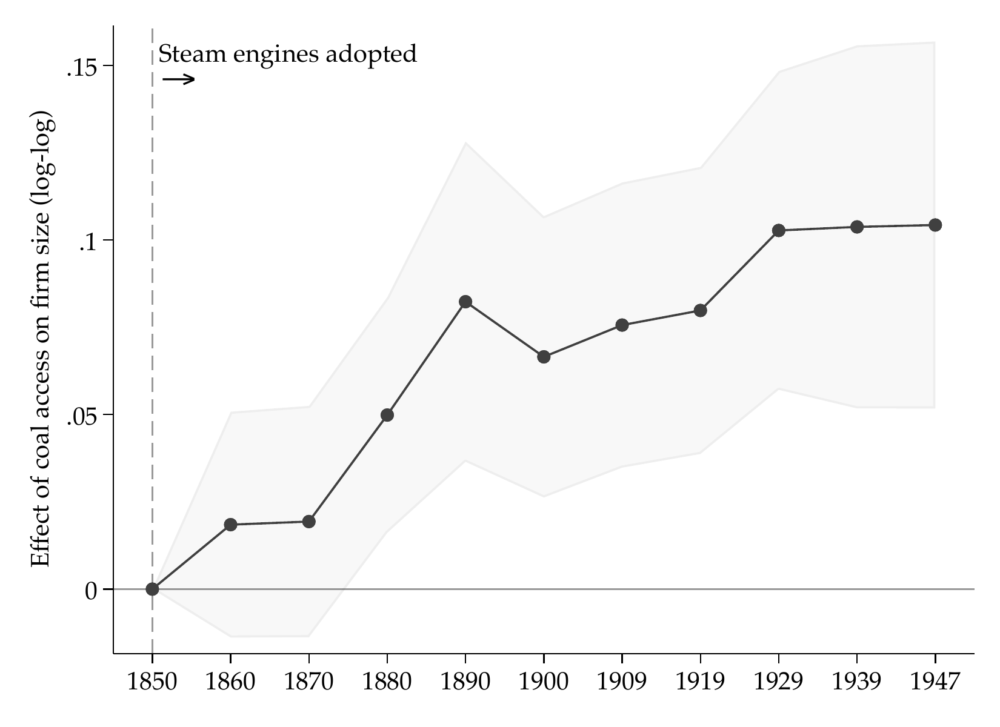
```

.footnote[.small[Standard errors are clustered on the state level. Confidence intervals are at the 95% confidence level.]]
]

---

# Results: reduced form effect of hydropower on firm size <br> .small[<span class="gray">Reichardt (2024)</span>]

.center-content[
```{r, echo = F, out.width = '55%'}
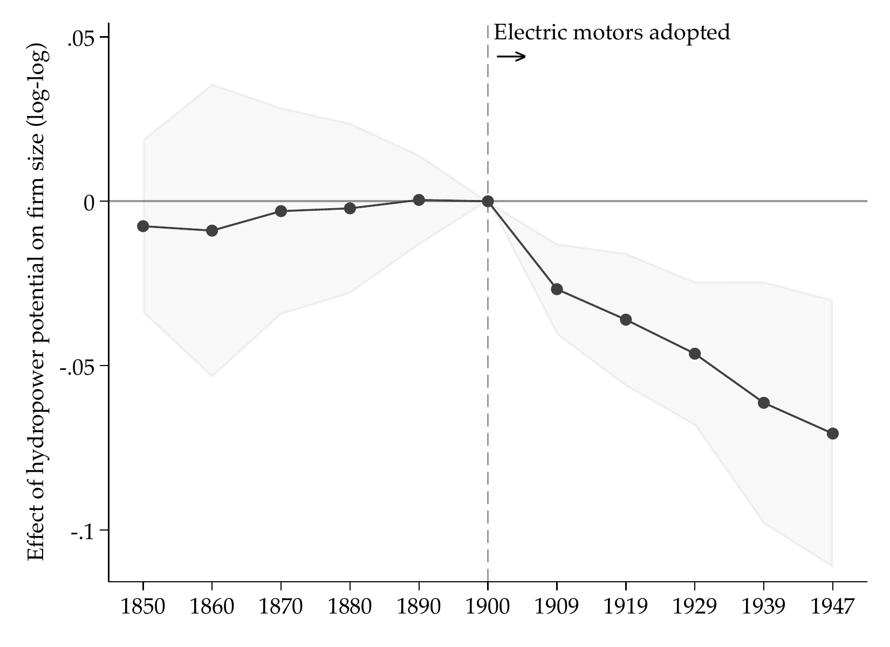
```

.footnote[.small[Standard errors are clustered on the state level. Confidence intervals are at the 95% confidence level.]]
]

---

# Takeaway: testing the theoretical predictions <br> .small[<span class="gray">Reichardt (2024)</span>]

.center-content[
1. .hi-lared[Large scale-biased] technical change increases firm sizes $\checkmark$

2. .hi-lared[Large scale-biased] technical change increases profit-wage ratio

3. .hi-lared[Large-scale-biased] technical change increases top income inequality
]

---

# Results: reduced form effect of coal access on profit-wage ratio

.center-content[
```{r, echo = F, out.width = '55%'}
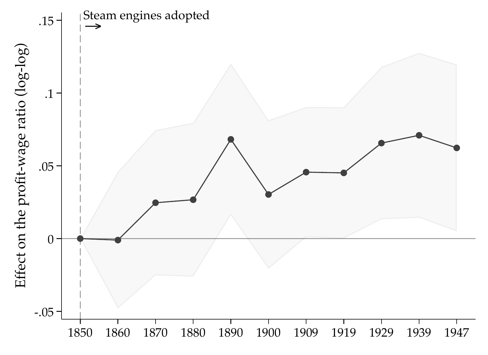
```

.footnote[.small[Standard errors are clustered on the state level. Confidence intervals are at the 95% confidence level.]]
]

---

# Results: reduced form effect of hydropower on profit-wage ratio

.center-content[
```{r, echo = F, out.width = '55%'}
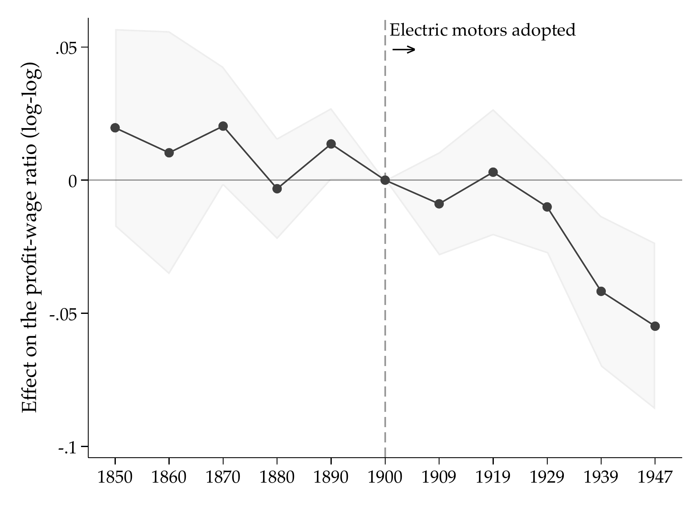
```

.footnote[.small[Standard errors are clustered on the state level. Confidence intervals are at the 95% confidence level.]]
]

---

# Takeaway: testing the theoretical predictions <br> .small[<span class="gray">Reichardt (2024)</span>]

.center-content[
1. .hi-lared[Large scale-biased] technical change increases firm sizes $\checkmark$

2. .hi-lared[Large scale-biased] technical change increases profit-wage ratio $\checkmark$

3. .hi-lared[Large-scale-biased] technical change increases top income inequality
]

---

# Results: effect of .hi-lared[steam engine] adoption on inequality <br> .small[<span class="gray">Reichardt (2024)</span>]

.center-content[
```{r, echo = F, out.width = '60%'}
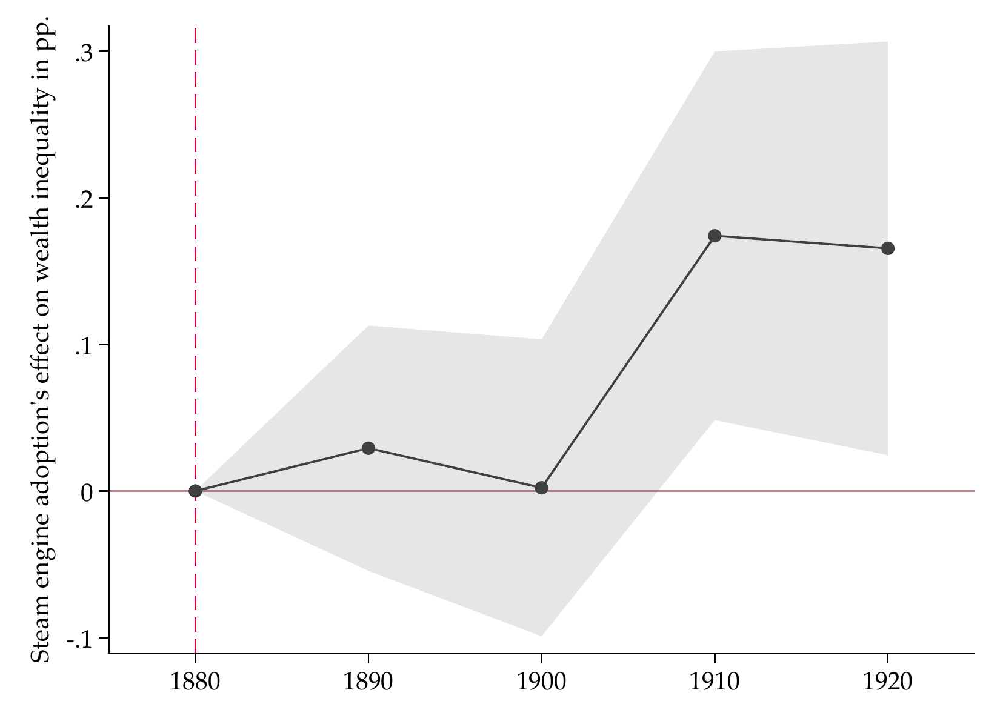
```
]

---

# Results: effect of .hi-lalightblue[electric motor] adoption on inequality <br> .small[<span class="gray">Reichardt (2024)</span>]

.center-content[
```{r, echo = F, out.width = '60%'}
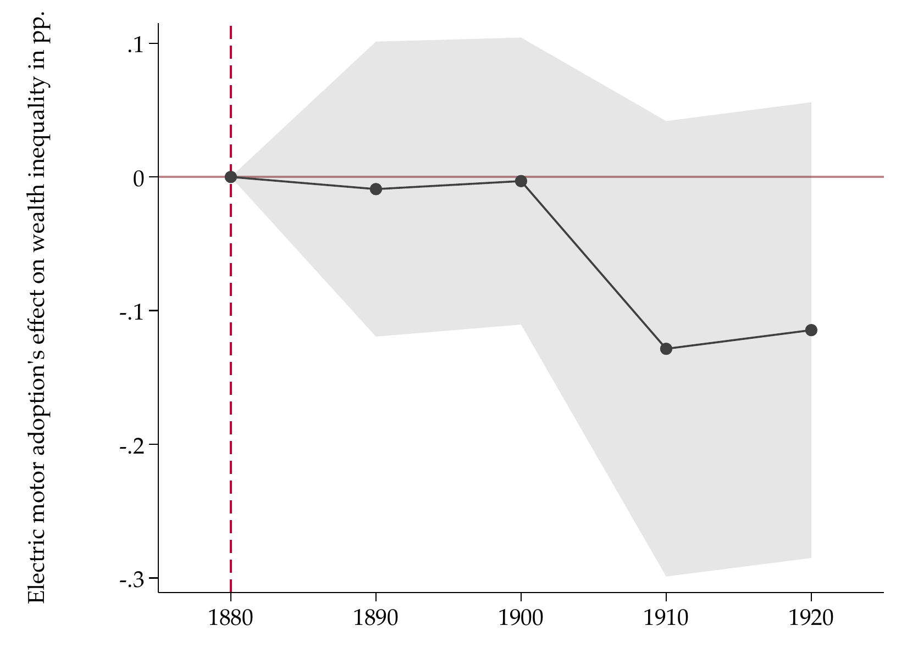
```
]

---

# Strategy IV: effect of .hi-lared[steam engines] and .hi-lalightblue[electric motors] on inequality

.center-content[
- Instead of adoption, use municipality $m$'s pre-industrial "exposure" to technology

$$\text{STEAM_EXP}_{1816,m} = \sum_{i\in I}\frac{\text{Employment in industry } i \text{ in } m \text{ in 1816}}{\text{Total employment in } m \text{ in 1816}}\times \text{STEAM}_{1930,i}$$

$$\text{ELECTR_EXP}_{1816,m} = \sum_{i\in I}\frac{\text{Employment in industry } i \text{ in } m \text{ in 1816}}{\text{Total employment in } m \text{ in 1816}}\times \text{ELECTR}_{1930,i}$$

- Same regressions, replacing adoption with exposure
]

---

# Results: effect of .hi-lared[steam engine] exposure on inequality <br> .small[<span class="gray">Reichardt (2024)</span>]

.center-content[
```{r, echo = F, out.width = '60%'}
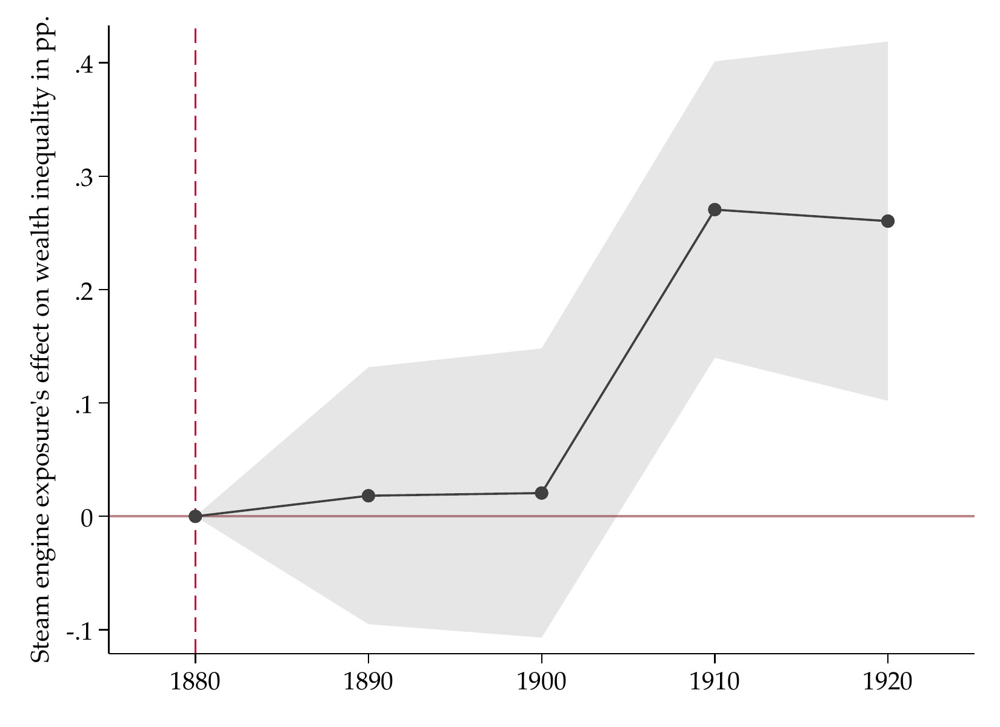
```
]

---

# Results: effect of .hi-lalightblue[electric motor] exposure on inequality <br> .small[<span class="gray">Reichardt (2024)</span>]

.center-content[
```{r, echo = F, out.width = '60%'}
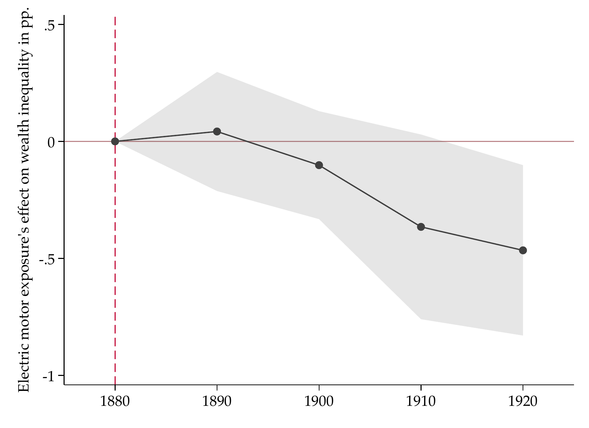
```
]

---

# Correlation between income and wealth <br> .small[<span class="gray">Reichardt (2024)</span>]

.center-content[
```{r, echo = F, out.width = '90%'}
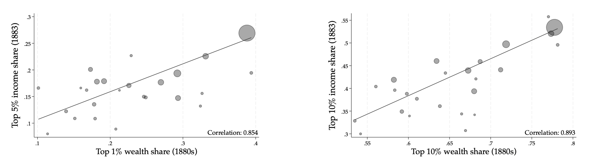
```
]

---

# Takeaway: testing the theoretical predictions <br> .small[<span class="gray">Reichardt (2024)</span>]

.center-content[
1. .hi-lared[Large scale-biased] technical change increases firm sizes $\checkmark$

2. .hi-lared[Large scale-biased] technical change increases profit-wage ratio $\checkmark$

3. .hi-lared[Large-scale-biased] technical change increases top income inequality $\checkmark$
]

---

# Conclusion <br> .small[<span class="gray">Reichardt (2024)</span>]


.center-content[

- **Scale bias** important for inequality

- .hi-lared[Large-scale-biased] technical change:
  - Less entrepreneurship
  - Larger firms
  - More inequality

- New look at current technology adoption
- How does this paper inform your thinking about AI's impact on inequality?
]

---
class: agenda

# Agenda

<ul class="agenda-list">
<li class="done">Scale-bias</li>
<li class="current">Skill-bias</li>
<li class="upcoming">Task-bias</li>
</ul>

---

# From L6-7: the theory → today: the inequality question

.center-content[
- **Last time** <span class="gray">(Acemoglu 2002, *Rev. Econ. Studies* — "Directed Technical Change")</span>
  - Tech change is *directed*: price effect vs. market-size effect
  - With elasticity of substitution $\sigma$ large enough, strong induced bias: rising supply of skill $\Rightarrow$ demand curve slopes up $\Rightarrow$ skill premium *rises*

- **Today** <span class="gray">(Acemoglu 2002, *J. Econ. Lit.* — "Technical Change, Inequality, and the Labor Market")</span>
  - Take SBTC as given $\Rightarrow$ what does it *imply* for US wage inequality?
  - Estimate $\sigma$ and the pace of SBTC from aggregate wage and supply data <span class="gray">(building on Katz & Murphy, 1992)</span>
  - Decompose rising inequality into supply shifts vs. demand (tech) shifts
]

---

# Skill-biased technical change

.center-content[
```{r, echo = F, out.width = '60%'}
knitr::include_graphics("files/college_wage_pr.png")
```

.center[Despite increasing supply of college-educated workers, the wage premium has risen]
]

---
class: inverse, center, middle

<div style="text-align: center; width: 100%;">
  <div style="color: #1A3A68; font-weight: 700; font-size: 42px; line-height: 1.2;">
    Technical Change, Inequality, and the Labor Market
  </div>
  <div style="color: rgba(26, 58, 104, 0.7); font-weight: 400; font-size: 26px; line-height: 1.35; margin-top: 16px;">
    Acemoglu (2002)
  </div>
</div>

---

# Skill-biased technological change <br> .small[<span class="gray">Acemoglu (2002)</span>]

.center-content[
- Builds on classic growth ideas while recognizing that new technology often helps skilled workers more

- The basic idea is that technology now tends to favor workers with higher skills

- **Modeling Approach:**
  - Represent technology as boosting either low-skilled or high-skilled labor productivity
  - We then ask: why does modern technology seem to give a bigger boost to skilled workers?
]

---

# Production function setup <br> .small[<span class="gray">Acemoglu (2002)</span>]

.center-content[
$$Y(t)= \left[g_L \,(A_L(t)L(t))^{\frac{\sigma-1}{\sigma}} + g_H \,(A_H(t)H(t))^{\frac{\sigma-1}{\sigma}}\right]^{\frac{\sigma}{\sigma-1}}$$

- $A_L(t)$ boosts productivity of low-skilled labor; $A_H(t)$ boosts that of high-skilled labor

- The parameters $g_L$ and $g_H$ (with $g_L + g_H = 1$) indicate how important each input is

- $\sigma$ (elasticity of substitution) tells us how easily one type of labor can replace the other:
  - When $\sigma = 1$: Cobb-Douglas case
  - When $\sigma \to 0$: No substitution is possible
  - When $\sigma > 1$: Workers can be substituted easily
  - When $\sigma < 1$: Workers work best together (their contributions are complementary)

- Whether a change in $A_L(t)$ or $A_H(t)$ ends up favoring wages (marginal product) of low- vs. high-skilled workers depends on the value of $\sigma$
]

---

# Comparing the impact on worker productivity <br> .small[<span class="gray">Acemoglu (2002)</span>]

.center-content[
$$\frac{\text{MP}_H}{\text{MP}_L} = \frac{g_H}{g_L} \left(\frac{A_H(t)}{A_L(t)}\right)^{\frac{\sigma-1}{\sigma}} \left(\frac{H(t)}{L(t)}\right)^{-\frac{1}{\sigma}}$$

- This equation compares the extra output from an additional high-skilled worker ($\text{MP}_H$) to that from an additional low-skilled worker ($\text{MP}_L$)

- If workers can substitute for each other easily ($\sigma>1$), a boost in $A_H(t)$ raises high-skilled workers' relative value

- When inputs work best together ($\sigma<1$), a boost in $A_H(t)$ can actually make low-skilled workers relatively more valuable

- If $\sigma=1$, the change does not favor one group over the other
]

---

# From theory to empirical specification <br> .small[<span class="gray">Acemoglu (2002)</span>]

.center-content[
- Take logs of the relative marginal product to get

$$\ln\frac{MP_H}{MP_L} = \ln\frac{g_H}{g_L} + \frac{\sigma-1}{\sigma}\bigl(\ln A_H - \ln A_L\bigr) - \frac{1}{\sigma}\ln\frac{H}{L}$$

- Normalize $A_L(t)=1$ and parameterize $\ln A_H(t)=g_0 + g_1\,t$

- Substitute and collect terms to obtain

$$\ln w_t = \frac{\sigma-1}{\sigma}\,g_0 + \frac{\sigma-1}{\sigma}\,g_1\,t - \frac{1}{\sigma}\ln\frac{H_t}{L_t}$$

- Resulting regression: $\ln w_t$ on a linear time trend and $\ln(H_t/L_t)$
]

---

# Empirical implementation <br> .small[<span class="gray">Katz & Murphy (1992); Acemoglu (2002)</span>]

.center-content[
- **Setup:**
  - From the model, we get a relationship for the log wage gap:

$$\ln w_t = \underbrace{\frac{\sigma-1}{\sigma}\,g_0}_{\text{constant}} \;+\;\underbrace{\frac{\sigma-1}{\sigma}\,g_1\,t}_{\text{time trend}} \;-\;\underbrace{\frac{1}{\sigma}\,\ln \!\left(\frac{H_t}{L_t}\right)}_{\text{relative supply effect}}$$

  - Here, $H_t$ and $L_t$ are the quantities of high- and low-skilled labor
]

---

# Empirical results <br> .small[<span class="gray">Katz & Murphy (1992); Acemoglu (2002)</span>]

.center-content[
- Estimated for 1963--1987:

$$\ln w_t = \text{constant} + 0.027\,t \;-\;0.612\,\ln\!\Bigl(\tfrac{H_t}{L_t}\Bigr)$$

- **Interpretation:** College worker supply pushed premium down, but technology was pushing it up even stronger, yielding 2.7% annual rise in wage gap

- **Key parameter values:**
  - $-0.612 = -\,\tfrac{1}{\sigma}$ $\;\Rightarrow\;\sigma \approx \tfrac{1}{0.612} \approx 1.63$ (if college share goes up, premium falls, but by less than one-for-one $\Rightarrow$ skilled and unskilled labor are substitutes)
  - $0.027 = \tfrac{\sigma-1}{\sigma}\,g_1$ $\;\Rightarrow\; g_1 \approx 0.027 \times \frac{\sigma}{\sigma-1} \approx 0.027 \times \frac{1.63}{0.63} \approx 0.07$ (relative productivity of skilled labor rising 7% per year)
]

---

# College degrees $\neq$ skills <br> .small[<span class="gray">Chandar (2025)</span>]

.center-content[
- With more lower-skill workers having a college degree, increase in college supply $>$ increase in skills
  - In Katz, Murphy '92 equation, corrected $H/L$ would rise slower than implied by using college as a proxy for $H$

- After accounting for **supply** of skills, **demand** for skills (due to technological change) implied to rise faster than demand for college

- To infer skill-biased technical change, we must control for changing worker composition

- Adj. skill-biased technological change (the part not explained by supply of skills) was faster than previously thought

Note: In 2000s (Chandar), adj. skill-biased technological change was slower than in 1970s/80s (Katz, Murphy)
]

---

# Critiques of the basic factor-augmenting view <br> .small[<span class="gray">Acemoglu (2002)</span>]

.center-content[
- **Problem 1: Poor out-of-sample predictions**
  - Regressions using the 1963--1987 trend fail to predict wage gaps accurately in later periods

- **Problem 2: Declining real wages for some groups**
  - The framework suggests no group should experience persistent wage declines if technology generally improves productivity

- **Problem 3: Unrealistic nature of factor-augmenting technology**
  - It's hard to see how innovations like computers or robots uniformly raise the productivity of any one type of labor; often they replace certain tasks rather than simply enhance them
]

---
class: agenda

# Agenda

<ul class="agenda-list">
<li class="done">Scale-bias</li>
<li class="done">Skill-bias</li>
<li class="current">Task-bias</li>
</ul>

---

# Task-based models of technological change

.center-content[
- Shift from uniform factor-augmenting technology to focus on allocating individual tasks

- View production as a set of tasks, each performed by labor or capital

- Capture how changes in task allocation affect productivity and inequality

- Provide different comparative statics and micro-level insights compared to standard aggregate models
]

---
class: inverse, center, middle

<div style="text-align: center; width: 100%;">
  <div style="color: #1A3A68; font-weight: 700; font-size: 42px; line-height: 1.2;">
    Task-Specific Technical Change and Comparative Advantage
  </div>
  <div style="color: rgba(26, 58, 104, 0.7); font-weight: 400; font-size: 26px; line-height: 1.35; margin-top: 16px;">
    Althoff &amp; Reichardt (2026)
  </div>
</div>

---

# Question: How does task-specific technical change affect workers? <br> .small[<span class="gray">Althoff & Reichardt (2026)</span>]

.center-content[
- "People should stop training radiologists" due to advances in AI .small[<span class="gray">(Hinton, 2016)</span>]

- Since then, radiologists' employment has continued to grow despite high AI adoption

- Understanding effects of task-specific technical change requires knowing
  - workers' comparative advantage across tasks and how technical change affects it
  - how easily workers can accumulate new skills in response
  - how prices, wages, and workers' occupational choices adjust in general equilibrium

  $\rightarrow$ Need for a structural and quantitative approach
]

---

# This paper: task-specific technical change and comparative advantage <br> .small[<span class="gray">Althoff & Reichardt (2026)</span>]

.center-content[
1. Build quantitative task-based general equilibrium labor market model
   - Workers accumulate multi-dimensional skills and face a discrete occupational choice
   - Occupations consist of tasks which differ by their skill requirements
   - Technology can augment, automate, and simplify tasks

2. Develop strategy to estimate task-specific productivity and learning

3. Apply framework to predict AI's labor market effects
   - Use LLMs to measure how AI augments, automates, and simplifies tasks (and validate)
   - Use quantified model to translate this into labor market effects
]

---

# Preview: AI raises average wage and reduces wage inequality <br> .small[<span class="gray">Althoff & Reichardt (2026)</span>]

.center-content[
```{r, echo = F, out.width = '60%'}
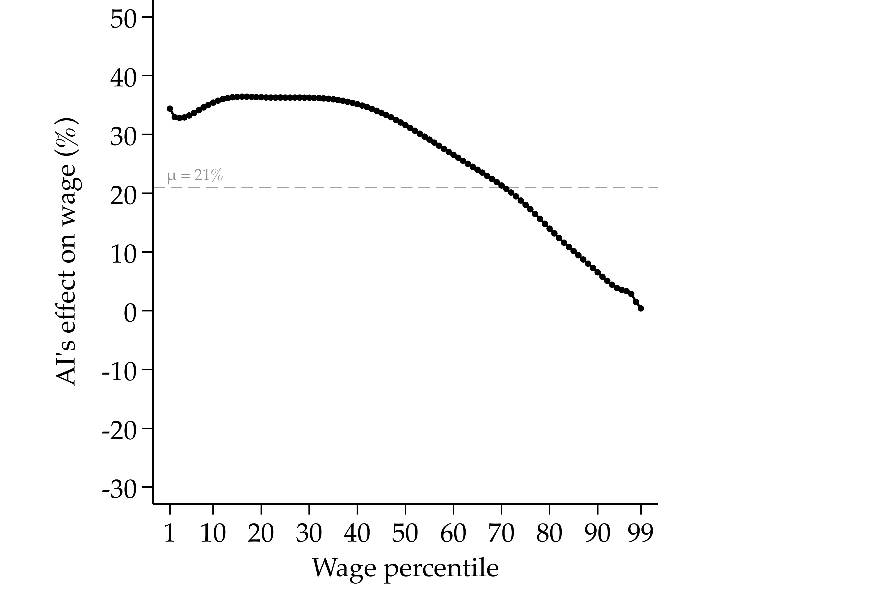
```
]

---

# Preview: simplification is key for AI's distributional effects <br> .small[<span class="gray">Althoff & Reichardt (2026)</span>]

.center-content[
```{r, echo = F, out.width = '60%'}
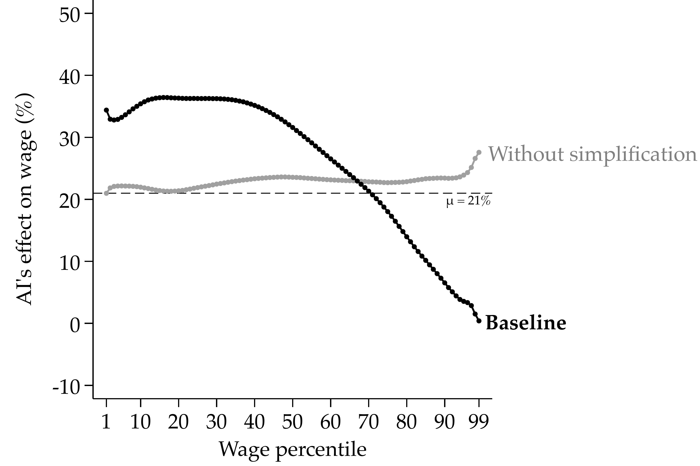
```
]

---

# Contributions to the literature <br> .small[<span class="gray">Althoff & Reichardt (2026)</span>]

.center-content[
- Technological change and tasks .small[<span class="gray">(Autor et al. '03; Acemoglu & Autor '11)</span>]
  - Provide a method to estimate workers' task-specific comparative advantage
  - Allow for multi-dimensional skill accumulation .small[<span class="gray">(Lise & Postel-Vinay '20; Guvenen et al. '20)</span>]
  - Integrate into GE dynamic occupational choice model .small[<span class="gray">(Keane & Wolpin '97; Traiberman '19)</span>]
  - Build new database on task-level skill requirements

- Effects of AI .small[<span class="gray">(Acemoglu et al. '22; Hampole et al. '25; Freund & Mann '25)</span>]
  - Estimate economic impact of future task-level technical change
  - Study the GE effect on workers and overall economy (not just occupations)
]

---
class: center, middle

# 1. Model

---

# Model: overview <br> .small[<span class="gray">Althoff & Reichardt (2026)</span>]

.center-content[
- Occupations consist of a set of tasks and produce a distinct good

- Tasks differ by the level of skill they require

- Multi-dimensional skills (e.g., math, social) govern workers' productivity in each task

- Skill accumulation depends on the tasks performed and a worker's current skills

- Occupational choice maximizes lifetime utility

- Overlapping generations of workers live for $A$ periods

- Demand for goods is generated by workers spending their income
]

---

# Production: occupations & tasks <br> .small[<span class="gray">Althoff & Reichardt (2026)</span>]

.center-content[
- Occupations produce a distinct good and are indexed by $j$

- Occupational goods are produced by a discrete set of tasks $\mathcal{T}_j$ with weights $\left\{\theta_{j,\tau}\right\}_{\tau \in \mathcal{T}_j}$

- Tasks combine with constant elasticity of substitution $\rho$, so output is

$$Y_j = \left( \sum_{\tau \in \mathcal{T}_j} \theta_{j,\tau}^\frac{1}{\rho} y_\tau^{\frac{\rho - 1}{\rho}} \right)^{\frac{\rho}{\rho - 1}}$$

  where $y_\tau$ is the quantity of task $\tau$
]

---

# Production: skills & task-specific productivity <br> .small[<span class="gray">Althoff & Reichardt (2026)</span>]

.center-content[
The production function of task $\tau$ in occupation $j$ is

$$y_\tau = \begin{cases} \ell_\tau \gamma_\tau f(\boldsymbol{h},\boldsymbol{r}_\tau) & \text{if } \tau \in \mathcal{N}_j \\ \ell_\tau \gamma_\tau f(\boldsymbol{h}, \boldsymbol{r}_\tau) + \phi_\tau k_\tau & \text{if } \tau \in \mathcal{A}_j \end{cases}$$

- $\mathcal{A}_j\subset \mathcal{T}_j$ is the set of automatable tasks; $\mathcal{N}_j \equiv \mathcal{T}_j\setminus \mathcal{A}_j$
- $\ell_\tau$: units of labor assigned to task $\tau$
- $\gamma_\tau$: task-specific productivity parameter
- $\boldsymbol{h} = \left(h_s\right)_{s\in S}'$: worker's skills
- $\boldsymbol{r}_\tau \equiv \left(r_{s,\tau}\right)_{s\in S}'$: skill requirements of the task
- $k_\tau$: automation capital assigned to task $\tau$
]

---

# Production: how can technical change affect production? <br> .small[<span class="gray">Althoff & Reichardt (2026)</span>]

.center-content[
Three ways in which technical change operates:

```{r, echo = F, out.width = '60%'}
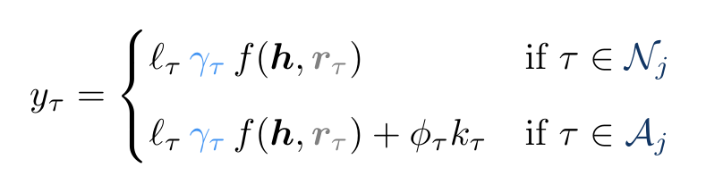
```

1. .hi-lalightblue[Augmentation]: enhancing human productivity, increasing $\gamma_\tau$
2. Automation: performing tasks autonomously with capital, at cost $R$
3. .gray[Simplification]: simplifying tasks for humans, reducing $\boldsymbol{r}_\tau$

Augmentation and automation: standard. Simplification: new to this paper.
]

---

# Skill accumulation: learning depends on occupational choices <br> .small[<span class="gray">Althoff & Reichardt (2026)</span>]

.center-content[
- Workers live for $A$ periods, born with initial skills $\boldsymbol{h}_1$ and "ability to learn" $\psi$

- A worker's skills next period $\boldsymbol{h}' = g_j(\boldsymbol{h},\psi)$ depend on
  - their current skills $\boldsymbol{h}$
  - their invariant ability to learn $\psi$ .small[<span class="gray">(as in Heckman et al. '98)</span>]
  - their occupational choice $j$

  $\rightarrow$ Occupational choice is a dynamic problem
]

---

# Occupational choice: solving the value function <br> .small[<span class="gray">Althoff & Reichardt (2026)</span>]

.center-content[
- Ex-ante value function of a worker of age $a < A$ with skill $\boldsymbol{h}$ and current occupation $k$:

$$V_a(\boldsymbol{h},\psi,k) = \mathbb{E}_{\varepsilon}\!\left[\max_{j} \log w_j(\boldsymbol{h}) + \mu_j - \kappa\, 1[j\neq k] + \varepsilon_j + \beta V_{a+1}\!\left(g_j(\boldsymbol{h},\psi),\psi,j\right)\right]$$

- $\mu_j$: occupation $j$'s non-wage amenities; $\kappa$: switching cost

- Productivity shock $\varepsilon_j \sim$ Gumbel $\rightarrow$ closed-form integrated value function

- Costly when $J$ is large $\rightarrow$ trick to shrink state space by factor $J$
]

---

# Competitive equilibrium: definition <br> .small[<span class="gray">Althoff & Reichardt (2026)</span>]

.center-content[
Given an initial distribution of age, skill, occupations, and learning ability, a *competitive equilibrium* is a sequence of prices such that

1. Workers' occupational choices maximize lifetime utility given prices

2. The distribution over states follows from occupational choices

3. Occupational output follows from the state distribution and choice probabilities

4. Prices are such that demand equals supply
]

---
class: center, middle

# 2. Data

---

# Data: three main sources to quantify and estimate the model <br> .small[<span class="gray">Althoff & Reichardt (2026)</span>]

.center-content[
1. **O\*NET**: database on occupations, tasks, and occupation-level skill requirements

2. New task-level skill requirement data: replicated O\*NET questionnaire using GPT-4o

3. NLSY79: multi-dimensional skill assessments and panel on occupations and wages
]

---

# O*NET: occupations, tasks, and skill requirements <br> .small[<span class="gray">Althoff & Reichardt (2026)</span>]

.center-content[
- Descriptions of 19,530 tasks in 974 occupations and their importance
  - $\rightarrow$ Task sets $\mathcal{T}_j$ for all occupations and measures of each task's importance $\theta_{j,\tau}$
  - Example: *Chief Executives* — *Prepare budgets for approval, including those for funding or implementation of programs.*

- Skill requirements of each occupation in 35 skill dimensions
  - Levels from 1 (low) to 7 (high) with interpretable anchors
  - Example: *reading comprehension* has level anchors
    - 2: *Read step-by-step instructions for completing a form*
    - 4: *Understand an email from management describing new personnel policies*
    - 6: *Read a scientific journal article describing surgical procedures*
]

---

# New task-level skill requirement data <br> .small[<span class="gray">Althoff & Reichardt (2026)</span>]

.center-content[
- O\*NET contains *occupational* skill requirements, but we need task-level data

- We use GPT-4o to estimate task-level skill requirements $\boldsymbol{r}_\tau$:
  - Same skill dimensions and level anchors as O\*NET uses on the occupation level
  - Prompt mirrors occupation-level questionnaire used by O\*NET
  - $19{,}530 \times 35 = 683{,}550$ prompts

- We reduce skill dimensions from 35 to 5: manual, math, social, technical, verbal

- .hi-lared[Validation]: compare $\sum_{\tau\in\mathcal{T}_j} \theta_{j,\tau} r_{s,\tau}$ with occupational skill requirements in O\*NET
]

---

# Validation: aggregating task-level data to occupations matches O*NET <br> .small[<span class="gray">Althoff & Reichardt (2026)</span>]

<div style="display: flex; justify-content: center; align-items: flex-end; gap: 0.5em; margin-top: 1em;">
  <div style="width: 23%; text-align: center;">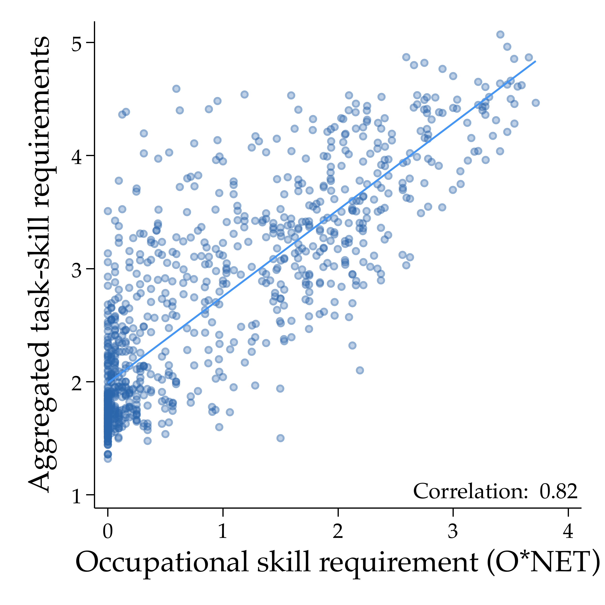<div>Manual</div></div>
  <div style="width: 23%; text-align: center;">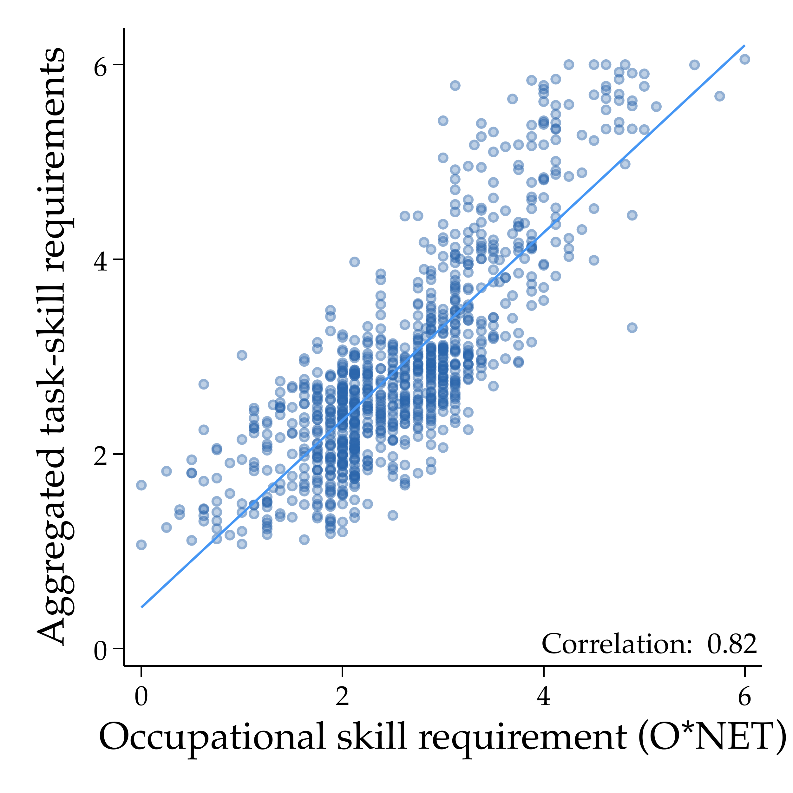<div>Math</div></div>
  <div style="width: 23%; text-align: center;">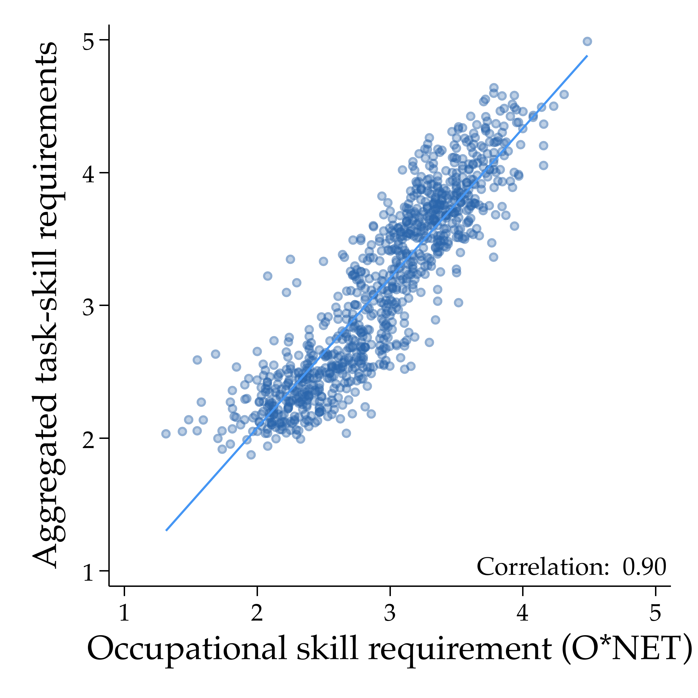<div>Social</div></div>
  <div style="width: 23%; text-align: center;">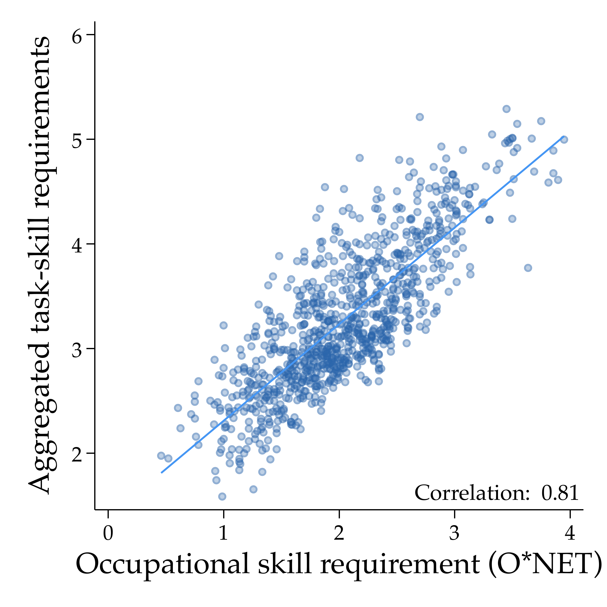<div>Technical</div></div>
</div>

---

# NLSY79: data on skills, wages, and occupations <br> .small[<span class="gray">Althoff & Reichardt (2026)</span>]

.center-content[
- Longitudinal survey of American youth born between 1957–1964

- Panel data on wages and occupations from age 20 to 65

- Multi-dimensional skills from test scores at age $\approx 20$: manual, math, social, technical, verbal

- Skill classification and measurement based on .small[<span class="gray">Deming '17; Addison et al. '20; Baley et al. '22</span>]
]

---
class: center, middle

# 3. Estimation

---
class: center, middle

# 4. AI and the Labor Market

---

# Counterfactuals: AI's labor market impact <br> .small[<span class="gray">Althoff & Reichardt (2026)</span>]

.center-content[
1. How will AI affect the distribution of wages?

2. How will AI affect the returns to skills?

3. Which workers will gain and lose the most?

4. How will occupations change?
]

---

# New data: task-level AI exposure <br> .small[<span class="gray">Althoff & Reichardt (2026)</span>]

.center-content[
- Use GPT-4o to elicit AI .hi-lalightblue[augmentation], automation, and .gray[simplification] by task

- Methodology close to .small[<span class="gray">Eloundou et al. '23; Acemoglu '25</span>]

- .hi-lared[Validation]
  - Human- and GPT-4-rated estimates of time savings by task from LLMs .small[<span class="gray">(Eloundou et al. '23)</span>]
  - Various estimates of productivity gains from RCTs with AI-augmented workers
  - Skill requirement data from job postings

- Key contribution: translating this into labor market effects
]

---

# Validation: simplification predicts reductions in "expertise" in job postings <br> .small[<span class="gray">Althoff & Reichardt (2026)</span>]

.center-content[
```{r, echo = F, out.width = '40%'}
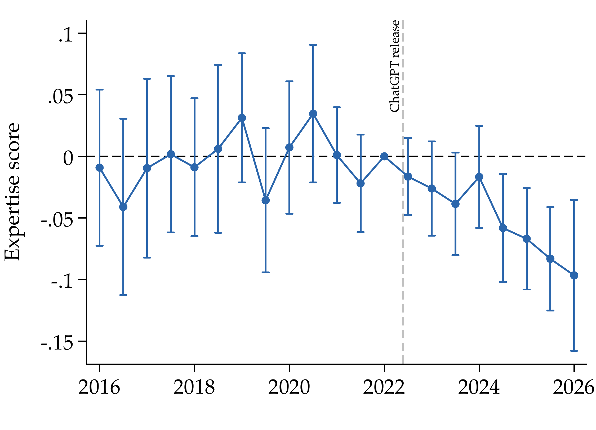
```
]

---

# Results: AI raises average wage, reduces wage inequality <br> .small[<span class="gray">Althoff & Reichardt (2026)</span>]

.center-content[
```{r, echo = F, out.width = '60%'}

```
]

---

# Results: simplification is key for AI's distributional effects <br> .small[<span class="gray">Althoff & Reichardt (2026)</span>]

.center-content[
```{r, echo = F, out.width = '60%'}

```
]

---

# Results: returns to math skills rise, returns to other skills fall <br> .small[<span class="gray">Althoff & Reichardt (2026)</span>]

.center-content[
```{r, echo = F, out.width = '50%'}
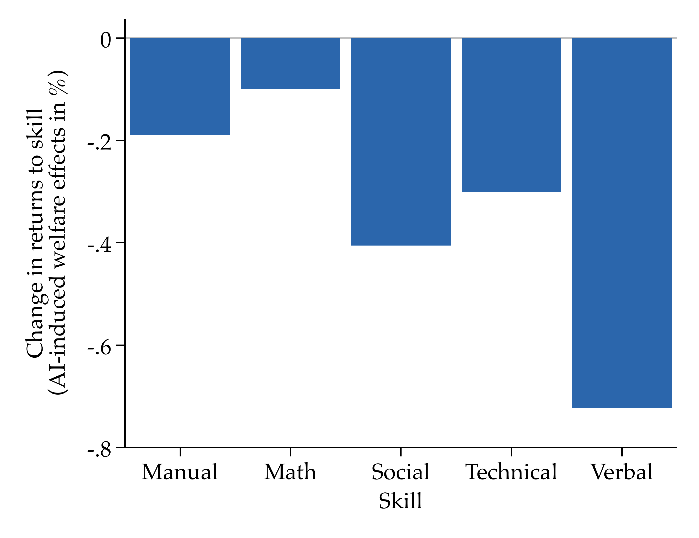
```
]

---

# Results: AI's welfare effect by learning ability and age <br> .small[<span class="gray">Althoff & Reichardt (2026)</span>]

.pull-left[
```{r, echo = F, out.width = '80%'}
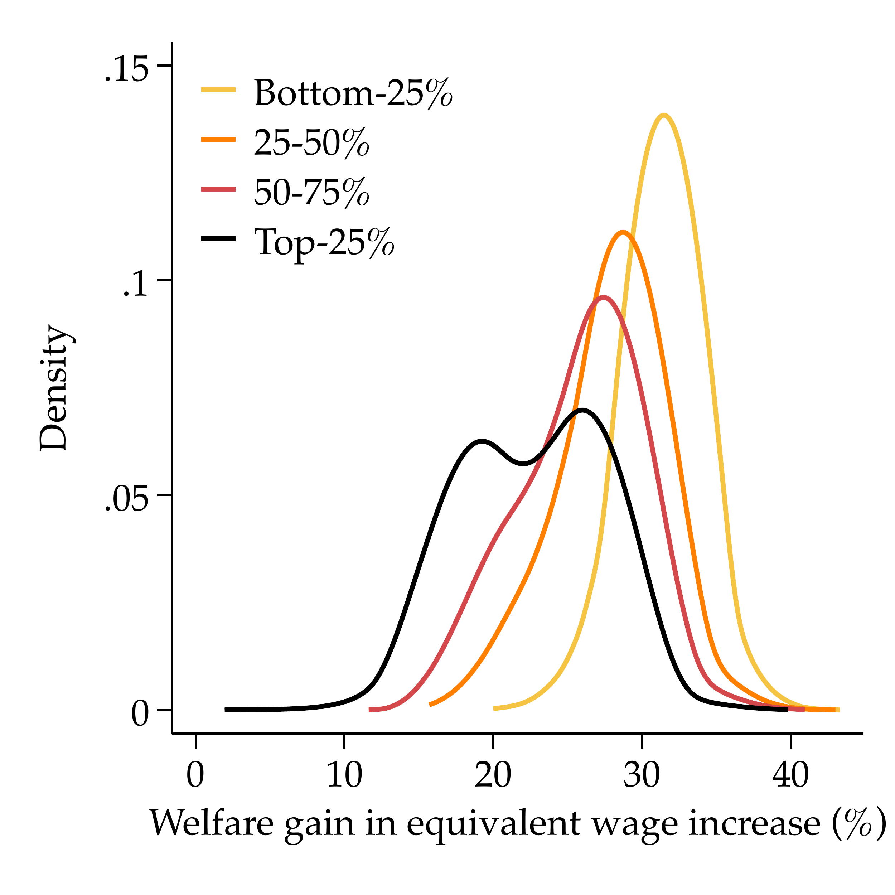
```
.center[By learning ability (AFQT)]
]

.pull-right[
```{r, echo = F, out.width = '80%'}
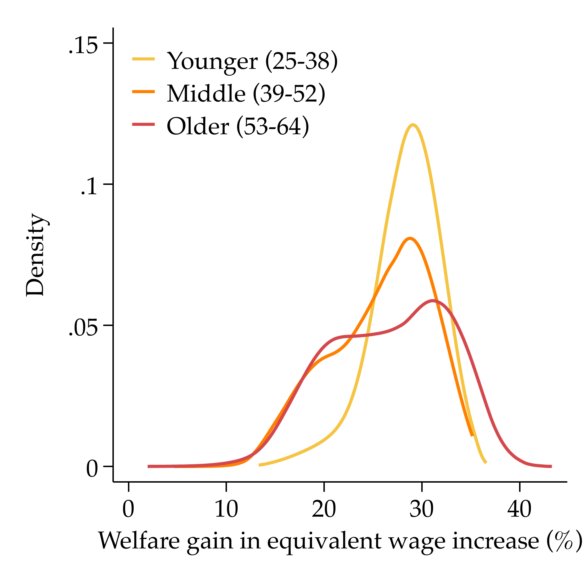
```
.center[By age]
]

---

# Results: AI's effect on occupations' wage bills <br> .small[<span class="gray">Althoff & Reichardt (2026)</span>]

.center-content[
```{r, echo = F, out.width = '45%'}
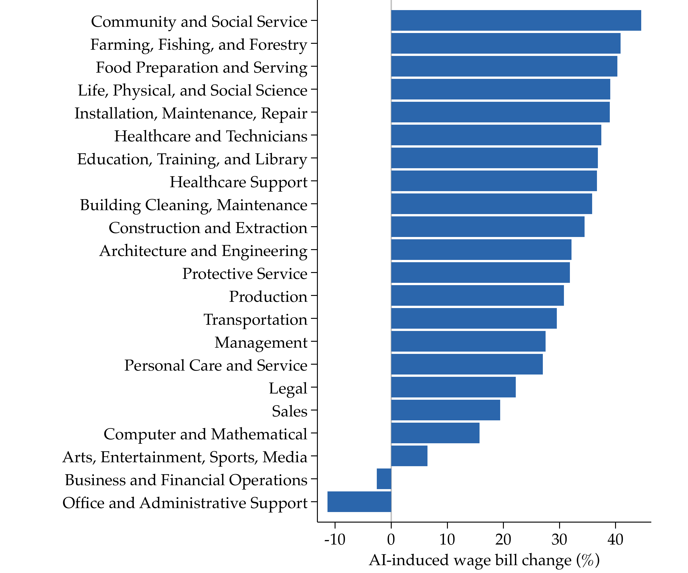
```
]

---

# Results: AI's effect on occupational employment & wages <br> .small[<span class="gray">Althoff & Reichardt (2026)</span>]

.pull-left[
```{r, echo = F, out.width = '80%'}
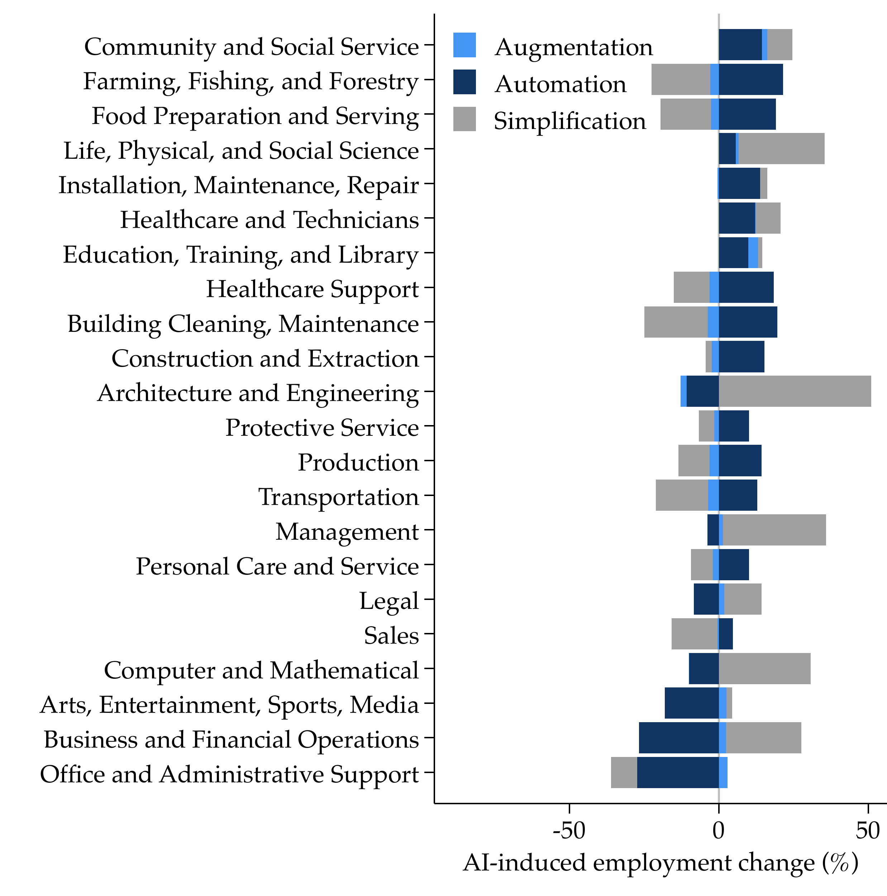
```
.center[Employment]
]

.pull-right[
```{r, echo = F, out.width = '43.5%'}
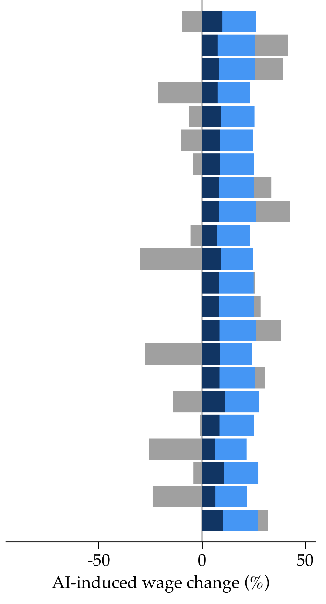
```
.center[Wages]
]

---

# Strategy: early labor market impacts of generative AI <br> .small[<span class="gray">Althoff & Reichardt (2026)</span>]

.center-content[
- Event study design using CPS data to test model predictions
  - Data: monthly cross-sections from CPS (2019–2025)
  - Event: ChatGPT release in November 2022
  - Outcomes: wage bill, employment shares, average wages
  - Treatment: model-predicted effects from generative AI by occupation, $\Delta\tilde{Y}_o$

- Specification:

$$Y_{o,t} = \sum_{k\neq -1} \beta_k \cdot 1[t=k] \times \Delta\tilde{Y}_o + \alpha_o + \gamma_t + \eta_t \cdot X_o + \epsilon_{o,t}$$

.footnote[.small[Note: descriptive analysis, no causal identification.]]
]

---

# Results: AI's early labor market impact (wage bill share) <br> .small[<span class="gray">Althoff & Reichardt (2026)</span>]

.center-content[
```{r, echo = F, out.width = '50%'}
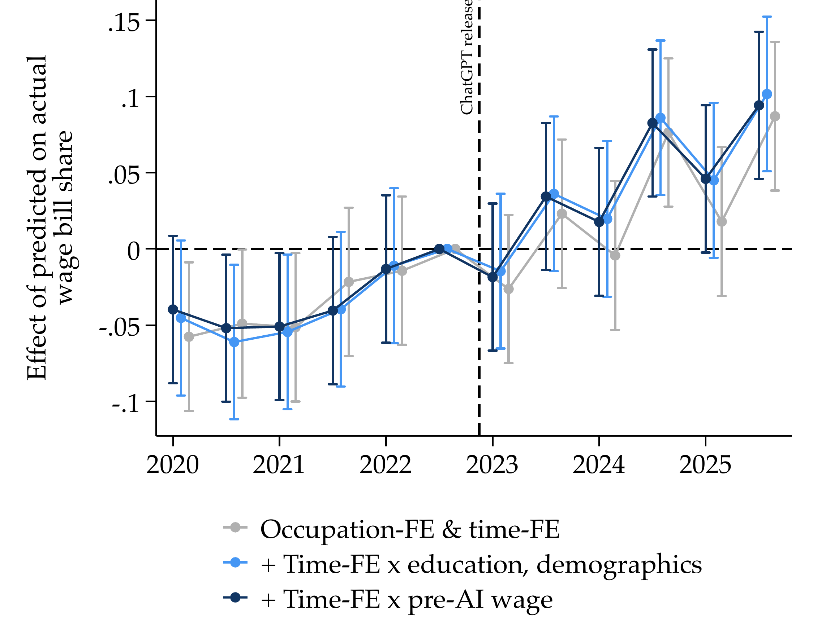
```
]

---

# Further evidence: technology and inequality

.center-content[
- Telephone operators: mechanization displaced incumbents, but new cohorts found other work <span class="gray">(Gross & Feigenbaum 2024)</span>

- Milking machines pushed women out of farming: gender-biased technical change <span class="gray">(Ager, Goni & Salvanes 2026)</span>

- Typewriter adoption expanded women's clerical employment and mobility <span class="gray">(Rashid 2026)</span>

- Origins of the technology-skill complementarity in early continuous-process manufacturing <span class="gray">(Goldin & Katz 1996)</span>

- Whether automation raises or cuts a job's wage depends on the expertise of remaining tasks <span class="gray">(Autor & Thompson 2025)</span>
]

---

# Conclusion <br> .small[<span class="gray">Althoff & Reichardt (2026)</span>]

.center-content[
- Introduced dynamic task-based labor market model

- Developed strategy to estimate and quantify
  - workers' comparative advantage across tasks and how technical change affects it
  - how easily workers can accumulate new skills in response
  - how prices, wages, and workers' occupational choices adjust in general equilibrium

- Studied AI's labor market effects
  - wage gains of 21% on average
  - substantial reduction in wage inequality, driven by simplification
  - predictions line up with early labor market data
]
