```{r, setup, include = F}
library(knitr)
opts_chunk$set(
  comment = "#>",
  fig.align = "center",
  fig.height = 7,
  fig.width = 10.5,
  warning = F,
  message = F
)
```

class: agenda

# Agenda

<ul class="agenda-list">
<li class="current">Incentives — what we choose to solve</li>
<li class="upcoming">Talent and ambition</li>
<li class="upcoming">Intergenerational mobility</li>
</ul>

---
class: inverse, middle, center

# How we motivate innovation

---

# Four ways to motivate innovation

.center-content[
| Mechanism | How it works | Example |
|-----------|-------------|---------|
| **Markets** | Price signals direct effort toward profitable problems | Pharmaceutical R&D |
| **Patents** | Temporary monopoly rewards inventors | 20-year exclusivity |
| **Prizes** | Fixed reward for solving a defined problem | Longitude Prize, X-Prizes |
| **Grants** | Public funding for research deemed valuable | NIH, NSF, HHMI |

]

---

class: inverse, middle, center

# Whose problems get solved?

---

# Innovation follows money, not need <br> .small[<span class="gray">Acemoglu & Linn (2004)</span>]

.center-content[
- Acemoglu & Linn study how demographic changes affect drug development

- When a large cohort ages into a disease category (e.g., baby boomers reaching heart disease age), pharmaceutical firms develop more drugs for that condition

- A 1% increase in potential market size leads to a 4–6% increase in new drug approvals

- Innovation responds to market size — not to disease burden or human suffering

- Diseases of the global poor have a tiny market, so they get tiny R&D budgets
]

.footnote[.small[Source: Acemoglu & Linn, "Market Size in Innovation," *Quarterly Journal of Economics*, 2004]]

---

# Inappropriate technology <br> .small[<span class="gray">Moscona & Sastry (2024)</span>]

.center-content[
- Agricultural R&D is concentrated in rich countries with temperate climates

- The seeds, fertilizers, and techniques developed are optimized for rich-country conditions

- Moscona & Sastry show that this "inappropriateness" of available technology explains 15-20% of cross-country agricultural productivity differences

- Crops grown primarily in poor countries (cassava, millet, sorghum) receive far less research than crops grown in rich countries (wheat, corn, soybeans)

- **Result:** The global innovation system is biased toward the problems of the already-prosperous
]

.footnote[.small[Source: Moscona & Sastry, "Inappropriate Technology: Evidence from Global Agriculture," NBER Working Paper 33500, 2025 (R&R, *American Economic Review*)]]

---
class: inverse, middle, center

# Can we redirect innovation?

---

# Redirecting innovation: Three tools

.center-content[
If markets alone direct innovation toward the rich, can policy redirect it toward the underserved?

Three promising mechanisms:

1. **Advance market commitments:** guarantee a market before the product exists

2. **Prizes and challenges:** reward solving specific problems

3. **Public funding:** governments and foundations fund research the market ignores
]

---

# Advance market commitments

.center-content[
- In 2009, donors committed USD 1.5 billion to purchase pneumococcal vaccines for developing countries if a suitable vaccine was developed

- The commitment guaranteed pharmaceutical firms a market, making R&D profitable

- Result: vaccines were developed and delivered, saving an estimated 700,000 lives

- The same logic was used for COVID-19 vaccines (Operation Warp Speed, COVAX)

- You do not need to pick the winner, just guarantee that a winner will be rewarded
]

.footnote[.small[Source: Kremer, Levin & Snyder, "Advance Market Commitments: Insights from Theory and Experience," *AEA Papers and Proceedings*, 2020]]

---

# The modern prize landscape

.center-content[
- Longitude Prize (1714)
- Napoleon's food preservation prize (1795)
- Orteig Prize for transatlantic flight (1927)
- Ansari X-Prize: USD 10 million for private spaceflight (2004)
- Global Learning X-Prize: literacy software for children
- Longitude Prize (revived, 2014): rapid antibiotic testing


]

---

class: agenda

# Agenda

<ul class="agenda-list">
<li class="done">Incentives — what we choose to solve</li>
<li class="current">Talent and ambition</li>
<li class="upcoming">Intergenerational mobility</li>
</ul>

---
class: inverse, middle, center

# Allocation of talent

---

# Allocation of Talent

.center-content[
- Barriers by race, gender, class, ... distort *whose* talents are used

- This creates a gap between *potential* vs. *realized* talent allocation

- Why the gap matters:
  - **Fairness**: Effort and ability, not parental background or identity orthogonal to those
  - **Growth**: Misallocation leaves ideas undiscovered & output unrealized
  - **Direction**: Narrow inventor pool skews R&D toward problems salient to dominant group

- Removing barriers has potential to reallocate talent, increasing **equity** and **output**
]

---

# Who Becomes an Inventor? <br> .small[<span class="gray">Bell et al. (2019)</span>]

.center-content[
- Research Question
  - Nature (inherent ability) vs. nurture (environment) in innovation career choice
  - Who becomes an inventor in the United States today?

- Key Data
  - 1.2 million inventors linked to tax records
  - Track inventors from birth to adulthood

- Main Finding
  - Children from top 1% income families are 10x more likely to become inventors
  - Large gaps persist even among children with similar math test scores
]

---

# Identifying Causal Effects of Exposure <br> .small[<span class="gray">Bell et al. (2019)</span>]

.center-content[
- Methodological Innovation:
  - Exploit variation across specific technology classes
  - Compare children's patent classes to parents/neighbors' patent classes
    
      $\Rightarrow$ Innate ability unlikely to vary across narrow tech classes

- Key Results:
  - Children of inventors patent in their parent's exact tech class 5x more often than in next-closest
  - Exposure effects are gender-specific: girls more influenced by female inventors in same class
  - Moving 25th- to 75th-percentile commuting zone (e.g., New Orleans → Austin) raises child's invention prob. by 37%

- Evidence for causal exposure effects, not just selection
]

---

# Lost Einsteins <br> .small[<span class="gray">Bell et al. (2019)</span>]

.center-content[
```{r, echo = F, out.width = '60%'}
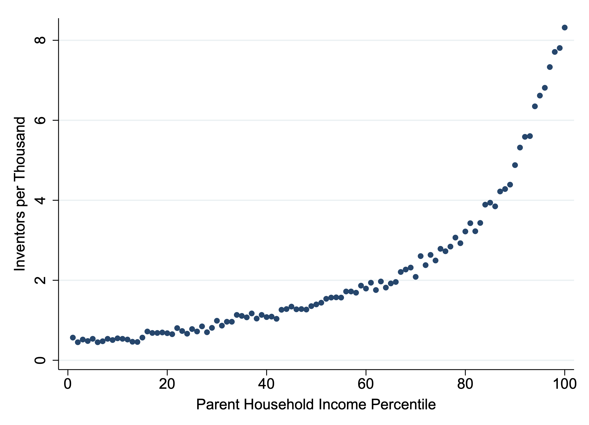
```
]

---

# Lost Einsteins <br> .small[<span class="gray">Bell et al. (2019)</span>]

.center-content[
```{r, echo = F, out.width = '60%'}
knitr::include_graphics("files/inventor_race.png")
```
]

---

# Lost Einsteins <br> .small[<span class="gray">Bell et al. (2019)</span>]

.center-content[
```{r, echo = F, out.width = '60%'}
knitr::include_graphics("files/inventor_sex.png")
```
]

---

# Lost Einsteins <br> .small[<span class="gray">Bell et al. (2019)</span>]

.center-content[
```{r, echo = F, out.width = '60%'}
knitr::include_graphics("files/inventor_inc_sexrace.png")
```
]

---

# Lost Einsteins <br> .small[<span class="gray">Bell et al. (2019)</span>]

.center-content[
```{r, echo = F, out.width = '52%'}
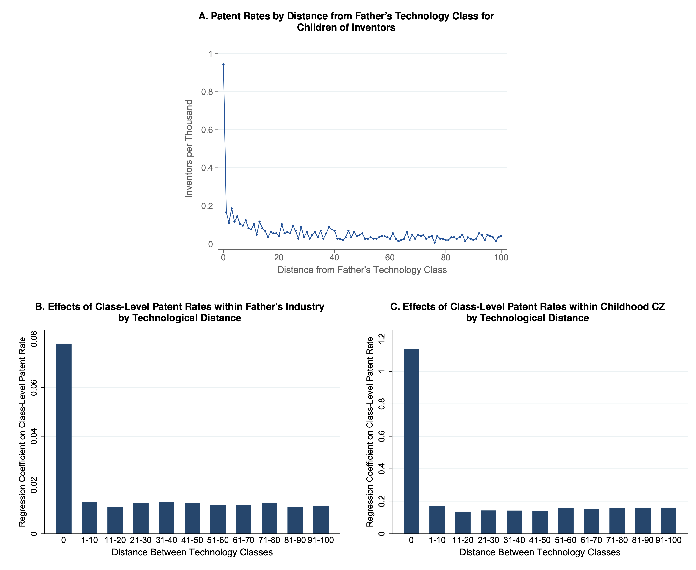
```

.footnote[.small[Genetic ability is unlikely to explain this pattern. A child shouldn't have genes that specifically make them better at inventing "pulse amplifiers" rather than "antenna oscillators"---these are very similar technological categories that would require similar skills and knowledge.]]
]

---

# Lost Einsteins <br> .small[<span class="gray">Bell et al. (2019)</span>]

.center-content[
```{r, echo = F, out.width = '60%'}
knitr::include_graphics("files/inventor_geo.png")
```
]

---

# Lost Einsteins and Policy Implications <br> .small[<span class="gray">Bell et al. (2019)</span>]

.center-content[
- "Lost Einsteins":
  - Under-represented inventors have similar earnings and citations as others
    
      $\Rightarrow$ Women/minorities/low-income who don't invent aren't marginal talents

- Counterfactual
  - If women, minorities, and low-income children invented at same rate as white men from high-income families
    
      $\Rightarrow$ 4x more inventors in America

- Policy
  - Focus on increasing exposure to innovation for under-represented groups
  - May have larger impact than traditional financial incentives
]

---

# Taking a Step Back: Mechanisms for Lost Einsteins

.center-content[
- Role-model "exposure" elasticities .small[<span class="gray">Bell et al. (2019)</span>]
  - Children exposed to inventors are more likely to invent
  - Gender and race-specific exposure effects strongest

- Credit & information frictions
  - Costly education, lack of exposure to STEM careers
  - Limited networks for mentorship and financing

- Structural discrimination
  - School quality differentials
  - Geographic segregation limiting opportunity
  - Social capital .small[<span class="gray">Chetty et al. (2022)</span>]
]

---

# Climbing the ivory tower: talent in academic science

.center-content[
- Human capital drives science <span class="gray">Waldinger (2016)</span>
  - Nazi dismissals of (mostly Jewish) scientists + Allied bombing of German universities
  - 10% loss of researchers → 0.2 SD drop in dept. output, persisting through 1980
  - 10% loss of facilities → 0.05 SD drop, recovering by ~1961
  - Star scientists drive disproportionate output; their loss degrades subsequent hires

- "Hidden stars" <span class="gray">Hager, Schwarz & Waldinger (2024)</span>
  - First citation database created quasi-random visibility of researchers' output
  - Reduced information frictions in hiring → assortative matching of scientists to departments
  - Highly cited researchers from lower-ranked departments and minority groups gained most

- Socio-economic background still shapes who climbs <span class="gray">Abramitzky et al. (2024)</span>
  - Academics from poorer backgrounds under-represented for seven decades; especially at elite universities
  - Father's occupation predicts professors' field of research $\Rightarrow$ steers research direction
  - Poorer-background academics introduce more novel concepts but  fewer citations, awards
]

---

# Macroeconomic Cost of Talent Misallocation <br> .small[<span class="gray">Hsieh et al. (2019)</span>]

.center-content[
- Occupational Convergence (1960-2010):
  - 1960: 94% of doctors/lawyers were white men
  - 2010: Only 62% of doctors/lawyers were white men
  - Assumption: Innate talent distribution unchanging across groups

- Three Sources of Misallocation:
  - Labor market discrimination (wage-productivity wedges)
  - Barriers to human capital formation
  - Differences in preferences/social norms

- Macroeconomic Impact:
  - 20–40% of growth in US GDP per worker (1960–2010) due to declining talent-allocation barriers
  - Mostly from reduced barriers to human capital formation; less from decl. labor market discrim.
]

---

# Who Innovates $\rightarrow$ What Gets Innovated

.center-content[
- Directed technical change: inventors' identities steer R&D topics <span class="gray">Acemoglu (2002)</span>
  - Inventors focus on problems they personally understand or value
  - Market size matters, but inventor demographics also shape focus

- Example facts:
  - All-female inventor teams 35% more likely than all-male teams to focus on women's health <span class="gray">Koning, Samila & Ferguson (2021)</span>
  - Black NIH applicants disproportionately propose work on community-level interventions and health disparities — topics with lower funding rates <span class="gray">Hoppe et al. (2019)</span>
  - Underrepresented groups introduce more novel concepts but get less credit <span class="gray">Hofstra et al. (2020)</span>
]

---
class: agenda

# Agenda

<ul class="agenda-list">
<li class="done">Incentives — what we choose to solve</li>
<li class="done">Talent and ambition</li>
<li class="current">Intergenerational mobility</li>
</ul>

---
class: inverse, middle, center

# Intergenerational mobility

---

# What is intergenerational mobility?

.center-content[
- **Intergenerational mobility** measures how much a child's economic outcomes depend on their parents' economic position

  - High mobility: Where you end up depends on your own effort and talent, not your parents' income

  - Low mobility: Children born poor stay poor; children born rich stay rich

- The "American Dream" is the idea that every generation does better than the last, regardless of starting point

]

---

# The fading American Dream <br> .small[<span class="gray">Chetty et al. (2017)</span>]

.pull-left[
- **Absolute mobility**: the fraction of children who earn more than their parents

- Children born in **1940**: about **90%** earned more than their parents

- Children born in **1980**: only about **50%** earned more than their parents

- In a single generation, the odds of achieving the American Dream fell by nearly half
]

.pull-right[
```{r, echo = FALSE, out.width = '100%'}
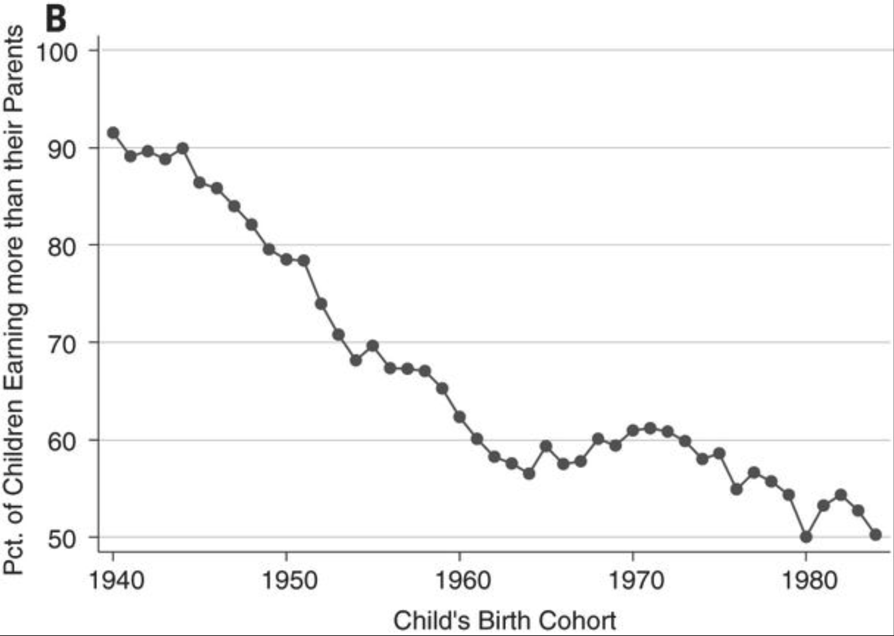
```
]

.footnote[.small[Source: Chetty et al., "The Fading American Dream," *Science*, 2017]]

---

# Why did absolute mobility decline? <br> .small[<span class="gray">Chetty et al. (2017)</span>]

.pull-left[
**GDP growth slowed**

- Growth was rapid in the postwar decades (1940s--1970s)
- Slower growth since the 1980s means a smaller pie to share
- Slower growth alone explains only about a third of the decline
]

.pull-right[
**Inequality rose**

- The bigger factor: growth was distributed differently
- In the 1950s--60s, growth was broadly shared across the income distribution
- Since the 1980s, gains have concentrated at the top
- If growth since 1980 had been distributed as in the 1940s--50s, absolute mobility would still be roughly 80%
]

.footnote[.small[Source: Chetty et al., "The Fading American Dream," *Science*, 2017]]

---

# Where is the Land of Opportunity? <br> .small[<span class="gray">Chetty et al. (2014)</span>]

.pull-left[
- Chetty, Hendren, Kline & Saez use tax records covering millions of families to measure relative mobility across the United States

- **Relative mobility:** how far up the income ladder do children from low-income families climb?

- Enormous geographic variation: a child born to parents at the 25th percentile reaches the 46th percentile in Salt Lake City but only the 36th percentile in Charlotte

]

.pull-right[
```{r, echo = FALSE, out.width = '100%'}
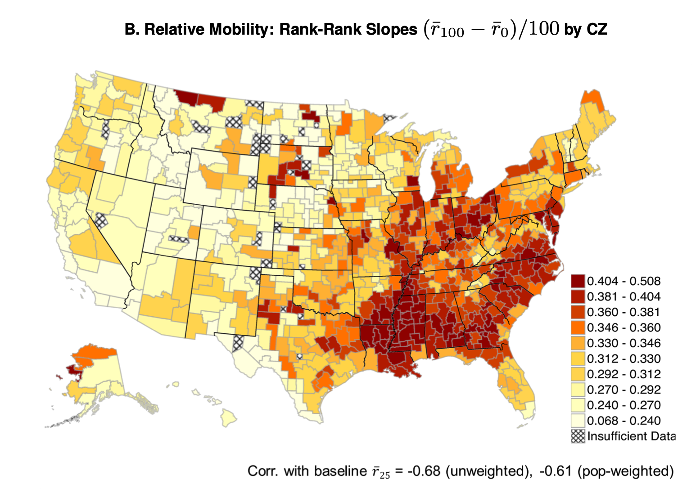
```
]

.footnote[.small[Source: Chetty, Hendren, Kline & Saez, "Where is the Land of Opportunity?" *QJE*, 2014]]

---

# What predicts high-mobility places?

.center-content[
Chetty et al. identify five strong correlates of upward mobility:

1. **Less residential segregation:** both by race and income

2. **Less income inequality:** smaller gaps between rich and poor

3. **Better schools:** higher test scores, lower dropout rates

4. **More social capital:** civic organizations, community engagement

5. **More stable family structures:** share of two-parent households

These are correlations, not necessarily causes. But they point to places and institutions, not just individual effort, as the drivers of mobility.
]

.footnote[.small[Source: Chetty et al., "Where is the Land of Opportunity?" *QJE*, 2014]]

---
class: inverse, middle, center

# What determines mobility?

---

# Neighborhoods matter <br> .small[<span class="gray">Chetty & Hendren (2018)</span>]

.center-content[
- Chetty & Hendren show that every year a child spends in a better neighborhood improves their adult outcomes

- Children who move to higher-mobility areas at younger ages earn more as adults

- The effect is roughly linear in age: the earlier you move, the more you gain

- This implies that neighborhoods have a causal effect on children --- it is not just that better-off families sort into better neighborhoods

- Implication: Where a child grows up is not merely a backdrop. It is a determinant of their future.
]

.footnote[.small[Source: Chetty & Hendren, "The Impacts of Neighborhoods on Intergenerational Mobility," *QJE*, 2018]]

---

# Early childhood and skill formation <br> .small[<span class="gray">Heckman</span>]

.center-content[
- The most important investments in children happen early (before age 5)

- Early cognitive and non-cognitive development creates a foundation for later learning

- Children from disadvantaged families arrive at kindergarten already behind, gap widens over time

- High-quality early childhood programs (like Perry Preschool) have been shown to raise adult earnings, reduce crime, and improve health

- Return on investment in early childhood far exceeds the return on interventions later in life

- But: the U.S. invests far less in early childhood than in college education
]

.footnote[.small[Source: Heckman, "Skill Formation and the Economics of Investing in Disadvantaged Children," *Science*, 2006]]

---

# Net cost of public programs by age of beneficiary <br> .small[<span class="gray">Hendren & Sprung-Keyser (2020)</span>]

.pull-left[
- **MVPF**: beneficiaries' willingness to pay per \$1 of net government cost

- **Net cost**: upfront spending minus revenue clawed back (e.g., higher future tax payments by beneficiaries)

- Many child-targeted programs (early education, child health, college aid) have negative net cost

  $\rightarrow$ They pay for themselves through higher adult earnings and taxes

- Adult-targeted transfers (unemployment, disability, top-tax cuts) cost roughly their face value
]

.pull-right[
```{r, echo = FALSE, out.width = '100%'}
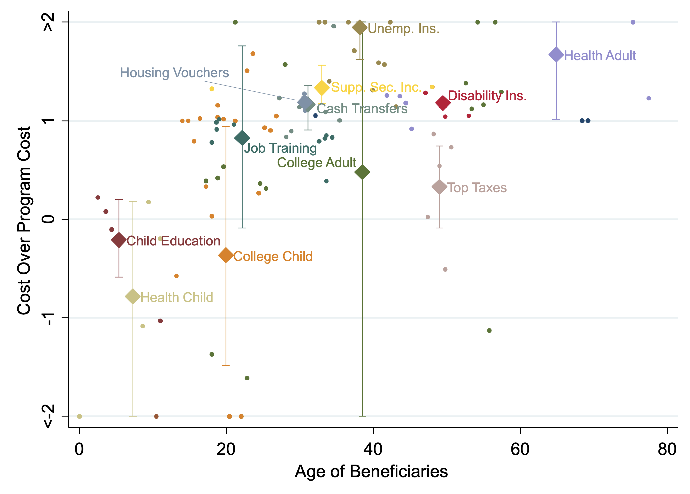
```
]

.footnote[.small[Source: Hendren & Sprung-Keyser, "A Unified Welfare Analysis of Government Policies," *QJE*, 2020]]

---

# Marginal value of public funds by age of beneficiary <br> .small[<span class="gray">Hendren & Sprung-Keyser (2020)</span>]

.pull-left[
- Hendren & Sprung-Keyser compute MVPFs for 133 historical US policies

- Programs investing in children (Perry Preschool, Medicaid expansions, college tuition aid, Moving to Opportunity) have infinite or very high MVPF

- Programs for adults (job training, cash transfers, social insurance) cluster around MVPF $\approx$ 1

- College for adults and most top-tax cuts have MVPF $<$ 1

- Returns to public investment fall sharply with age of beneficiary
]

.pull-right[
```{r, echo = FALSE, out.width = '100%'}
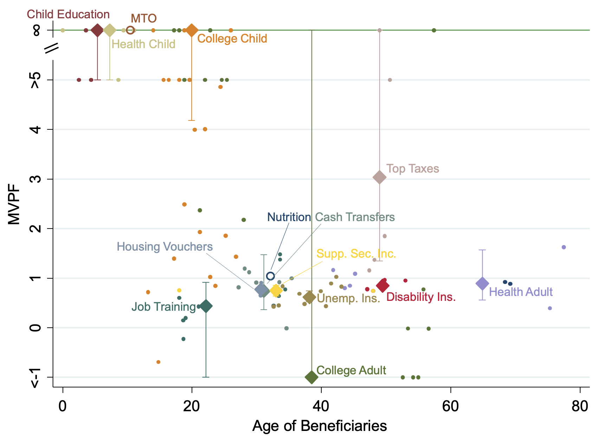
```
]

.footnote[.small[Source: Hendren & Sprung-Keyser, "A Unified Welfare Analysis of Government Policies," *QJE*, 2020]]

---

# **Motivation:** The Land of Opportunity <br> .small[<span class="gray">Althoff, Brookes Gray & Reichardt (2025)</span>]

.center-content[
- How did the US become a land of opportunity?

- Limited evidence on drivers of mobility, especially role of human capital

- Past evidence focused on men: father's income $\leftrightarrow$ son's income

  - *Reason 1:* Income as primary measure of parental background

  - *Reason 2:* Lack of intergenerational datasets that include women
]

---

# **Historical anecdotes** <br> .small[<span class="gray">Althoff, Brookes Gray & Reichardt (2025)</span>]

.center-content[
1. **Abraham Lincoln** (1809-1865): US President
  - (Step-)mother supported his education; father (illiterate farmer) disinterested in education

2. **Thomas Edison** (1847-1931): American inventor
  - Mother (trained teacher) home-educated him; father had no formal schooling

3. **Katherine Johnson** (1918--2020): NASA mathematician
  - Mother was a teacher; father a janitor (parents moved for school access amid Jim Crow)
  - Own daughter also became NASA mathematician
]

---

# **Preview of results:** Schools as a driver of high mobility <br> .small[<span class="gray">Althoff, Brookes Gray & Reichardt (2025)</span>]

.center-content[
```{r, echo = FALSE, out.width = '40%'}
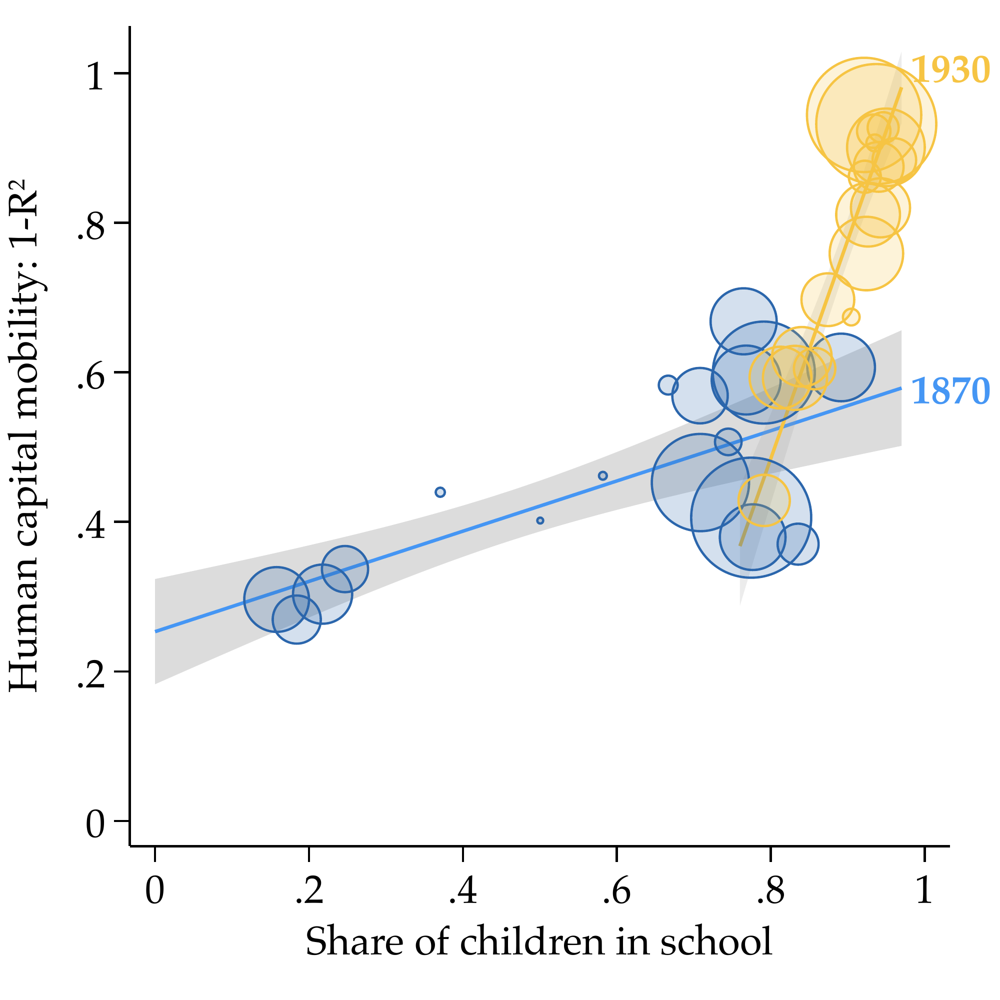
```
]

---

# **Historical context:** Shift from home to school education <br> .small[<span class="gray">Althoff, Brookes Gray & Reichardt (2025)</span>]

.center-content[
```{r, echo = FALSE, out.width = '40%'}
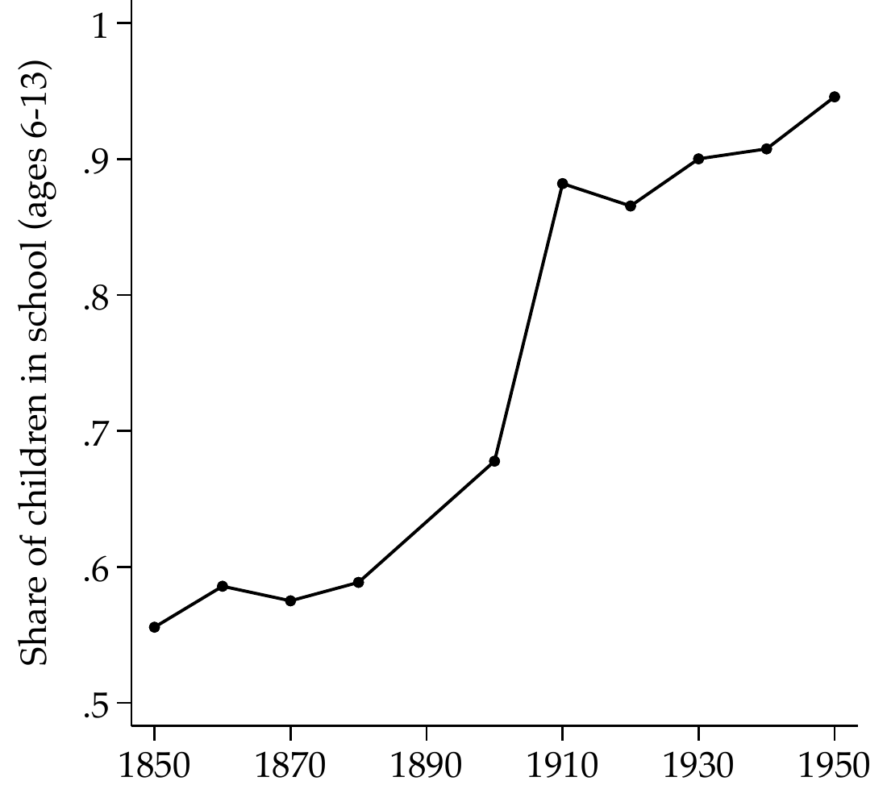
```
]

---

# **This paper:** Intergenerational mobility & maternal human capital <br> .small[<span class="gray">Althoff, Brookes Gray & Reichardt (2025)</span>]

.center-content[
- **Methods:** Measuring intergenerational mobility with multiple inputs

  - Measure mobility as variation unexplained by parental background $(1-R^2)$

  - Decompose predictive power of maternal vs. paternal human capital

  - Address data limitations with Gaussian copula method *<span class="gray">Fan et al. (2017)</span>*

- **Data:** Representative panel tracing both men & women (1850-1950)

  - 186 million linked census records covering 42 million Americans

  - Overcome marriage name changes using SSA administrative data

- **Results:** Maternal human capital & mass schooling shaped mobility

  - Mothers more predictive of children's literacy-based HC, esp. when schooling limited

  $\rightarrow$ Incl. mothers alters conclusions about trends & geography of mobility

  - Human capital mobility rose sharply (0.3 to 0.65) as schooling expanded

  - Distinct mobility patterns for Black Americans post-slavery & during Jim Crow
]

---

# **Literature** <br> .small[<span class="gray">Althoff, Brookes Gray & Reichardt (2025)</span>]

.center-content[
1. **Measuring US intergenerational mobility**

  - Father-child correlations *<span class="gray">Abramitzky et al. 2021, Ward 2023, Olivetti & Paserman (2015)</span>*

  - Parents' average status *<span class="gray">Chetty et al. 2014, Card et al. (2022)</span>*

  - **This paper:** Directly estimates mothers' distinct role in shaping mobility

2. **Women's contributions to long-run economic development**

  - Labor force participation mid-20th century *<span class="gray">Goldin 1977, 1990, 2006, Fern\'andez et al. (2004)</span>*

  - Time spent in home production *<span class="gray">Greenwood et al. 2005, Ramey 2009, Ngai et al. (2024)</span>*

  - **This paper:** Quantifies key "hidden" contribution via human capital transmission

3. **Datasets including women in historical mobility studies**

  - Automated record linkage for men *<span class="gray">Abramitzky et al. (2020)</span>*

  - Women via vital records or crowd-sourced family trees *<span class="gray">Craig et al. 2019, Buckles et al. (2023)</span>*

  - **This paper:** Uses historical administrative data for both scale & representativeness
]

---
class: inverse, middle, center

# Intergenerational Datasets

---

# **Data (childhood):** Census cross-sections of children & parents <br> .small[<span class="gray">Althoff, Brookes Gray & Reichardt (2025)</span>]

.center-content[
- Full-count census data from 1850 to 1950

  - Identifies family relationships within households

  $\rightarrow$ observe parents & children jointly

  - Children (13-16): Measure literacy (1850-1930) and years of schooling (1940-1950)

  - Parents: Measure literacy and years of schooling

- Advantages:

  - Full US population

  - Can directly analyze transmission of human capital during childhood

- Limitations:

  - Cannot observe children's outcomes once they reach adulthood

  - Next: New intergenerational dataset
]

---

# **Data (adulthood):** Historical administrative data (SSA) <br> .small[<span class="gray">Althoff, Brookes Gray & Reichardt (2025)</span>]

.center-content[
```{r, echo = FALSE, out.width = '84%'}

```
]

---

# **Data (adulthood):** Linking women despite name changes <br> .small[<span class="gray">Althoff, Brookes Gray & Reichardt (2025)</span>]

.center-content[
```{r, echo = FALSE, out.width = '95%'}
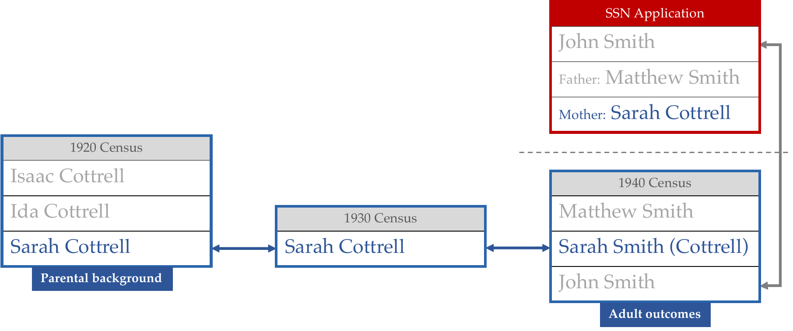
```
]

---

# **Data (adulthood):** Representativeness & coverage (1850-1950) <br> .small[<span class="gray">Althoff, Brookes Gray & Reichardt (2025)</span>]

.center-content[
```{r, echo = FALSE, out.width = '36%'}
knitr::include_graphics("files/representativeness_across_years.png")
```
]

---
class: inverse, middle, center

# Measuring Mobility with Multiple Parental Inputs

---

# **Strategy:** Simple model of rank mobility with multiple inputs <br> .small[<span class="gray">Althoff, Brookes Gray & Reichardt (2025)</span>]

.center-content[
$$\text{rank}(Y_{i}) = \alpha + \boldsymbol{\beta}_{1} \textbf{rank}\left(\boldsymbol{Y}^{\text{father}}_{i}\right) + \boldsymbol{\beta}_{2} \textbf{rank}\left(\boldsymbol{Y}^{\text{mother}}_{i}\right) + \varepsilon_{i}$$

- $Y_i^j$: $i$'s outcome (e.g., human capital)

- **New:** Explicitly incorporates multiple parental inputs
]

---

# **Strategy:** Measuring mobility via $R^2$ <br> .small[<span class="gray">Althoff, Brookes Gray & Reichardt (2025)</span>]

.center-content[
$$R^2 = \frac{\text{Variance in child outcomes explained by parents}}{\text{Variance in child outcomes}}$$

- **Comparability:** Closely tied to parent-child coefficient $\beta$

  - $R^2 = \left(\beta \cdot \frac{\sigma_X}{\sigma_Y}\right)^2$

  - One-to-one mapping with rank-rank coefficient: $R^2 = \beta^2$

- **Multiple parental inputs**

- **Intuitive interpretation**
]

---
class: inverse, middle, center

# Human Capital Mobility

---

# **Strategy:** Rank-rank human capital mobility <br> .small[<span class="gray">Althoff, Brookes Gray & Reichardt (2025)</span>]

.center-content[
$$HC^{\text{child}}_{i} = \alpha_{g} + \beta_{f} \cdot HC^{\text{father}}_{i} + \beta_{m} \cdot HC^{\text{mother}}_{i} + \varepsilon_{i}$$

- We only observe literacy as a binary proxy of (latent) human capital.

- **Solution:** Gaussian copula method *<span class="gray">Fan et al. (2017)</span>*
]

---

# **Strategy:** Identification of rank mobility despite data limitations <br> .small[<span class="gray">Althoff, Brookes Gray & Reichardt (2025)</span>]

.center-content[
- **Goal:** Estimate mobility (1-$R^2$) via rank($Y_i$) = $\alpha$ + $\beta \cdot$ rank($X_i$) + $\epsilon_i$

- **Challenge:** Only binary indicators observed: $Y^*_i = \mathbb{1}[Y_i > \delta_y]$ and $X^*_i = \mathbb{1}[X_i > \delta_x]$

  $\rightarrow$ Many possible rank correlations compatible with binary data

- **Solution:** Gaussian copula method *<span class="gray">Fan et al. (2017)</span>*

  $\rightarrow$ Allows time-varying marginal distr. $\Rightarrow$ rising literacy does not inflate mobility

- **Validation:** Method performs well under various conditions

  - Alternative methods (Kendall's $\tau$, normalized $R^2$) confirm same patterns

  - Simulation: Accurately recovers true rank mobility from binary data

  - 1930-1940 comparison: High correlation (0.85) across states, sex, and race

  - Modern data (NLSY79, PSID): Robust to extreme cutoffs in dichotomization
]

---

# **Results:** Human capital mobility rises over US history <br> .small[<span class="gray">Althoff, Brookes Gray & Reichardt (2025)</span>]

.pull-left[
**All**
```{r, echo = FALSE, out.width = '78%'}
knitr::include_graphics("files/figure3_panel_a_with_cis_all_years.png")
```
]

.pull-right[
**By group**
```{r, echo = FALSE, out.width = '100%'}
knitr::include_graphics("files/figure3_panel_b_with_cis_all_years.png")
```
]

.footnote[.small[Bootstrap 95% confidence intervals shown. All available census waves included.]]

---

# **Strategy:** Assessing drivers of changing mobility <br> .small[<span class="gray">Althoff, Brookes Gray & Reichardt (2025)</span>]

.center-content[
- **Decomposition of** $\boldsymbol{R^2}$ **into components**

$$R^2 = \beta_m^2 + \beta_f^2 + 2\beta_m \beta_f\hat{\rho}_{m,f}$$

1. **Maternal contribution:** $\beta_m^2$ (mothers' predictive power)

2. **Paternal contribution:** $\beta_f^2$ (fathers' predictive power)

3. **Assortative mating:** $2\beta_m \beta_f\hat{\rho}_{m,f}$ (where $\hat{\rho}_{m,f}$ is correlation between parents)

- **Application:** Counterfactual analysis by holding parameters constant
]

---

# **Results:** Changing role of mothers drives rising mobility <br> .small[<span class="gray">Althoff, Brookes Gray & Reichardt (2025)</span>]

.center-content[
```{r, echo = FALSE, out.width = '50%'}
knitr::include_graphics("files/latgaussbin2_counterfactual_r2_betas_xsection.png")
```
]

---

# **Strategy:** Separating contribution of mothers vs. fathers to $R^2$ <br> .small[<span class="gray">Althoff, Brookes Gray & Reichardt (2025)</span>]

.center-content[
- **Shapley-Owen decomposition of** $\boldsymbol{R^2}$ *<span class="gray">Shapley 1953; Owen 1977</span>*

- **Unique advantages** of this method *<span class="gray">Young 1985</span>*

1. **Additivity:** Individual contributions add up to the total $R^2$

2. **Equal treatment:** Perfectly substitutable regressors receive equal values

3. **Monotonicity:** More predictive regressors receive larger values
]

---

# **Results:** Mothers disproportionally predict child's human capital <br> .small[<span class="gray">Althoff, Brookes Gray & Reichardt (2025)</span>]

.pull-left[
**All**
```{r, echo = FALSE, out.width = '78%'}
knitr::include_graphics("files/parenthumancap_slv_xsection_lit_literate_cohort_sharemom_latgaussbin.png")
```
]

.pull-right[
**By group**
```{r, echo = FALSE, out.width = '100%'}
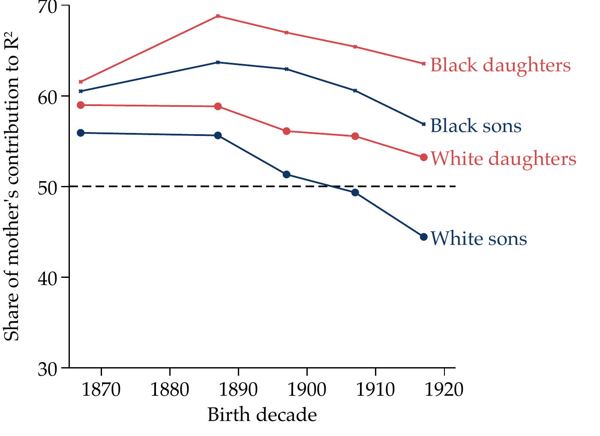
```
]

---

# **Results:** Mothers' predictive power across family types <br> .small[<span class="gray">Althoff, Brookes Gray & Reichardt (2025)</span>]

```{r, echo = FALSE, out.width = '70%'}
knitr::include_graphics("files/parenthumancap_xsection_latgaussbin_familystatus1.png")
```

.footnote[.small[Results are for 1900 cohort, based on single input model that excludes fathers.]]

---

# **Results:** Geography of human capital mobility after incl. mothers <br> .small[<span class="gray">Althoff, Brookes Gray & Reichardt (2025)</span>]

.center-content[
```{r, echo = FALSE, out.width = '20%'}
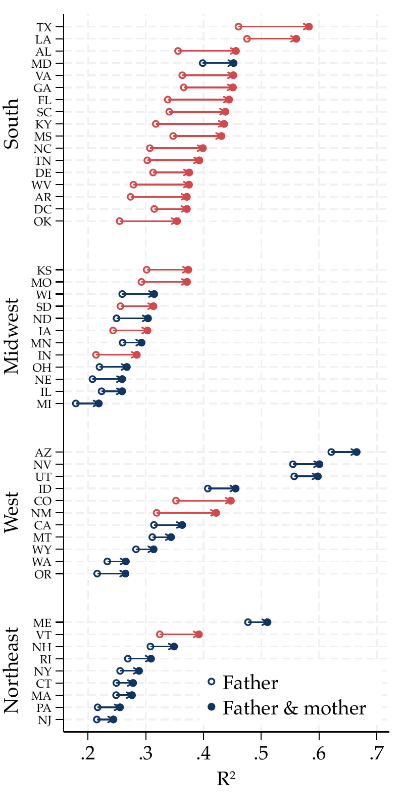
```
]

---

# Takeaways: Human Capital Mobility <br> .small[<span class="gray">Althoff, Brookes Gray & Reichardt (2025)</span>]

.center-content[
**Surging human capital mobility in two episodes**

1. **Black:** After end of slavery
2. **White:** Early 1900s ($\sim$ school attendance becomes universal)

**Maternal human capital** key predictor of child HC

- **Mother's human capital** more predictive than father's
- **Female & Black children** have stronger maternal link
]

---
class: inverse, middle, center

# Rising Human Capital Mobility & Mass Schooling

---

# **Results:** Schools as a driver of high mobility <br> .small[<span class="gray">Althoff, Brookes Gray & Reichardt (2025)</span>]

.center-content[
```{r, echo = FALSE, out.width = '40%'}

```
]

---

# **Results:** Human capital mobility & school access <br> .small[<span class="gray">Althoff, Brookes Gray & Reichardt (2025)</span>]

.pull-left[
**Mothers**
```{r, echo = FALSE, out.width = '90%'}
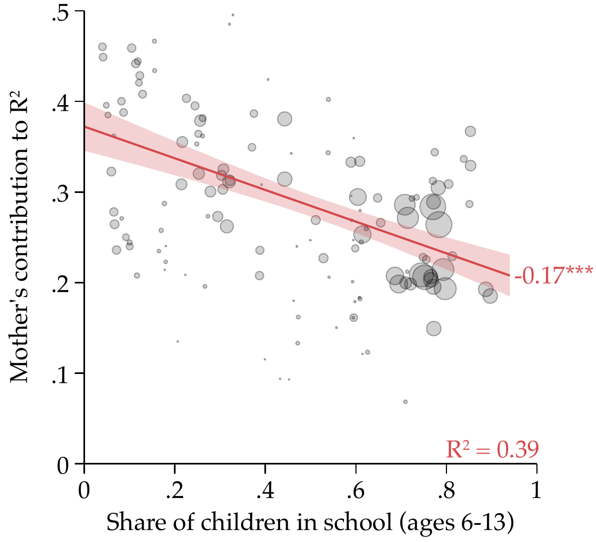
```
]

.pull-right[
**Fathers**
```{r, echo = FALSE, out.width = '90%'}
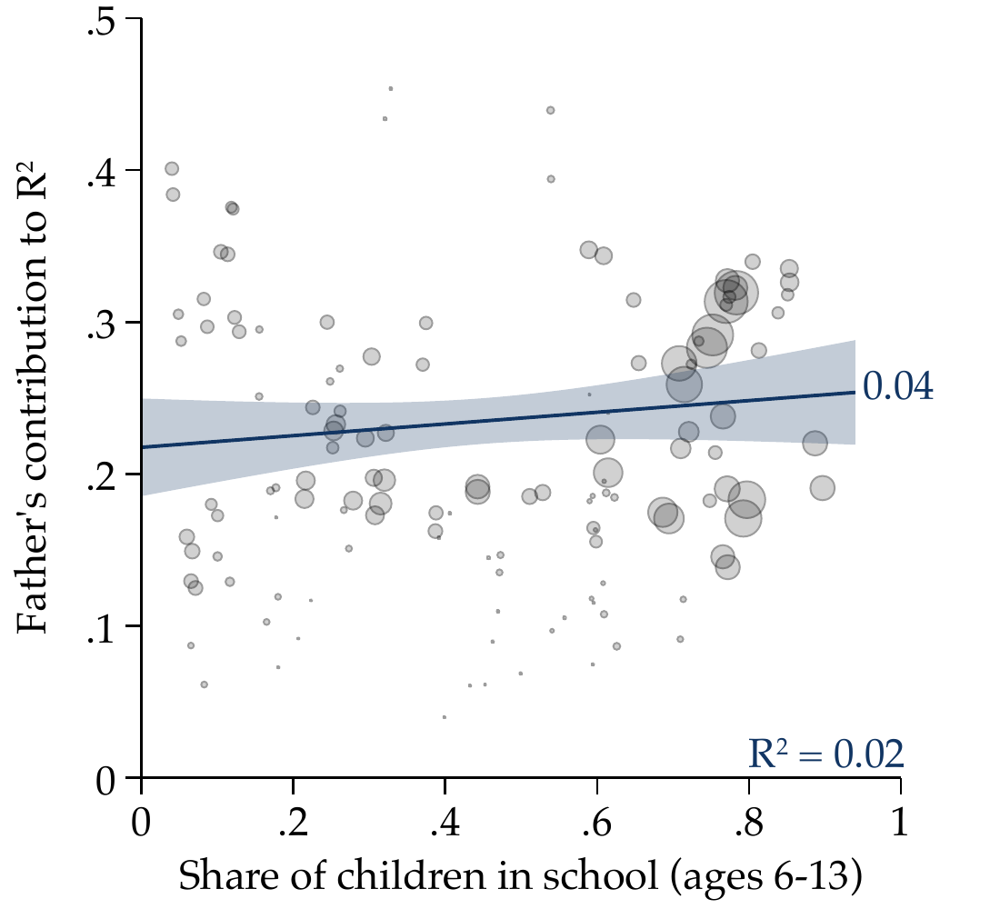
```
]

.footnote[.small[Estimates separate by sex, race, state.]]

---

# **Results:** Human capital mobility & *two different measures* of school access <br> .small[<span class="gray">Althoff, Brookes Gray & Reichardt (2025)</span>]

.center-content[
|  | $\phi_{\text{Mother}}$ | $\phi_{\text{Father}}$ | $\frac{\phi_{\text{Mother}}}{R^2}$ | $\phi_{\text{Mother}}$ | $\phi_{\text{Father}}$ | $\frac{\phi_{\text{Mother}}}{R^2}$ |
|---|:---:|:---:|:---:|:---:|:---:|:---:|
| **Baseline measure of school access** | -0.18*** | 0.04 | -0.20*** |  |  |  |
|  | (0.03) | (0.05) | (0.03) |  |  |  |
| **Refined measure of school access** |  |  |  | -0.47*** | 0.15 | -0.58*** |
| *(accounts for attendance, term lengths, etc.)* |  |  |  | (0.08) | (0.11) | (0.10) |
| R$^2$ | 0.39 | 0.02 | 0.51 | 0.37 | 0.04 | 0.57 |
| Observations | 133 | 133 | 133 | 128 | 128 | 128 |
]

---

# **Strategy:** Isolating causal impact of schooling on maternal influence <br> .small[<span class="gray">Althoff, Brookes Gray & Reichardt (2025)</span>]

.center-content[
$$\phi^{\text{Mother}}_{s,r,yob} = \alpha + \beta \cdot \text{inschool}_{s,r,yob} + \gamma_{yob} + \varepsilon_{s,r,yob}$$

- **Identification strategy**

  - Outcome: Mother's contribution to intergenerational persistence ($\phi^{\text{Mother}}$)

  - Endogenous variable: Share of children in school by state-race ($\text{inschool}_{s,r,yob}$)

  - Exploit staggered implementation of compulsory schooling laws across states

  - Instrument: Number of years child exposed to compulsory schooling
]

---

# **Results:** Causal evidence from mandatory schooling legislation <br> .small[<span class="gray">Althoff, Brookes Gray & Reichardt (2025)</span>]

.center-content[
| | OLS | IV | OLS | IV |
|---|:---:|:---:|:---:|:---:|
| **IV: Schooling via compulsory schooling laws** | -0.23*** | -0.92*** | -0.73*** | -0.92*** |
| | (0.04) | (0.22) | (0.18) | (0.22) |
| Cohort Fixed Effects | Y | Y | Y | Y |
| Sample restricted to 1920-1940 | N | N | Y | Y |
| F-statistic | -- | 35.52 | -- | 35.39 |
| R$^2$ | 0.47 | -- | 0.38 | -- |
| Observations | 1,049 | 1,049 | 465 | 465 |
]

---

# Takeaways: Schools and Mobility <br> .small[<span class="gray">Althoff, Brookes Gray & Reichardt (2025)</span>]

.center-content[
1. **School access** $\leftrightarrow$ **human capital mobility** (time, space, sex, race)

  **With school access, mothers' contribution converges w/ fathers'**

2. **Schooling** $\Rightarrow$ **human capital mobility** via evidence from staggered mandatory school laws
]

---
class: inverse, middle, center

# Income Mobility & Human Capital Mobility Rise Together

---

# **Strategy:** Measuring income mobility incorporating human capital <br> .small[<span class="gray">Althoff, Brookes Gray & Reichardt (2025)</span>]

.center-content[
$$\text{rank}(\text{inc}_i) = \alpha + \beta_p\text{rank}(\text{inc}^{\text{parents}}_i) + \beta_m\text{rank}(h^{\text{mother}}_i) + \beta_f\text{rank}(h^{\text{father}}_i) + \varepsilon_i$$

- **Method:** Gaussian copula method to handle binary proxies (literacy)

- **Data:** Applied to our new representative panel dataset
]

---

# **Results:** Income mobility rises in tandem with human capital mobility <br> .small[<span class="gray">Althoff, Brookes Gray & Reichardt (2025)</span>]

.center-content[
```{r, echo = FALSE, out.width = '50%'}
knitr::include_graphics("files/parentalbackground_lido_cohort_latgaussbin_new2.png")
```
]

---

# **Results:** Changing role of mothers sole driver of rising mobility ($\beta_m$) <br> .small[<span class="gray">Althoff, Brookes Gray & Reichardt (2025)</span>]

.center-content[
```{r, echo = FALSE, out.width = '50%'}
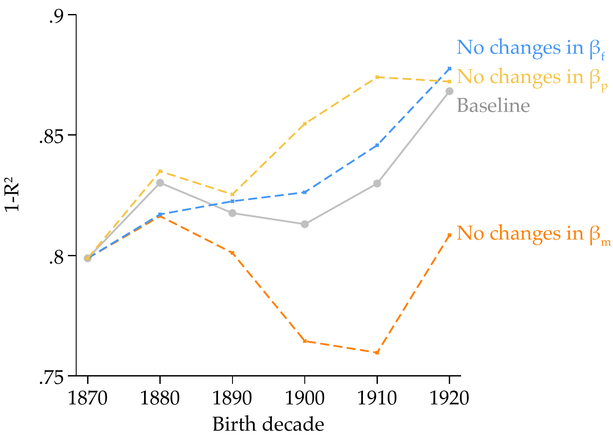
```
]

---

# **Conclusion** <br> .small[<span class="gray">Althoff, Brookes Gray & Reichardt (2025)</span>]

.center-content[
- Mothers' human capital was key predictor of children's outcomes before mass schooling

  **→ Including mothers alters key conclusions** *(e.g., South as least mobile region)*

- Mobility in human capital and income surged from the 19th to the 20th century

  **→ US was not born as country of opportunity**

- Mass schooling replaced home education, reducing reliance on maternal human capital

  **→ High mobility is not guaranteed---depends on public provision of schooling**

  **→ Quality schooling especially benefits children of less-educated parents**
]

---
exclude: true
class: inverse, middle, center

# College as a mobility engine

---
exclude: true

# Mobility Report Cards <br> .small[<span class="gray">Chetty et al. (2020)</span>]

.center-content[
- Chetty, Friedman, Saez, Turner & Yagan link college attendance records to tax data for 30 million students

- They ask: Which colleges move children from the bottom to the top of the income distribution?

- Two facts determine a college's contribution to mobility:
  1. **Access:** What fraction of students come from low-income families?
  2. **Success rates:** What fraction of graduates reach high incomes?

- **Mobility rate** = Access $\times$ Success rate
]

.footnote[.small[Source: Chetty et al., "Mobility Report Cards," *QJE*, 2020]]

---
exclude: true

# The access gap <br> .small[<span class="gray">Chetty et al. (2020)</span>]

.center-content[
*[Placeholder: figure showing share of students from bottom 20% vs top 1% at Ivy-Plus colleges]*

- Children from top-1% families are 77 times more likely to attend an Ivy-Plus college than children from the bottom 20%
- At elite colleges, more students come from the top 1% than from the entire bottom 50%
- Conditional on attending the same college, children from low-income and high-income families have similar earnings outcomes
- The problem is not that low-income students cannot succeed at elite colleges --- it is that they never get there
]

.footnote[.small[Source: Chetty et al., "Mobility Report Cards," *QJE*, 2020]]

---
exclude: true

# Where mobility actually happens <br> .small[<span class="gray">Chetty et al. (2020)</span>]

.pull-left[
**Mid-tier public universities**

- The highest mobility rates are at institutions like CUNY, Cal State, and certain regional publics
- These colleges combine high access (many low-income students) with decent success rates (many graduates reach the middle class)
- They move more students from poverty to prosperity than the Ivy League
]

.pull-right[
**A worrying trend**

- The fraction of low-income students at high-mobility colleges has been declining
- State funding cuts have forced public universities to raise tuition and recruit wealthier out-of-state students
- The colleges that do the most for mobility are under the greatest financial pressure
- If these institutions lose their low-income students, America loses its most effective mobility engine
]

.footnote[.small[Source: Chetty et al., "Mobility Report Cards," *QJE*, 2020]]

---
exclude: true
class: inverse, middle, center

# Mobility, inequality, and the path forward

---
exclude: true

# The Great Gatsby Curve

.center-content[
*[Placeholder: scatter plot of inequality (Gini) vs. intergenerational earnings elasticity across countries]*

- The **Great Gatsby Curve** shows a striking cross-country pattern: **more unequal societies are also less mobile**

- Countries with high inequality (U.S., UK) have lower intergenerational mobility

- Countries with low inequality (Denmark, Canada) have higher mobility

- **Why?** Higher inequality means:
  - Larger gaps in neighborhood quality, school quality, and social networks
  - Greater returns to parental investments --- amplifying initial advantages
  - Weaker public institutions that might otherwise level the playing field

- Inequality and immobility reinforce each other in a **vicious cycle**
]

---
exclude: true

# Mobility varies by race and gender

.center-content[
- **Black children** have substantially lower upward mobility than white children, even from families with the same income <span class="gray">Chetty et al. (2020)</span>

- The gap is especially large for **Black boys**, driven by neighborhoods, incarceration, and discrimination

- **Hispanic children** show relatively high rates of upward mobility --- closer to white children than Black children

- **Girls** have higher upward mobility than boys in most places --- but face a glass ceiling at the top of the income distribution

- Mobility is not a single number --- it depends on **who you are** and **where you grow up**
]
