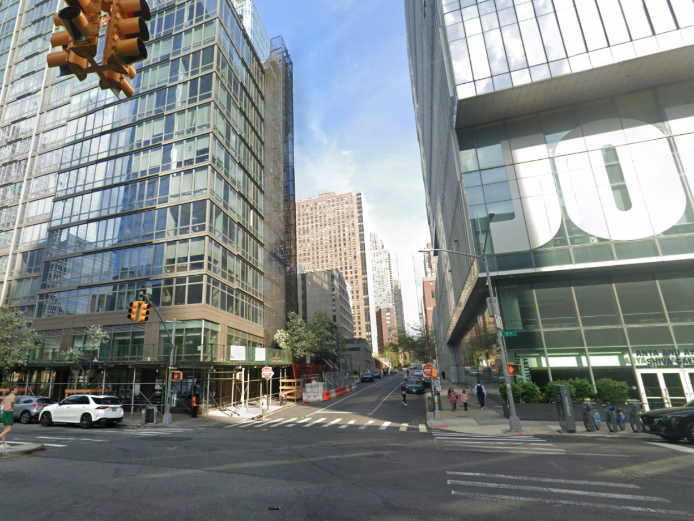
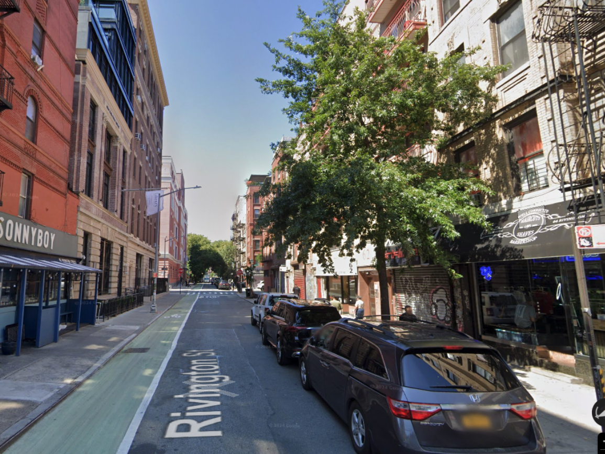
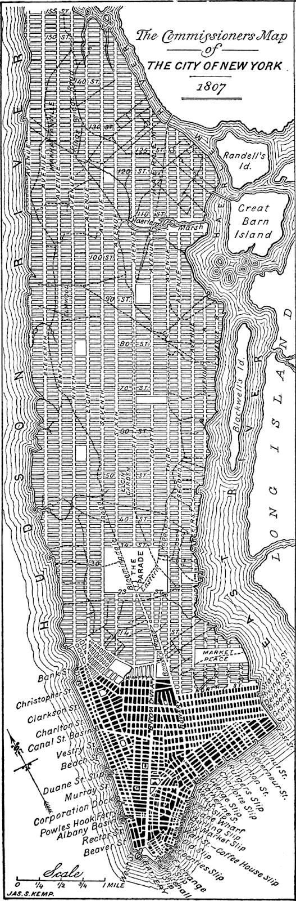
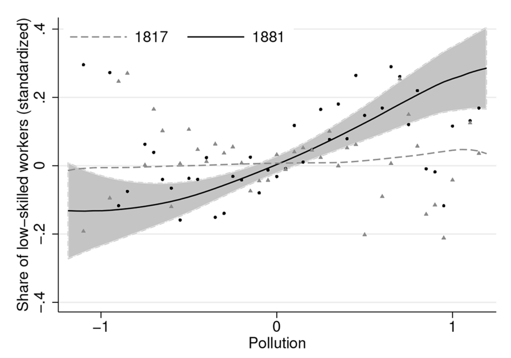
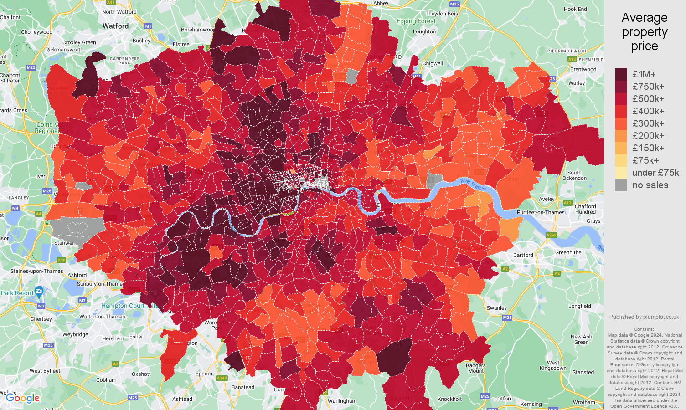
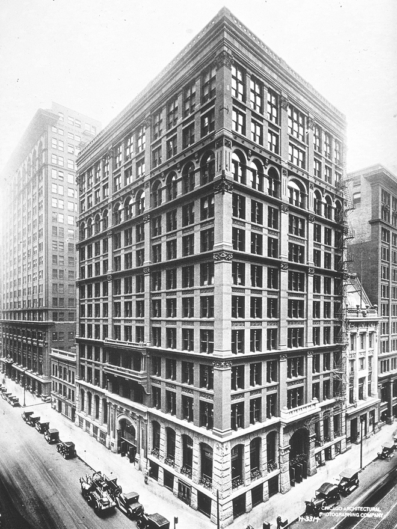
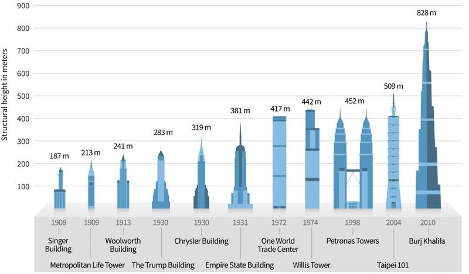
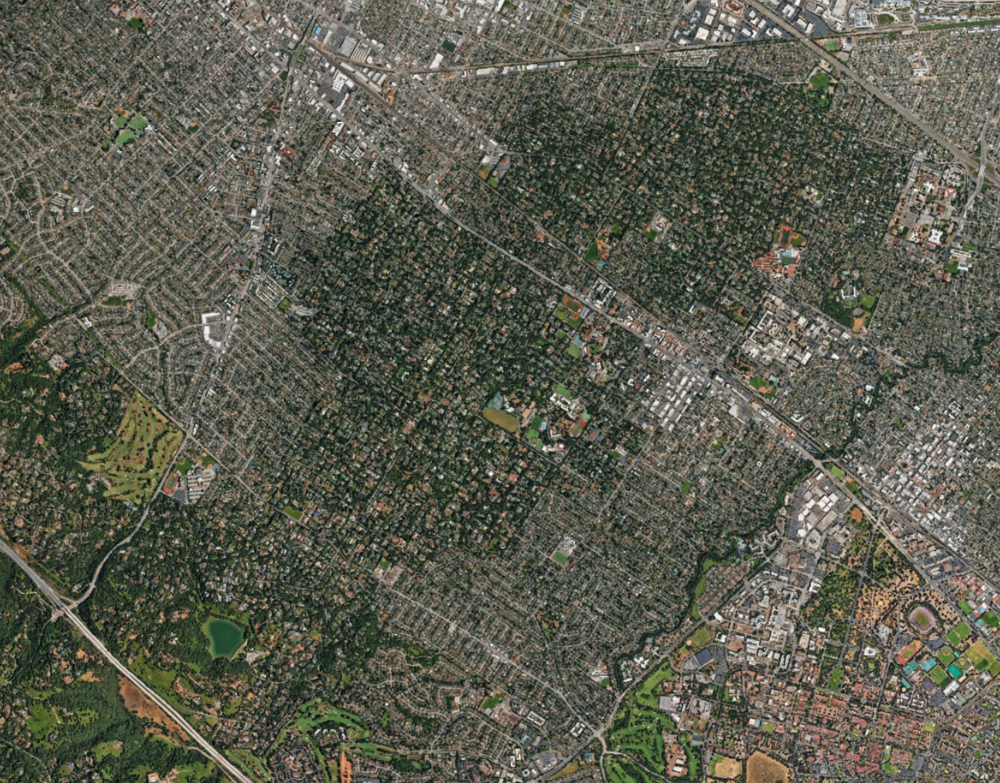
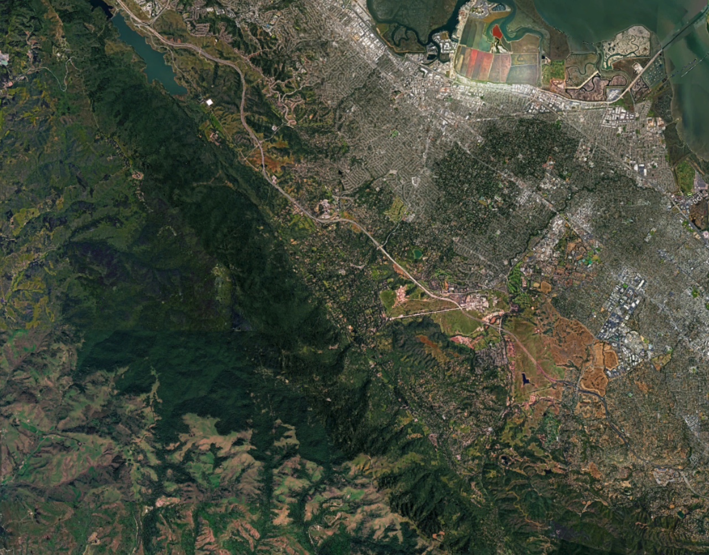

```{r, setup, include = F}
library(knitr)
opts_chunk$set(
  comment = "#>",
  fig.align = "center",
  fig.height = 7,
  fig.width = 10.5,
  warning = F,
  message = F
)
```

class: agenda

# Agenda

<ul class="agenda-list">
<li class="current">The long arc of cities</li>
<li class="upcoming">Why do cities exist?</li>
<li class="upcoming">Cities as engines of innovation</li>
<li class="upcoming">Cities and inequality</li>
<li class="upcoming">The future of cities</li>
</ul>

---

# The Neolithic revolution made cities possible

.center-content[
- For most of our species' history, *Homo sapiens* was nomadic

- ~10,000 BCE: agriculture and storage → people settle down

- Surplus food supports people who *aren't* farmers — priests, scribes, artisans, soldiers, traders

- Cities are the physical infrastructure of the division of labor
]

---

# From village to city

.pull-left[
```{r, echo = F, out.width = '100%'}
knitr::include_graphics("files/catalhoyuk.png")
```

**Çatalhöyük (~7000 BCE):**
- *Proto*-city, ~8,000 people in Anatolia
- Houses entered through the roof
- No streets, no central plaza
]

.pull-right[
```{r, echo = F, out.width = '100%'}
knitr::include_graphics("files/uruk.png")
```

**Uruk (~3500 BCE):**
- First true city, ~40,000 people in Sumer
- Writing invented to track grain
- Specialized occupations, full-time priests
]

---

# Urbanization in the very long run

.center-content[
  <div style="display: flex; justify-content: center; align-items: center; height: 490px; width: 100%; text-align: center;">
    <iframe src="../materials/urbanization_long_run.html" width="100%" height="100%" style="border: none; display: block; margin: 0 auto;"></iframe>
  </div>
]

---

# The majority of humans live in cities

.center-content[
```{r, echo = F, out.width = '70%'}
knitr::include_graphics("files/share-urban-and-rural-population.png")
```

]

---
class: bg-blurry, middle, center, timer-5min-cities

<div class="timer-quote">What are the major benefits vs. costs of cities?</div>
<div class="timer-sep"></div>

<div style="text-align: left; max-width: 700px; margin: 0 auto 24px; font-size: 22px; line-height: 1.6;">
1. <strong>Brainstorm</strong> (2 min): In pairs, list benefits and costs of cities.<br>
2. <strong>Debate</strong> (3 min): Pair up with another pair (4 students) and compare your lists.
</div>

<div class="timer-countdown" id="timer-5min-cities">05:00</div>
<div class="timer-controls">
  <button class="timer-toggle is-play" id="timer-5min-cities-toggle" type="button" aria-label="Start timer">&#9654;</button>
</div>

<script>
(function() {
  var totalSeconds = 5 * 60;
  var remaining = totalSeconds;
  var intervalId = null;
  var isRunning = false;
  var display = document.getElementById('timer-5min-cities');
  var toggle = document.getElementById('timer-5min-cities-toggle');
  var playLabel = '&#9654;';
  var resetLabel = 'reset';
  var buttonState = 'play';

  if (!display || !toggle) {
    return;
  }

  function formatTime(seconds) {
    var minutes = Math.floor(seconds / 60);
    var secs = seconds % 60;
    return String(minutes).padStart(2, '0') + ':' + String(secs).padStart(2, '0');
  }

  function render() {
    display.textContent = formatTime(remaining);
  }

  function setButtonState(state) {
    buttonState = state;
    toggle.innerHTML = state === 'reset' ? resetLabel : playLabel;
    toggle.setAttribute('aria-label', state === 'reset' ? 'Reset timer' : 'Start timer');
    toggle.classList.toggle('is-reset', state === 'reset');
    toggle.classList.toggle('is-play', state === 'play');
  }

  function stopTimer() {
    if (intervalId) {
      clearInterval(intervalId);
      intervalId = null;
    }
    isRunning = false;
  }

  function resetTimer() {
    stopTimer();
    remaining = totalSeconds;
    render();
    setButtonState('play');
  }

  function startTimer() {
    if (isRunning) {
      return;
    }
    if (remaining <= 0) {
      remaining = totalSeconds;
    }
    stopTimer();
    isRunning = true;
    setButtonState('reset');
    intervalId = setInterval(function() {
      remaining -= 1;
      if (remaining <= 0) {
        remaining = 0;
        render();
        stopTimer();
        return;
      }
      render();
    }, 1000);
  }

  function hasTimerClass(slide) {
    if (!slide || !slide.properties || !slide.properties.class) {
      return false;
    }
    var classes = slide.properties.class.split(/[,\\s]+/).filter(Boolean);
    return classes.indexOf('timer-5min-cities') !== -1;
  }

  toggle.addEventListener('click', function() {
    if (buttonState === 'play') {
      startTimer();
    } else {
      resetTimer();
    }
  });

  if (window.slideshow && window.slideshow.on) {
    var lastWasTimer = false;

    window.slideshow.on('afterShowSlide', function(slide) {
      var isTimerSlide = hasTimerClass(slide);
      if (isTimerSlide && !lastWasTimer) {
        resetTimer();
      }
      if (!isTimerSlide && lastWasTimer) {
        resetTimer();
      }
      lastWasTimer = isTimerSlide;
    });

    if (window.slideshow.getSlides) {
      var slides = window.slideshow.getSlides();
      var index = typeof window.slideshow.getCurrentSlideIndex === 'function'
        ? window.slideshow.getCurrentSlideIndex()
        : null;
      if (index !== null && slides[index] && hasTimerClass(slides[index])) {
        lastWasTimer = true;
        resetTimer();
      }
    }
  } else {
    resetTimer();
  }
})();
</script>

---

# Two faces of the city

.pull-left[
**Benefits**

- **Agglomeration**: ideas, division of labor, thicker markets

- **Trade** and specialization

- **Cultural production**: art, music, learning

- **Defense** behind walls

- Access to political and religious power
]

.pull-right[
**Costs**

- **Disease**: dense populations were death traps until the 1900s

- **Fire**: London 1666, Chicago 1871, Tokyo 1923

- **Pollution**: smog, sewage, lead

- **Crime** and social conflict

- Higher rents, congestion
]

---

# What changed: the urban mortality penalty disappeared

.center-content[
Three nineteenth-century revolutions made cities *survivable*:

1. **Sanitation**: London sewers (1865), Paris under Haussmann (1850s–60s)

2. **Germ theory**: Pasteur, Koch, Lister → clean water, antiseptics, vaccines

3. **Refrigeration and food distribution**: cities could feed themselves safely

By 1900, urban life expectancy began to *exceed* rural in rich countries — and the modern city took off.
]

---

# John Snow and the Broad Street pump (1854)

.pull-left[
```{r, echo = F, out.width = '100%'}
knitr::include_graphics("files/snow_cholera_map.jpg")
```
]

.pull-right[
- Soho, London, 1854: a cholera outbreak killed 616 people in weeks

- Prior theory was disease from "bad air"

- Snow mapped each death as a bar on the street: clusters pointed to one water pump

- He convinced the parish to remove the pump handle → the outbreak ended

- Snow had no germ theory yet, but he had **data + a map**

]

---
class: inverse, middle, center

# A timeline of great cities

The largest, most innovative, or most influential city of its era

---

# Uruk .small[(Sumer, c. 3500 BCE)]

.center-content[
```{r, echo = F, out.width = '60%'}
knitr::include_graphics("files/uruk.png")
```
]

---

# Babylon .small[(Neo-Babylonian Empire, c. 600 BCE)]

.center-content[
```{r, echo = F, out.width = '60%'}
knitr::include_graphics("files/babylon.png")
```
]

---

# Athens .small[(Classical Greece, 5th c. BCE)]

.center-content[
```{r, echo = F, out.width = '60%'}
knitr::include_graphics("files/athens.png")
```
]

---

# Alexandria .small[(Hellenistic Egypt, 3rd c. BCE)]

.center-content[
```{r, echo = F, out.width = '60%'}
knitr::include_graphics("files/alexandria.png")
```
]

---

# Rome .small[(Imperial Rome, c. 100 CE)]

.center-content[
```{r, echo = F, out.width = '60%'}
knitr::include_graphics("files/rome.png")
```
]

---

# Chang'an .small[(Tang dynasty, c. 750 CE)]

.center-content[
```{r, echo = F, out.width = '60%'}
knitr::include_graphics("files/changan.png")
```
]

---

# Baghdad .small[(Abbasid Caliphate, c. 800 CE)]

.center-content[
```{r, echo = F, out.width = '60%'}
knitr::include_graphics("files/baghdad.png")
```
]

---

# Amsterdam .small[(Dutch Golden Age, 17th c.)]

.center-content[
```{r, echo = F, out.width = '60%'}
knitr::include_graphics("files/amsterdam.png")
```
]

---

# London

.center-content[
```{r, echo = F, out.width = '60%'}
knitr::include_graphics("files/london.jpg")
```
]

---

# New York

.center-content[
```{r, echo = F, out.width = '60%'}
knitr::include_graphics("files/new_york.jpg")
```
]

---

# Tokyo

.center-content[
```{r, echo = F, out.width = '60%'}
knitr::include_graphics("files/tokyo.jpg")
```
]

---

# Shenzhen

.center-content[
```{r, echo = F, out.width = '60%'}
knitr::include_graphics("files/shenzen.jpg")
```
]

---

# The next great cities: megacities, 1975 → 2050

.center-content[
```{r, echo = F, out.width = '70%'}
knitr::include_graphics("files/megacities_rank_flow_1975_2025_2050.svg")
```


.footnote[.small[Source: UN World Urbanization Prospects]]
]

---

# Explore the world's cities

.center-content[
  <div style="display: flex; justify-content: center; align-items: center; height: 490px; width: 100%;">
    <iframe src="https://luminocity3d.org/WorldCity/#1.76/19.3/18.7" width="100%" height="100%" style="border: none; display: block; margin: 0 auto;"></iframe>
  </div>

.footnote[.small[Source: Duncan Smith, UCL Centre for Advanced Spatial Analysis — *LuminoCity 3D: World City Populations 1950–2035*]]
]

---
class: agenda

# Agenda

<ul class="agenda-list">
<li class="done">The long arc of cities</li>
<li class="current">Why do cities exist?</li>
<li class="upcoming">Cities as engines of innovation</li>
<li class="upcoming">Cities and inequality</li>
<li class="upcoming">The future of cities</li>
</ul>

---

# Alfred Marshall's three reasons (1890)

.center-content[
1. **Labor pooling** — Thick labor markets reduce risk for workers and firms

2. **Specialized suppliers** — Density supports niche intermediate inputs

3. **Knowledge spillovers** — Ideas flow through proximity and conversation

.footnote[.small[Source: Marshall, *Principles of Economics* (1890), Book IV, Ch. X]]
]

---

# Jane Jacobs: cross-pollination of ideas

.center-content[

Jacobs argued that diversity of cities is what makes them creative

- Different industries rubbing shoulders
- Innovation comes from unexpected combinations, not specialization alone
-  This is why company towns stagnate and diverse cities thrive

"Cities have the capability of providing something for everybody, only because, and only when, they are created by everybody."
]

---

# Two neighborhoods, one city

.center-content[


]

---

# The Commissioners' Plan of 1811

.center-content[

]

---

# Glaeser's summary

.center-content[
Cities make us:

- **Richer** — Urban wage premium of 30%+
- **Smarter** — Faster learning, more idea exchange
- **Greener** — New Yorkers use 1/3 the energy of average Americans
- **Healthier** — Better access to hospitals, cleaner water
- **Happier** — More social connections, cultural amenities

]

---

# The value of density: The Berlin Wall experiment <br> .small[<span class="gray">Ahlfeldt et al. (2015)</span>]

.center-content[

Exploit Berlin's division and reunification as a natural experiment.

- Data on thousands of city blocks: 1936, 1986, 2006
- Division destroyed economic density near the Wall
- Reunification restored it
- Density itself generates economic value
]

---
# Berlin land prices pre-Wall (Wall: 1961-1989)

.center-content[
```{r, echo = F, out.width = '50%'}
knitr::include_graphics("files/berlin_wall1.png")
```
]

---

# Berlin land prices pre-Wall and post-Wall (Wall: 1961-1989)

.center-content[
```{r, echo = F, out.width = '85%'}
knitr::include_graphics("files/berlin_wall2.png")
```
]


---

# Building the modern metropolis: London <br> .small[<span class="gray">Heblich, Redding & Sturm (2020)</span>]

.pull-left[

The steam railway arrived in London in the 1840s, dramatically lowering commuting costs

- Before: workers had to live within walking distance of work
- After: workplaces concentrate downtown, residences spread out
- Population of Greater London grew from 1M (1801) to 6.6M (1901)
]

.pull-right[
Heblich, Redding & Sturm (QJE 2020) build a quantitative spatial model and use station-level data to estimate:


- Without commuting, central London population would have been ~50% lower

- Workplace concentration generates large productivity externalities
]

.footnote[.small[Source: Heblich, Redding & Sturm, "The Making of the Modern Metropolis: Evidence from London" (QJE 2020)]]


---


# London: where people live vs. where they work

.pull-left[
<div style="margin-top: 267px;">
```{r, echo = F, out.width = '50%'}
knitr::include_graphics("files/london_residential.png")
```
</div>
.center[**Residential** density]
]

.pull-right[
```{r, echo = F, out.width = '50%'}
knitr::include_graphics("files/london_employment.png")
```
.center[**Employment** density]
]
---

# East-Side Story <br> .small[<span class="gray">Heblich, Trew & Zylberberg (2021)</span>]

.center-content[
- Prevailing west-to-east winds blew coal smoke east
- Cleaner west sides attracted richer households; poorer households remained in dirtier east-side neighborhoods
- Pollution sorted people within cities, not just across them
- That east-west class geography persisted long after coal smoke ended
]

---

# East-Side Story <br> .small[<span class="gray">Heblich, Trew & Zylberberg (2021)</span>]

.center-content[
```{r, echo = F, out.width = '50%'}

```
]

---

# London house prices today

.center-content[
```{r, echo = F, out.width = '75%'}

```
]

---

# The three micro-foundations of agglomeration


| Mechanism | How it works | Example |
|-----------|-------------|---------|
| **Sharing** | Larger cities support indivisible facilities and a wider variety of specialized inputs | A city can sustain a world-class opera, a niche supplier of medical devices, or a deep market for venture capital |
| **Matching** | Bigger labor markets improve the fit between workers and jobs | A machine learning engineer in NYC has hundreds of potential employers; in rural Iowa, maybe one |
| **Learning** | Density facilitates face-to-face knowledge transfer between skilled and unskilled, and across industries | Young firms "tinker" in diverse cities, then mature and move to specialized ones |

.footnote[.small[Source: Duranton & Puga, "Micro-Foundations of Urban Agglomeration Economies" (2004)]]

---

class: agenda

# Agenda

<ul class="agenda-list">
<li class="done">The long arc of cities</li>
<li class="done">Why do cities exist?</li>
<li class="current">Cities as engines of innovation</li>
<li class="upcoming">Cities and inequality</li>
<li class="upcoming">The future of cities</li>
</ul>

---

# The first skyscraper: Chicago, 1885

.center-content[

]

---

# History of skyscrapers

.center-content[
```{r, echo = F, out.width = '80%'}

```
]

---

# Burj Khalifa

.center-content[

]

---

# Cities have *always* been where breakthroughs happen

.center-content[
| Era | City | Innovation |
|-----|------|-----------|
| 3500 BCE | Uruk | Writing, accounting |
| 1st c. | Rome | Aqueducts, law, roads |
| 1200s | Venice, Florence | Banking, art, trade |
| 1800s | Manchester | Factory system |
| 1950s | Detroit | Mass production |
| 2000s | Silicon Valley, Shenzhen | Software, hardware |


]

---

# Florence in the Renaissance

.pull-left[

A city of just **60,000 people** produced:
- Michelangelo
- Leonardo da Vinci
- Machiavelli
- Brunelleschi
- Botticelli
- Galileo
]

.pull-right[
Why Florence?

- Wealthy merchant patrons (Medici)
- Guild system that trained artisans
- Competition between workshops
- **Density**: artists, scientists, and engineers all lived within walking distance

Knowledge spillovers in action — 500 years before economists had the term
]

---

# Silicon Valley

.center-content[

- During WWII, Stanford's Fred Terman ran a research lab at Harvard and saw how East Coast universities partnered closely with industry and government

- Back at Stanford in the 1950s, he imported the model: pushing engineering students to start companies nearby, building an industrial park on campus

- Small electronics labs took root in Palo Alto; their engineers kept quitting to launch competing firms a few miles away, which spawned more firms

- Within a generation, a stretch of orchards south of San Francisco held the densest concentration of engineers, venture capital, and ideas anywhere in the world

- That density is what produced Apple, Google, and a $5 trillion industry
]

---

# Detroit's rise and fall

.pull-left[
**The rise:**
- 1900: Henry Ford builds the auto industry
- 1950: Richest big city in America
- Population peaks at 1.85 million
- Average factory worker earns middle-class wage

]

.pull-right[
**The fall:**
- Over-reliance on one industry
- Highways enabled suburban sprawl
- Racial tensions and white flight
- 2013: Largest municipal bankruptcy in US history
- Population drops to 640,000

Cities that depend on a single industry are fragile
]

---

class: agenda

# Agenda

<ul class="agenda-list">
<li class="done">The long arc of cities</li>
<li class="done">Why do cities exist?</li>
<li class="done">Cities as engines of innovation</li>
<li class="current">Cities and inequality</li>
<li class="upcoming">The future of cities</li>
</ul>

---

# The $2 trillion misallocation

.center-content[

- Housing constraints in high-productivity cities (SF, NYC, San Jose) prevent workers from moving to where they would be most productive

- Key finding: relaxing housing constraints in just three cities could have raised US GDP by 36% between 1964 and 2009

.footnote[.small[Source: Hsieh & Moretti, "Housing Constraints and Spatial Misallocation" (2019), *AEJ: Macro*]]
]

---

# The spatial sorting machine

.center-content[
High housing costs act as a **filter**:

- **College-educated workers** move to productive cities → earn high wages → can afford housing
- **Less-educated workers** are priced out → stuck in lower-productivity areas
- Result: cities amplify inequality rather than reducing it

Urban vs. rural divergence is now one of the defining fault lines of American politics and economics
]

---

# Gentrification: progress for whom?

.pull-left[
When a neighborhood improves:
- Property values rise
- New businesses arrive
- Crime falls
- Schools improve

]

.pull-right[
But for existing residents:
- Rents spike → displacement
- Community networks dissolve
- Cultural identity erodes
- Long-time residents can't afford to stay in the neighborhoods they built

]

---
class: agenda

# Agenda

<ul class="agenda-list">
<li class="done">The long arc of cities</li>
<li class="done">Why do cities exist?</li>
<li class="done">Cities as engines of innovation</li>
<li class="done">Cities and inequality</li>
<li class="current">The future of cities</li>
</ul>

---

# Glaeser's prescription: build, build, build

.center-content[
The fundamental problem: we have made it **illegal** to build housing in our most productive cities

- Zoning laws restrict density
- NIMBYism blocks new construction
- Environmental review adds years of delay
- Height restrictions limit supply

Glaeser's argument: if you care about inequality, you should care about **housing supply**

Restricting building in San Francisco doesn't protect the environment — it just pushes people to sprawling, car-dependent cities like Houston
]

---

.center-content[
```{r, echo = F, out.width = '60%'}

```
]

---

.center-content[
```{r, echo = F, out.width = '60%'}

```
]

---

.center-content[
```{r, echo = F, out.width = '60%'}

```
]

---

# The car-free city: Paris as case study

.pull-left[
```{r, echo = F, out.width = '100%'}
knitr::include_graphics("files/paris_carfree.jpg")
```
]

.pull-right[
Mayor Hidalgo's transformation:
- Protected bike lanes on Rue de Rivoli, Champs-Élysées area
- Cars banned from the Seine banks → public parks
- Bike trips tripled between 2019 and 2023
]

---

# Building a city from scratch?

.center-content[

]

---

.center-content[
<iframe width="322" height="573" src="https://www.youtube.com/embed/fqpJZG2AEG4" frameborder="0" allow="accelerometer; autoplay; clipboard-write; encrypted-media; gyroscope; picture-in-picture" allowfullscreen style="display: block; margin: 0 auto;"></iframe>
]
